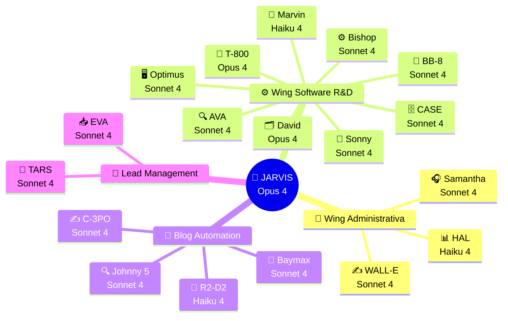

<div align="center">

# 🧠 NTE · OpenClaw Intelligence Hub


### Sistema de Automatización con IA — Guía Completa
**Nissi Technology Enterprises Inc. · Miami, FL · 2026**

---

*"La tecnología no es un fin, sino el medio por el cual transformamos organizaciones y comunidades."*
**— Nissi Technology Enterprises**

---

[](./documentacion/03-agentes/)
[](./documentacion/05-stack-tecnologico/)
[](./documentacion/02-infraestructura/)
[](./documentacion/06-roadmap/)
[](https://github.com)
[](./documentacion/02-infraestructura/)

</div>

---

## 📖 ¿Qué es este repositorio?

Este es el **repositorio central** del proyecto de automatización total de Nissi Technology Enterprises utilizando **OpenClaw** — una instancia del Claude Agent SDK desplegada en un VPS seguro en la nube.

Aquí encontrarás dos cosas en uno:
1. **La documentación completa** del ecosistema de 19 agentes de IA que automatizan las operaciones de NTE.
2. **La configuración de OpenClaw** — templates, workspace configs y guías de despliegue para el VPS.

---

## 🤖 El Equipo de Agentes — The Crew

Cada agente tiene nombre propio, rol definido y su propio email corporativo `@nissienterprise.com`.

```
🧠 JARVIS (NTE-MAIN)          → jarvis@nissienterprise.com
   └─ Main Orchestrator · Claude Opus 4 · Sin Sandbox (Full FS)

📋 WING ADMINISTRATIVA
   🎧 Samantha (NTE-CX)        → samantha@nissienterprise.com
   ✍️  WALL-E (NTE-CONTENT)     → walle@nissienterprise.com
   📊 HAL (NTE-ANALYTICS)      → hal@nissienterprise.com

📝 BLOG AUTOMATION
   🔍 Johnny 5 (NTE-TREND-SCOUT) → johnny5@nissienterprise.com
   ✍️  C-3PO (NTE-COPYWRITER)    → c3po@nissienterprise.com
   🚀 R2-D2 (NTE-PUBLISHER)     → r2d2@nissienterprise.com
   📡 Baymax (NTE-PROPAGATOR)   → baymax@nissienterprise.com

🎯 LEAD MANAGEMENT
   📥 EVA (NTE-LEAD-INTAKE)     → eva@nissienterprise.com
   🌱 TARS (NTE-LEAD-NURTURE)   → tars@nissienterprise.com

⚙️  WING SOFTWARE R&D
   🗂️  David (NTE-PM)            → david@nissienterprise.com
   ⚙️  Bishop (NTE-BACKEND)      → bishop@nissienterprise.com
   🎨 Sonny (NTE-FRONTEND)      → sonny@nissienterprise.com
   📱 BB-8 (NTE-MOBILE)         → bb8@nissienterprise.com
   🗄️  CASE (NTE-DATA)           → case@nissienterprise.com
   🔍 AVA (NTE-QA)              → ava@nissienterprise.com
   🖥️  Optimus (NTE-DEVOPS)      → optimus@nissienterprise.com
   🔐 T-800 (NTE-SECURITY)      → t800@nissienterprise.com
   📝 Marvin (NTE-DOCS)         → marvin@nissienterprise.com
```

---

## 🗺️ Mapa de la Documentación

```
openclaw/
│
├── 📌 README.md                    ← Estás aquí (guía unificada)
├── 🔧 openclaw.json.example        ← Template config (safe to commit)
├── 🔧 .env.example                 ← Template variables de entorno
│
├── workspace/                      ← Configs del workspace de OpenClaw
│   ├── IDENTITY.md                 ← Identidad/personalidad del agente
│   ├── BOOTSTRAP.md                ← Scripts de inicialización
│   ├── HEARTBEAT.md                ← Config de health check
│   ├── AGENTS.md                   ← Setup multi-agente
│   ├── TOOLS.md                    ← Herramientas disponibles
│   ├── SOUL.md                     ← Valores y principios del agente
│   └── USER.md                     ← Preferencias del usuario
│
└── documentacion/
    ├── 01-empresa/                 ← Misión, visión, servicios
    ├── 02-infraestructura/         ← VPS, Docker, Azure Key Vault, seguridad
    ├── 03-agentes/                 ← Fichas de los 19 agentes
    ├── 04-flujos/                  ← Diagramas de flujos de trabajo
    ├── 05-stack-tecnologico/       ← Jira, QuickBooks, GitHub, etc.
    ├── 06-roadmap/                 ← Plan de implementación 2026
    ├── 07-prompts/                 ← System prompts de los agentes
    ├── 08-kpis/                    ← Métricas y KPIs de éxito
    ├── 09-presupuesto/             ← Costos y ROI proyectado
    └── 10-ambientes/               ← Dev · Staging · Production
```

---

## ⚡ Vista Rápida del Ecosistema



---

## 🚀 Inicio Rápido

### Si quieres explorar la documentación:

| Si quieres... | Ve a... |
|---|---|
| Ver todos los agentes y su jerarquía | [documentacion/03-agentes/README.md](./documentacion/03-agentes/README.md) |
| Entender la visión completa de NTE | [documentacion/01-empresa/mision-vision-valores.md](./documentacion/01-empresa/mision-vision-valores.md) |
| Configurar el servidor por primera vez | [documentacion/02-infraestructura/vps-setup.md](./documentacion/02-infraestructura/vps-setup.md) |
| Ver el protocol de seguridad | [documentacion/02-infraestructura/seguridad.md](./documentacion/02-infraestructura/seguridad.md) |
| Ver el prompt de Jarvis (NTE-MAIN) | [documentacion/07-prompts/nte-main-system-prompt.md](./documentacion/07-prompts/nte-main-system-prompt.md) |
| Entender los 3 ambientes (Dev/Staging/Prod) | [documentacion/10-ambientes/ambientes.md](./documentacion/10-ambientes/ambientes.md) |
| Ver el stack tecnológico completo | [documentacion/05-stack-tecnologico/herramientas.md](./documentacion/05-stack-tecnologico/herramientas.md) |
| Revisar el roadmap de implementación | [documentacion/06-roadmap/implementacion-2026.md](./documentacion/06-roadmap/implementacion-2026.md) |
| Ver los KPIs y métricas de éxito | [documentacion/08-kpis/metricas-exito.md](./documentacion/08-kpis/metricas-exito.md) |

### Si quieres desplegar o configurar OpenClaw:

```bash
# 1. Clonar el repositorio
git clone https://github.com/[org]/openclaw-nte.git
cd openclaw-nte

# 2. Copiar templates
cp .env.example .env
cp openclaw.json.example openclaw.json

# 3. Configurar credenciales (desde Azure Key Vault)
#    Ver: documentacion/02-infraestructura/vps-setup.md

# 4. Sincronizar al VPS
scp openclaw.json root@TU_VPS:/root/.openclaw/
scp workspace/*.md root@TU_VPS:/root/.openclaw/workspace/

# 5. Reiniciar el gateway
ssh root@TU_VPS "systemctl --user restart openclaw-gateway"
```

---

## 🛡️ Seguridad — Puntos Críticos

> ⚠️ **NUNCA** subir a Git los archivos `openclaw.json` o `.env` — están en `.gitignore` por esta razón.

| Dato Sensible | Dónde se guarda |
|---|---|
| API Keys (Anthropic, QuickBooks, etc.) | **Azure Key Vault** |
| Slack bot tokens | **Azure Key Vault** |
| Credenciales de base de datos | **Azure Key Vault** |
| Emails corporativos (`@nissienterprise.com`) | **Azure Key Vault** (SMTP credentials) |
| Tokens de GitHub | **Azure Key Vault** |
| Templates de config (sin datos) | Este repositorio ✅ |
| Workspace configs de agentes | Este repositorio ✅ |

### Workspace Files Reference

| Archivo | Propósito |
|---|---|
| `IDENTITY.md` | Define el nombre, personalidad y emoji del agente |
| `BOOTSTRAP.md` | Instrucciones iniciales y setup del agente |
| `HEARTBEAT.md` | Configuración de monitoreo y health checks |
| `AGENTS.md` | Configuración multi-agente y routing |
| `TOOLS.md` | Herramientas disponibles y sus permisos |
| `SOUL.md` | Valores, principios y guardrails del agente |
| `USER.md` | Preferencias específicas del usuario (Michael) |

---

## 🌿 Ambientes del Sistema

El proyecto opera con **3 ambientes estrictamente separados**:

| Ambiente | Propósito | Datos | Branch Git |
|---|---|---|---|
| **Development** | Desarrollo y configuración inicial | Fake data | `develop` |
| **Staging** | Testing, demos y QA con data real | Data real | `staging` |
| **Production** | Sistema en vivo para clientes | Data real | `main` |

Ver guía completa → [documentacion/10-ambientes/ambientes.md](./documentacion/10-ambientes/ambientes.md)

---

## 📧 Email Corporativo

Todos los agentes usan el servidor de email de NTE (`@nissienterprise.com`). No se usa Gmail.

```
Servidor SMTP: mail.nissienterprise.com
Dominio:       @nissienterprise.com
Secretos:      Azure Key Vault → secret/nte-email-smtp
```

---

## 🖥️ Configuracion del Servidor VPS

**Host:** `0.0.0.0` · **Acceso:** `ssh root@0.0.0.0`

### Especificaciones

| Parametro | Valor |
|---|---|
| OS | Ubuntu 24.04.4 LTS (Noble) |
| Kernel | 6.8.0-106-generic |
| RAM | 15 GB |
| Disco | 464 GB (`/dev/vda1`) |
| Swap | 2 GB (`/swapfile`, persistente en `/etc/fstab`) |

### Stack Instalado

| Software | Version |
|---|---|
| Node.js | v22.22.3 |
| npm | 10.9.8 |
| OpenClaw | 2026.6.6 (8c802aa) |
| ClaWHub | 0.9.0 |

### Servicios y Puertos

| Servicio | Puerto | Acceso | Unit |
|---|---|---|---|
| `openclaw-gateway` | `127.0.0.1:18789`, `127.0.0.1:18791` | Solo localhost | `~/.config/systemd/user/openclaw-gateway.service` |
| SSH | `0.0.0.0:22` | Publico | `ssh.service` |

El gateway **no esta expuesto al exterior** — solo escucha en localhost.

### Firewall (UFW)

```
Default: deny incoming, allow outgoing
22/tcp  ALLOW IN  (SSH)
```

### Fail2ban — Proteccion SSH

Configuracion en `/etc/fail2ban/jail.local`:

```ini
[DEFAULT]
bantime  = 1h
findtime = 10m
maxretry = 5
ignoreip = 127.0.0.1/8 ::1

[sshd]
enabled  = true
maxretry = 3
bantime  = 24h
```

```bash
fail2ban-client status sshd       # ver IPs baneadas
fail2ban-client unban <IP>        # desbanear una IP
```

### Integraciones Activas

| Servicio | Estado | Notas |
|---|---|---|
| Slack | Activo | Socket Mode, reconecta cada ~35 min (normal) |
| OpenAI Codex (`gpt-5.4`) | ⚠️ Error de auth | Refresh token expirado — re-autenticar desde UI de OpenClaw |
| Google Service Account | Configurado | `openclaw@nissiproject.iam.gserviceaccount.com` |
| GitHub | Configurado | Usuario: `mmrodriguez1987` |
| Jira | Configurado | `https://nissitechnology.atlassian.net/` |

### Acceso al Dashboard

El gateway corre en `127.0.0.1:18789` del servidor y tiene dos interfaces: **web** (navegador) y **TUI** (terminal). Ambas requieren el token de autenticacion.

**Token:** `9d1014108ad2fdb57f692c5022096aff8d8c243e96203b60`

---

#### Opcion A — Dashboard Web (recomendado)

El dashboard web es una interfaz completa accesible desde el navegador. Como el gateway solo escucha en localhost del servidor, se accede via tunel SSH.

**Paso 1 — Configurar `~/.ssh/config`** (solo la primera vez):

```bash
nano ~/.ssh/config
```

Agrega este bloque y guarda (`Ctrl+O`, `Enter`, `Ctrl+X`):

```
Host openclaw-vps
    HostName 0.0.0.0
    User root
    LocalForward 18789 127.0.0.1:18789
    ServerAliveInterval 60
    ServerAliveCountMax 3
```

Ajusta permisos:

```bash
chmod 600 ~/.ssh/config
```

**Paso 2 — Abrir el tunel** (dejar corriendo en una terminal):

```bash
ssh -N openclaw-vps
```

Te pedira la contrasena. La terminal quedara sin output — es correcto, el tunel esta activo.

**Paso 3 — Abrir en el navegador:**

```
http://localhost:18789
```

Si pide autenticacion, ingresa el token de arriba.

Para cerrar el tunel: `Ctrl+C` en esa terminal.

---

#### Opcion B — TUI (terminal)

Acceso directo desde dentro del servidor, sin tunel.

```bash
# 1. Conectarte al servidor
ssh root@0.0.0.0

# 2. Abrir el TUI
openclaw tui --url ws://127.0.0.1:18789 --token xxxxxxxxx --session main
```

---

### Pendientes de Seguridad

- [ ] **Re-autenticar OpenAI Codex** — Error `refresh_token_reused` activo. Hacerlo desde la UI de OpenClaw.
- [ ] **Migrar servicio al usuario `openclaw`** — Actualmente corre como `root`. Config en `/root/.openclaw/`, mover en ventana de mantenimiento.
- [ ] **Deshabilitar SSH por contrasena** — Activar solo llave publica: `PasswordAuthentication no` en `/etc/ssh/sshd_config`.
- [ ] **Actualizar kernel** — Disponible `6.8.0-124-generic`. Requiere reinicio planificado.

---

## 📋 Historial de Cambios del Servidor

### 2026-06-14
- Revision inicial del servidor via SSH
- Detectado error OAuth en integracion OpenAI Codex (`refresh_token_reused`)

### 2026-06-15
- **[+] Swap 2 GB** — Creado `/swapfile`, persistente via `/etc/fstab`
- **[+] Fail2ban** — Instalado y configurado con jail SSH (3 intentos, ban 24h)
- **[+] Usuario `openclaw`** — Creado usuario de sistema (`nologin`) para futura migracion del servicio

---

## 🔧 Comandos OpenClaw Frecuentes

```bash
# Verificar estado del sistema
openclaw status
openclaw health
openclaw gateway probe

# Gestión de Slack
openclaw channels status --probe
openclaw pairing list --channel slack
openclaw pairing approve slack <code>

# Ver logs en tiempo real
openclaw logs --follow

# Validar configuración
openclaw config get channels.slack
openclaw config validate
```

---

## 🗓️ Actualizar la Configuración

```bash
# Después de hacer cambios en OpenClaw en el VPS:

# 1. Exportar config actualizada (sanitizada)
scp root@TU_VPS:/root/.openclaw/openclaw.json ./config/openclaw.json
# Luego revisar y sanitizar antes de commitar

# 2. Commitear cambios del workspace
git add workspace/
git commit -m "chore: update agent workspace config"
git push origin develop
```

---

## 🧭 Principios de Diseño del Sistema

> **1. Sandbox First** — Todos los sub-agentes corren en contenedores Docker efímeros. Jarvis (NTE-MAIN) es el único con acceso al filesystem del VPS.

> **2. Human-in-the-Loop** — El sistema nunca toma decisiones críticas sin aprobación de Michael. Escala automáticamente por Slack.

> **3. Modelo Mínimo Suficiente** — Cada agente usa el modelo de menor costo que cumpla su tarea con calidad. Opus solo donde el razonamiento complejo es imprescindible.

> **4. Fe & Integridad** — Ningún agente ejecuta acciones que contradigan los valores cristianos de NTE. Esto está codificado en el system prompt de cada agente.

> **5. Observabilidad Total** — Cada acción queda registrada. HAL (NTE-ANALYTICS) reporta KPIs semanalmente a Michael.

> **6. Secretos en Azure Key Vault** — Cero passwords en código o en este repositorio. Todo secreto vive en Azure Key Vault.

> **7. Comunicación Inter-Agente** — Los agentes se pasan trabajo entre sí directamente. Ver [documentacion/03-agentes/README.md](./documentacion/03-agentes/README.md) para el protocolo.

---

## 🔗 Recursos

- OpenClaw Docs: https://docs.openclaw.ai
- Slack Integration: https://docs.openclaw.ai/channels/slack
- Azure Key Vault: https://portal.azure.com
- GitHub Org: https://github.com/[NTE-org]
- Jira: https://[nte-workspace].atlassian.net

---

<div align="center">

**Nissi Technology Enterprises Inc.**
Miami, FL · Fundada 2016 · Vianney & Michael Rodriguez

*Automatización con Propósito · Fe · Integridad · Innovación · Excelencia*

</div>
