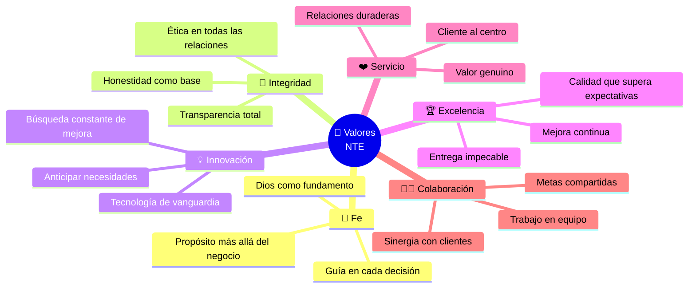
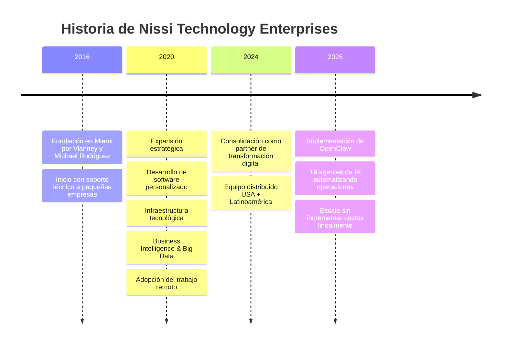
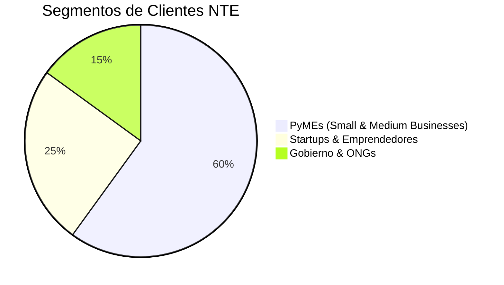

# 🏢 Nissi Technology Enterprises
### Misión · Visión · Valores · Propósito

*La identidad que guía cada decisión de cada agente del sistema*

---

## ⚡ Misión

> **Empoderar a empresas de todos los tamaños ofreciendo soluciones tecnológicas innovadoras, confiables y personalizadas que mejoran la eficiencia, impulsan el crecimiento y generan impacto sostenible — siempre guiados por valores cristianos y un compromiso con la excelencia.**

---

## 🌟 Visión

> **Transformar la manera en que empresas y comunidades experimentan la tecnología, integrando fe, innovación y excelencia. Visualizamos un mundo donde la transformación digital empodera a las personas, fortalece las organizaciones y cierra la brecha digital en las Américas.**

---

## 🎯 Propósito

En Nissi Technology Enterprises creemos que la tecnología no es solo una herramienta, sino **una forma de servir, empoderar y transformar vidas**.

Hacemos lo que hacemos porque somos apasionados de ayudar a las organizaciones a crecer a través de la innovación, la integridad y la excelencia.

Nuestro propósito es **tender un puente entre la tecnología y el potencial humano**, creando soluciones que no solo resuelven problemas sino que inspiran progreso.

---

## 💎 Valores Centrales

| Valor | Definición | Cómo se aplica en los Agentes |
|---|---|---|
| 🙏 **Fe** | Reconocemos a Dios como fundamento de cada decisión | Los agentes no ejecutan acciones que contradigan valores éticos. NTE-MAIN tiene esto hardcoded en su system prompt |
| 🤝 **Integridad** | Transparencia, ética y honestidad en todas las relaciones | Cada acción de cada agente queda registrada. Sin acciones ocultas ni manipulación |
| 💡 **Innovación** | Búsqueda constante de mejores formas de operar | El sistema de agentes en sí ES la innovación. Se actualiza trimestralmente |
| 🏆 **Excelencia** | Soluciones de la más alta calidad | Modelos Claude Opus/Sonnet para outputs de calidad premium. QA automatizado |
| ❤️ **Servicio** | El cliente al centro de todo | NTE-CX responde en < 5 min. NTE-LEAD-NURTURE da seguimiento personalizado |
| 🤜🤛 **Colaboración** | Equipo y clientes trabajando hacia metas compartidas | Los 19 agentes colaboran entre sí como un equipo cohesionado |

---

## 📅 Historia de NTE

---

## 🎯 Mercado Objetivo

### Segmento A: PyMEs
Representan el 99% de las empresas en EE.UU. Buscan optimizar procesos, automatizar tareas y mejorar su presencia digital. NTE les ofrece soluciones accesibles y escalables.

### Segmento B: Startups & Emprendedores
Necesitan lanzar productos tech, plataformas eCommerce, CRMs y apps móviles. NTE acelera su time-to-market con soluciones ágiles.

### Segmento C: Gobierno & ONGs
Invierten en modernización digital, seguridad de datos y eficiencia operacional. NTE accede a contratos federales y estatales gracias a sus certificaciones Minority-Owned y Women-Owned.

---

## 🌎 Posicionamiento

> NTE se posiciona como una empresa **boutique con enfoque humano**, precios competitivos y una fuerte orientación hacia valores cristianos y servicio comunitario — diferenciándose de firmas como Globant, Wizeline o Koombea.

**Diferenciadores clave:**
- Oferta integral: Software + Marketing + Infraestructura + AI + BI bajo una sola marca
- Valores corporativos auténticos integrados en la cultura
- Modelo remoto USA + LATAM que reduce costos sin sacrificar calidad
- Atención personalizada directa con el cliente

---

[← Volver al inicio](../README.md) | [Servicios →](./servicios.md)
