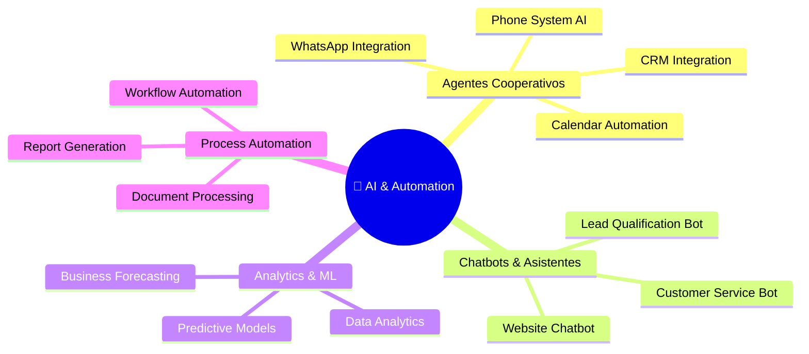

# 🛠️ Catálogo de Servicios NTE
### Base de Conocimiento para los Agentes de IA

*Todos los agentes deben conocer este catálogo para cotizar, responder y generar contenido alineado*

---

## División 1 · Software & Desarrollo Digital

### 🌐 Desarrollo Web

| Servicio | Precio Base | Stack | Agente Principal |
|---|---|---|---|
| Landing Page Básica | $800 – $1,500 | WordPress + AI | NTE-FRONTEND |
| Landing Page Profesional | $1,500 – $2,500 | WordPress + AI | NTE-FRONTEND |
| Sitio Corporativo Estándar | $2,000 – $3,500 | WordPress + AI | NTE-FRONTEND |
| Sitio Corporativo Premium | $3,500 – $5,000 | WordPress + AI | NTE-FRONTEND |
| eCommerce Básico | $3,500 – $5,500 | WooCommerce + AI | NTE-FRONTEND + NTE-BACKEND |
| eCommerce Profesional | $5,500 – $9,000 | WooCommerce + AI | NTE-FRONTEND + NTE-BACKEND |
| eCommerce Enterprise | $9,000 – $15,000 | WooCommerce + AI | NTE-FRONTEND + NTE-BACKEND |

### 💻 Desarrollo de Software

| Servicio | Precio Base | Stack | Agente Principal |
|---|---|---|---|
| Web App Básica | $5,000 – $8,000 | Laravel + Vue + AI | NTE-BACKEND + NTE-FRONTEND |
| Web App Profesional | $8,000 – $15,000 | Laravel + Vue + AI | NTE-BACKEND + NTE-FRONTEND |
| Web App Enterprise | $15,000 – $30,000 | Laravel + Vue + Cloud + AI | Full Team |
| SaaS Solution | $20,000 – $50,000+ | Laravel + Vue + Cloud + Full AI | Full Team |
| CRM / ERP Personalizado | $10,000 – $25,000 | Custom Stack | Full Team |
| Plugins WordPress Custom | $500 – $3,000 | PHP + WordPress API | NTE-BACKEND |

### 📱 Aplicaciones Móviles

| Servicio | Precio Base | Stack | Agente Principal |
|---|---|---|---|
| App Móvil iOS / Android | $5,000 – $10,000 | React Native / Flutter | NTE-MOBILE |
| App con Backend Completo | $10,000 – $20,000 | React Native + Node.js | NTE-MOBILE + NTE-BACKEND |

---

## División 2 · Inteligencia Artificial & Automatización

| Servicio | Precio Base | Descripción |
|---|---|---|
| AI Cooperative Agents | $3,000 – $5,000 | Agentes integrados con WhatsApp, calendario, website, CRM |
| AI Chatbot Básico | $1,500 – $3,000 | Bot de atención al cliente con NLP básico |
| AI Chatbot Avanzado | $3,000 – $6,000 | Bot con ML, historial de conversaciones y CRM integration |
| Data Analytics & ML | $5,000 – $15,000 | Modelos predictivos y analíticos para decisiones estratégicas |
| Automatización de Procesos | $2,000 – $8,000 | Workflows automatizados con integraciones API |

---

## División 3 · Infraestructura Tecnológica & Redes

| Servicio | Precio | Descripción |
|---|---|---|
| Network Design & Security | Por proyecto | Diseño e implementación de redes empresariales seguras |
| Active Directory Setup | Por proyecto | Configuración de AD, servidores y cámaras de seguridad |
| Hardware Procurement | Por proyecto | Suministro e instalación de equipos tecnológicos |
| Cloud Migration | Por proyecto | Migración a AWS, Azure o Google Cloud |
| Server Management | $200 – $500/mes | Mantenimiento y gestión de servidores cloud o físicos |
| Virtualization Setup | Por proyecto | Implementación de entornos virtuales (VMware, Hyper-V) |

---

## División 4 · Marketing Digital & Multimedia

### 📱 Social Media & SEO

| Servicio | Precio Mensual | Incluye |
|---|---|---|
| SEO Básico | $450/mes | Optimización on-page + reportes mensuales |
| SEO Profesional | $900/mes | On-page + Off-page + contenido + reportes |
| SEO Enterprise | $1,500/mes | Estrategia completa + 4 artículos/mes + link building |
| Social Media Básico | $500/mes | 3 plataformas + 12 posts/mes |
| Social Media Pro | $1,000/mes | 5 plataformas + posts diarios + stories |
| Social Media Enterprise | $2,000/mes | Gestión completa + campañas pagas + analytics |

### 🎬 Nissi Media Services

| Servicio | Precio | Descripción |
|---|---|---|
| Fotografía Corporativa | Por sesión | Fotos profesionales para marca y equipo |
| Video Institucional | Por proyecto | Video corporativo de alta producción |
| Streaming & Eventos | Por evento | Transmisión en vivo de eventos corporativos |

---

## División 5 · Business Intelligence & Big Data

| Servicio | Precio Base | Herramientas |
|---|---|---|
| Power BI Dashboard | $2,000 – $5,000 | Power BI + Data Sources |
| Data Warehouse (ETL) | $5,000 – $15,000 | Python + dbt + PostgreSQL/BigQuery |
| SharePoint Site | $1,500 – $4,000 | SharePoint + Microsoft 365 |
| BI Consulting | $150/hora | Análisis + Estrategia de datos |
| Mantenimiento BI | $300 – $800/mes | Actualización de dashboards + nuevos reportes |

---

## 📋 Planes de Mantenimiento Web

| Plan | Precio | Incluye |
|---|---|---|
| **Básico** | $150/mes | Updates, backups, uptime monitoring |
| **Pro** | $300/mes | Básico + SEO básico + 2 cambios/mes + soporte |
| **Enterprise** | $600/mes | Pro + SEO avanzado + cambios ilimitados + prioridad |

---

## 💡 Reglas de Cotización para Agentes

> **NTE-CX y NTE-LEAD-INTAKE** deben usar esta base de conocimiento para generar cotizaciones preliminares. Siempre presentar un rango, no un precio fijo, y escalar a Michael para proyectos > $5,000.

**Factores que aumentan el precio:**
- Integraciones con sistemas legacy (+20-40%)
- Timeline agresivo/urgente (+25-50%)
- Funcionalidades de IA avanzada (+30-60%)
- Soporte 24/7 requerido (+20%)

**Descuentos disponibles:**
- Cliente referido: -10%
- Contrato anual de mantenimiento: -15%
- Startup / ONG: -20% (caso a caso, aprobación de Michael)
- Pago completo por adelantado: -5%

---

[← Misión & Valores](./mision-vision-valores.md) | [Volver al inicio](../README.md) | [Infraestructura →](../02-infraestructura/vps-setup.md)
