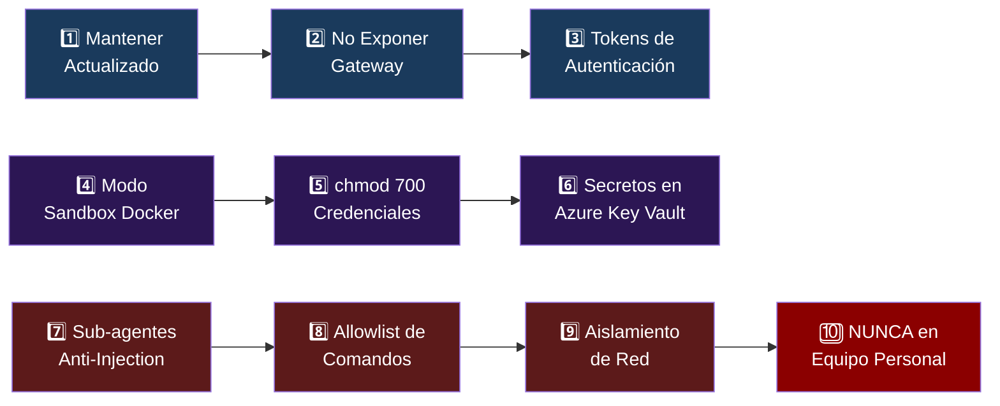
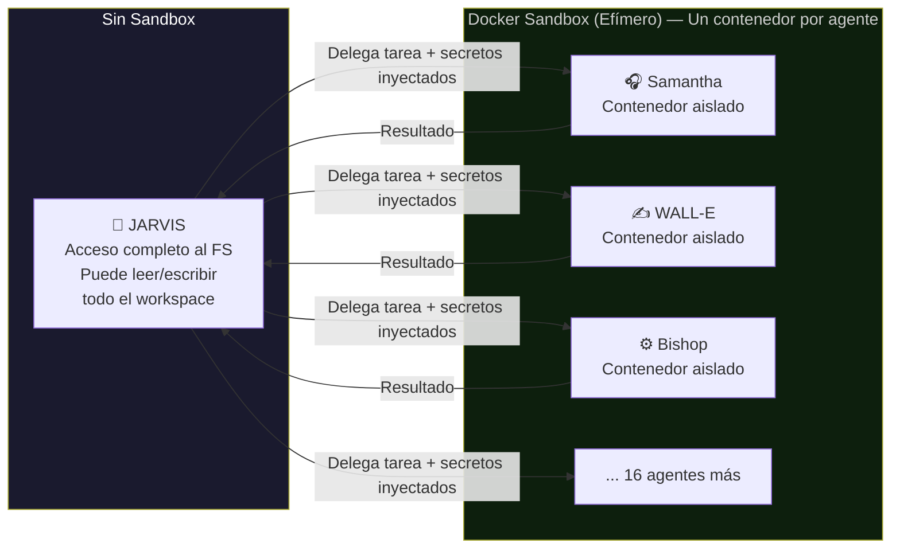

<div align="center">

# 🔒 Las 10 Reglas de Seguridad de OpenClaw
### Protocolo de Seguridad Obligatorio — NTE

> ⚠️ **CRÍTICO:** Aplicar TODAS las reglas antes de poner cualquier agente en producción.

</div>

---



---

## Regla 1 · Mantener Siempre Actualizado

```bash
# Ejecutar semanalmente (automatizado via Optimus)
sudo apt update && sudo apt upgrade -y
npm update -g @anthropic-ai/claude-code
```

> Los parches de seguridad son críticos. Un servidor desactualizado puede ser comprometido en horas. Optimus (NTE-DEVOPS) tiene este comando en su heartbeat semanal.

---

## Regla 2 · No Exponer el Gateway (Puerto 18789)

```bash
# ✅ CORRECTO — Solo localhost
gateway.host = "127.0.0.1"

# ❌ INCORRECTO — Expone al mundo
gateway.host = "0.0.0.0"
```

**Acceso siempre via SSH tunnel:**
```bash
ssh -L 18789:localhost:18789 openclaw@TU_VPS_IP
```

---

## Regla 3 · Tokens de Autenticación

```json
// ~/.openclaw/config.json
{
  "auth_mode": "token",
  "token": "GENERADO_AUTOMÁTICAMENTE_NO_EDITAR"
}
```

> Nunca dejar acceso libre sin token. El token debe rotar cada 90 días. T-800 (NTE-SECURITY) genera un recordatorio automático.

---

## Regla 4 · Modo Sandbox con Docker ⭐ La más importante

NTE usa el modo **`non_main`** (recomendado para operaciones normales):



```bash
# Modo non_main: Jarvis tiene FS, sub-agentes en Docker
docker run --rm --network none \
  -v /workspace:/workspace:ro \
  openclaw-sandbox:latest
```

---

## Regla 5 · Protección de Credenciales con chmod

```bash
# Aplicar inmediatamente después de instalar
chmod 700 -R ~/.openclaw

# Verificar permisos
ls -la ~/.openclaw
# drwx------ (700) — solo el usuario openclaw puede acceder
```

> **NUNCA** guardar API keys en texto plano con permisos abiertos. Si alguien compromete el server, `.openclaw` con chmod 700 es su última barrera.

---

## Regla 6 · Todos los Secretos en Azure Key Vault ⭐ OBLIGATORIO

> ✅ **NTE usa Azure Key Vault** como el único gestor de secretos. **Cero passwords en código, en repositorios de GitHub, o en archivos de configuración.**

```bash
# ✅ CORRECTO — Obtener secreto desde Azure Key Vault
export ANTHROPIC_API_KEY=$(az keyvault secret show \
  --name "anthropic-api-key" \
  --vault-name "nte-keyvault" \
  --query "value" -o tsv)

# ❌ INCORRECTO — API key en el config file
{
  "anthropic_key": "sk-ant-..."  // NUNCA HACER ESTO
}

# ❌ INCORRECTO — API key en variables de entorno hardcodeadas en Docker
ENV ANTHROPIC_API_KEY="sk-ant-..."  // NUNCA HACER ESTO
```

**Configuración de Azure Key Vault para NTE:**
```bash
# Vault name: nte-keyvault
# Resource Group: nte-production-rg
# Región: East US 2

# Crear secreto
az keyvault secret set \
  --vault-name "nte-keyvault" \
  --name "anthropic-api-key" \
  --value "sk-ant-..."

# Dar acceso a Jarvis via Managed Identity
az keyvault set-policy \
  --name "nte-keyvault" \
  --object-id [managed-identity-id] \
  --secret-permissions get list
```

**Secretos obligatorios en Azure Key Vault:**

| Nombre del Secreto | Descripción |
|---|---|
| `anthropic-api-key` | Claude API key |
| `slack-bot-token` | Slack bot token (xoxb-...) |
| `slack-app-token` | Slack app token (xapp-...) |
| `jira-api-token` | Jira API token |
| `quickbooks-oauth-token` | QuickBooks OAuth 2.0 token |
| `quickbooks-refresh-token` | QuickBooks refresh token |
| `github-token` | GitHub Personal Access Token |
| `nte-email-smtp` | Credenciales SMTP @nissienterprise.com |
| `google-calendar-token` | Google Calendar OAuth token |
| `wordpress-api-key` | WordPress REST API key |
| `semrush-api-key` | Semrush API key |
| `buffer-api-key` | Buffer Pro API key |
| `openclaw-gateway-token` | Token del gateway de OpenClaw |
| `db-connection-string` | String de conexión a base de datos |

---

## Regla 7 · Mitigar Prompt Injection con Sub-agentes

> Los agentes que navegan la web o leen documentos de terceros son los más vulnerables a prompt injection.

**Estrategia de NTE:**
- Johnny 5 (navega la web) → siempre en Docker con red limitada
- Samantha (lee mensajes de desconocidos) → Docker con allowlist de acciones
- EVA (procesa formularios externos) → Docker sin acceso a filesystem

```bash
# Sub-agente con red limitada a APIs específicas
docker run --rm \
  --network=nte-restricted \  # Solo permite IPs de APIs permitidas
  -e ANTHROPIC_API_KEY \
  openclaw-sandbox:latest
```

---

## Regla 8 · Control de Comandos con Allowlist

```json
// Ejemplo de allowlist para Optimus (NTE-DEVOPS)
{
  "allowed_commands": [
    "git pull",
    "docker ps",
    "docker restart",
    "nginx -t",
    "systemctl restart nginx",
    "certbot renew"
  ],
  "ask_on_miss": true,   // Pide aprobación por Slack para comandos no listados
  "block_patterns": [
    "rm -rf",
    "DROP TABLE",
    "chmod 777"
  ]
}
```

---

## Regla 9 · Aislamiento de Red y Auditoría

```bash
# Revisar logs de auditoría (automatizado por T-800)
tail -f /workspace/logs/openclaw-audit.log

# Activar logging completo
export OPENCLAW_LOG_LEVEL=audit
export OPENCLAW_LOG_FILE=/workspace/logs/openclaw-audit.log
```

**T-800 (NTE-SECURITY) revisa estos logs:**
- Cada domingo a las 6 AM (reporte semanal de seguridad)
- Inmediatamente si detecta patrones de inyección
- Mensualmente para auditoría completa (reporte a Michael)

---

## Regla 10 · NUNCA en Equipo Personal

| ✅ Correcto | ❌ Incorrecto |
|---|---|
| OpenClaw en VPS aislado | OpenClaw en tu MacBook |
| VPS dedicado sin datos personales | Servidor compartido con otros proyectos |
| Usuario `openclaw` sin permisos root | Ejecutar como root |
| Si el VPS se compromete → pérdida limitada | Si tu Mac se compromete → pérdida total |

> Si la instancia es comprometida, el atacante solo accede al VPS aislado. **NUNCA dar permisos root a OpenClaw.**

---

## 📋 Checklist de Seguridad Pre-Producción

```
□ Sistema operativo actualizado (apt upgrade)
□ OpenClaw actualizado a última versión
□ Gateway en 127.0.0.1 (NO 0.0.0.0)
□ Token de autenticación configurado
□ Modo sandbox non_main activado
□ chmod 700 aplicado a ~/.openclaw
□ Azure Key Vault configurado con todos los secretos
□ Managed Identity de Jarvis con acceso a Azure Key Vault
□ Allowlist de comandos definida para Optimus (NTE-DEVOPS)
□ Logs de auditoría activados
□ UFW Firewall activo
□ Fail2Ban instalado y configurado
□ Cloudflare WAF activo
□ Backups automáticos configurados
□ T-800 (NTE-SECURITY) configurado para revisión semanal
□ Rotación de secretos programada (90 días) en Azure Key Vault
□ Docker containers con network isolation configurado
□ Variables de entorno de los 3 ambientes separadas en Azure KV
```

---

[← VPS Setup](./vps-setup.md) | [Volver al inicio](../README.md) | [Agentes →](../03-agentes/README.md)
