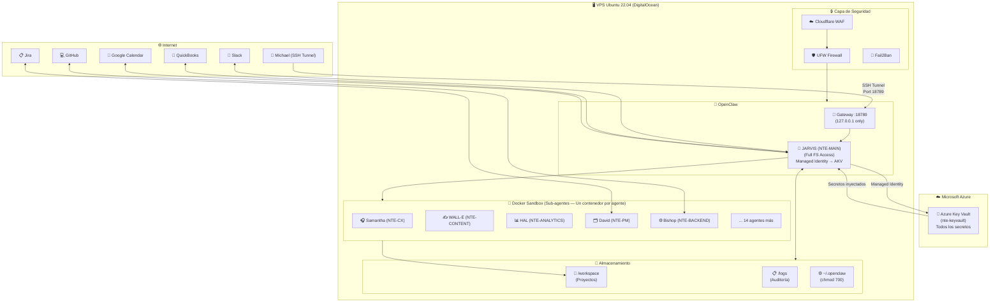

<div align="center">

# 🖥️ Infraestructura Base
### VPS + OpenClaw + Docker + Azure Key Vault — Configuración y Despliegue

</div>

---

## Especificaciones del Servidor

| Componente | Requerimiento Mínimo | Recomendado NTE |
|---|---|---|
| **CPU** | 2 vCPUs | 4 vCPUs |
| **RAM** | 4 GB | 8 GB |
| **Almacenamiento** | 40 GB SSD | 80 GB NVMe SSD |
| **Sistema Operativo** | Ubuntu 20.04 | **Ubuntu 22.04 LTS** |
| **Ancho de Banda** | 2 TB/mes | 4 TB/mes |
| **Proveedor** | Cualquiera | DigitalOcean Droplet (~$48/mes) |

---

## Arquitectura del Sistema



---

## Comandos de Instalación

### 1. Preparación del Servidor

```bash
# Actualizar el sistema
sudo apt update && sudo apt upgrade -y

# Instalar dependencias
sudo apt install -y docker.io docker-compose git curl ufw fail2ban

# Instalar Azure CLI
curl -sL https://aka.ms/InstallAzureCLIDeb | sudo bash

# Crear usuario dedicado (NUNCA usar root)
sudo adduser openclaw --disabled-password
sudo usermod -aG docker openclaw

# Configurar firewall
sudo ufw default deny incoming
sudo ufw default allow outgoing
sudo ufw allow ssh
sudo ufw enable
```

### 2. Instalar OpenClaw

```bash
# Como usuario openclaw
su - openclaw

# Instalar OpenClaw (Claude Code SDK)
npm install -g @anthropic-ai/claude-code

# Configurar permisos restrictivos
chmod 700 -R ~/.openclaw
```

### 3. Configurar Azure Key Vault (Managed Identity)

```bash
# En el VPS — Configurar acceso a Azure Key Vault
# (usar Managed Identity del VPS si está en Azure, o Service Principal para DigitalOcean)

# Login con Service Principal
az login --service-principal \
  --username [app-id] \
  --password [client-secret] \
  --tenant [tenant-id]

# Verificar acceso al vault
az keyvault secret list --vault-name "nte-keyvault"

# Obtener un secreto (ejemplo)
export ANTHROPIC_API_KEY=$(az keyvault secret show \
  --name "anthropic-api-key" \
  --vault-name "nte-keyvault" \
  --query "value" -o tsv)
```

### 4. Configuración Segura del Gateway

```bash
# ~/.openclaw/config.json
{
  "gateway": {
    "host": "127.0.0.1",      # NUNCA 0.0.0.0
    "port": 18789,
    "auth_mode": "token"
  },
  "sandbox": {
    "mode": "non_main",        # Jarvis tiene FS, sub-agentes en Docker
    "docker_image": "openclaw-sandbox:latest"
  }
}
```

### 5. Acceso via SSH Tunnel (desde tu máquina local)

```bash
# Conectarte al gateway de forma segura
ssh -L 18789:localhost:18789 openclaw@TU_VPS_IP

# Luego en el navegador:
# http://localhost:18789?token=TU_TOKEN
```

### 6. Inyección de Secretos desde Azure Key Vault

```bash
# Script de arranque — carga secretos desde Azure KV al entorno
#!/bin/bash

VAULT="nte-keyvault"

export ANTHROPIC_API_KEY=$(az keyvault secret show --name "anthropic-api-key" --vault-name $VAULT --query "value" -o tsv)
export SLACK_BOT_TOKEN=$(az keyvault secret show --name "slack-bot-token" --vault-name $VAULT --query "value" -o tsv)
export JIRA_API_TOKEN=$(az keyvault secret show --name "jira-api-token" --vault-name $VAULT --query "value" -o tsv)
export QUICKBOOKS_TOKEN=$(az keyvault secret show --name "quickbooks-oauth-token" --vault-name $VAULT --query "value" -o tsv)
export GITHUB_TOKEN=$(az keyvault secret show --name "github-token" --vault-name $VAULT --query "value" -o tsv)
export NTE_SMTP_USER=$(az keyvault secret show --name "nte-email-smtp-user" --vault-name $VAULT --query "value" -o tsv)
export NTE_SMTP_PASS=$(az keyvault secret show --name "nte-email-smtp-pass" --vault-name $VAULT --query "value" -o tsv)

echo "✅ Secrets loaded from Azure Key Vault"
```

---

## 🐳 Docker — Un Contenedor por Agente

Cada sub-agente corre en su propio contenedor Docker. Esto garantiza:
- **Aislamiento total** — si un agente es comprometido, no afecta a los demás
- **Recursos controlados** — límites de CPU y RAM por agente
- **Reproducibilidad** — mismo comportamiento en Dev, Staging y Production

```bash
# Construir imagen de un agente
docker build -t nte-samantha:latest ./nte-agents-docker/samantha/

# Lanzar agente con secretos inyectados (sin hardcodear nada)
docker run --rm \
  --name nte-samantha \
  --network nte-restricted \
  --memory="512m" \
  --cpus="0.5" \
  -e ANTHROPIC_API_KEY \
  -e NTE_SMTP_USER \
  -e NTE_SMTP_PASS \
  nte-samantha:latest

# Ver agentes corriendo
docker ps --filter "name=nte-"
```

### Docker Compose para el equipo completo

```yaml
# /workspace/docker-compose.yml
version: '3.8'
services:
  samantha:
    image: nte-samantha:latest
    restart: unless-stopped
    networks: [nte-restricted]
    environment:
      - ANTHROPIC_API_KEY
      - NTE_SMTP_USER
      - NTE_SMTP_PASS
    deploy:
      resources:
        limits:
          memory: 512M
          cpus: '0.5'

  walle:
    image: nte-walle:latest
    restart: unless-stopped
    networks: [nte-restricted]
    environment:
      - ANTHROPIC_API_KEY
      - NTE_SMTP_USER
      - NTE_SMTP_PASS
      - WORDPRESS_API_KEY
      - BUFFER_API_KEY

  # ... (un servicio por cada sub-agente)

networks:
  nte-restricted:
    driver: bridge
    # Solo permite salida a IPs/dominios específicos via reglas de firewall
```

---

## 🌿 Configuración por Ambiente

```bash
# Los secretos están separados por ambiente en Azure Key Vault
# Prefijos: dev/, staging/, prod/

# Desarrollo
az keyvault secret set --vault-name "nte-keyvault" \
  --name "dev/anthropic-api-key" --value "sk-ant-..."

# Staging
az keyvault secret set --vault-name "nte-keyvault" \
  --name "staging/anthropic-api-key" --value "sk-ant-..."

# Production
az keyvault secret set --vault-name "nte-keyvault" \
  --name "prod/anthropic-api-key" --value "sk-ant-..."
```

Ver guía completa de ambientes → [../10-ambientes/ambientes.md](../10-ambientes/ambientes.md)

---

## Estructura de Directorios

```
/home/openclaw/
├── .openclaw/              ← chmod 700 | Config de OpenClaw
│   ├── config.json
│   └── tokens/
│
/workspace/
├── projects/               ← Proyectos de clientes
│   ├── client-001/
│   └── client-002/
├── agents/                 ← Configuraciones de agentes
│   ├── jarvis/
│   ├── wing-administrativa/
│   └── wing-software/
├── content/                ← Artículos del blog en draft
├── leads/                  ← Base de leads (encriptada)
└── logs/                   ← Auditoría de todas las acciones
    ├── openclaw-audit.log
    └── agent-comms.log     ← Comunicaciones inter-agente
```

---

[← Volver al inicio](../README.md) | [Seguridad →](./seguridad.md)
