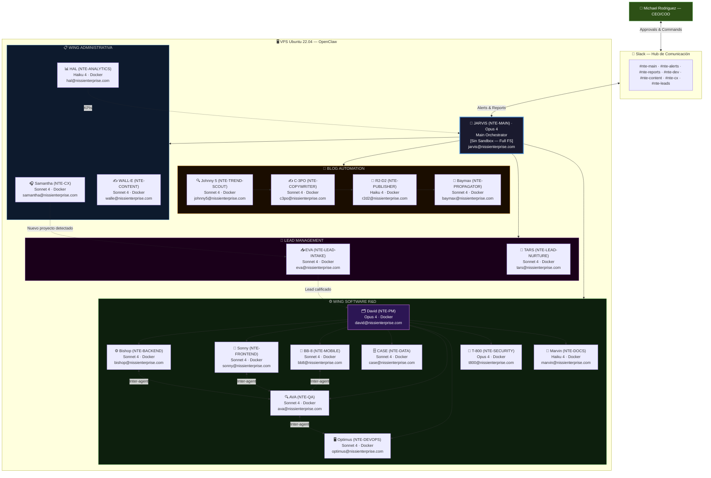
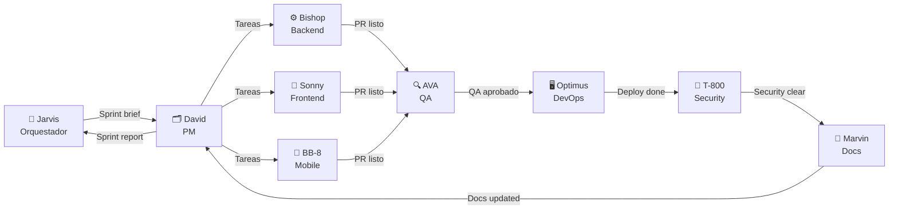
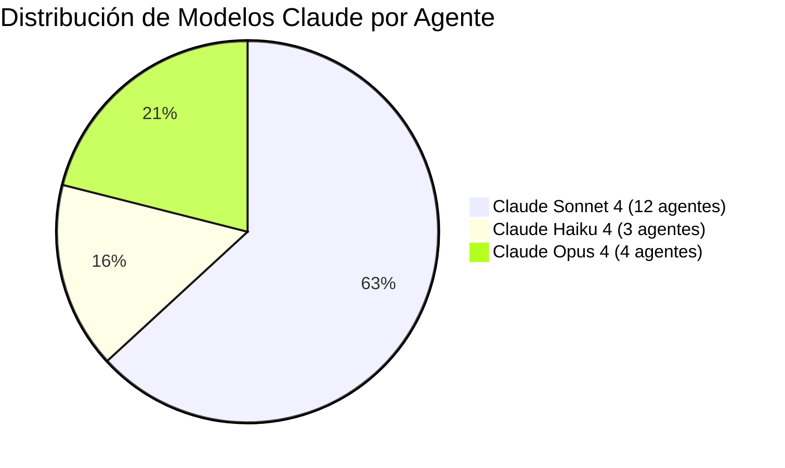

<div align="center">

# 🤖 Ecosistema de Agentes OpenClaw — NTE
### Los 19 Agentes de Nissi Technology Enterprises

</div>

---

## Arquitectura General



---

## 🔀 Comunicación Inter-Agente

Los agentes no son islas. Se pasan trabajo directamente sin necesidad de que Jarvis intermedie en cada paso:



**Protocolo de comunicación entre agentes:**
- Cada agente puede invocar directamente a otro usando el sistema de mensajería de OpenClaw.
- Todas las comunicaciones inter-agente quedan registradas en `/workspace/logs/agent-comms.log`.
- Jarvis supervisa el estado pero no bloquea el flujo entre agentes de nivel inferior.
- Si un agente no puede completar su tarea, escala a David (Wing Software) o a Jarvis (cualquier wing).

---

## Tabla de Todos los Agentes

| # | Nombre | ID Técnico | Email | Rol | Modelo | Sandbox | Frecuencia |
|---|---|---|---|---|---|---|---|
| 01 | [🧠 **Jarvis**](./jarvis.md) | NTE-MAIN | jarvis@nissienterprise.com | Main Orchestrator | Opus 4 | ❌ Full FS | 24/7 + Heartbeat |
| — | **WING ADMINISTRATIVA** | | | | | | |
| 02 | [🎧 **Samantha**](./wing-administrativa/samantha.md) | NTE-CX | samantha@nissienterprise.com | Customer Experience | Sonnet 4 | ✅ Docker | 24/7 Continuo |
| 03 | [✍️ **WALL-E**](./wing-administrativa/walle.md) | NTE-CONTENT | walle@nissienterprise.com | Content & Marketing | Sonnet 4 | ✅ Docker | Alta (diaria) |
| 04 | [📊 **HAL**](./wing-administrativa/hal.md) | NTE-ANALYTICS | hal@nissienterprise.com | Analytics & Reporting | Haiku 4 | ✅ Docker | Semanal + alertas |
| — | **BLOG AUTOMATION** | | | | | | |
| 05 | [🔍 **Johnny 5**](./flujos-especializados/blog-automation/johnny5.md) | NTE-TREND-SCOUT | johnny5@nissienterprise.com | Investigador de Tendencias | Sonnet 4 | ✅ Docker | Semanal (Lun 2AM) |
| 06 | [✍️ **C-3PO**](./flujos-especializados/blog-automation/c3po.md) | NTE-COPYWRITER | c3po@nissienterprise.com | Redactor de Artículos | Sonnet 4 | ✅ Docker | 2x/semana |
| 07 | [🚀 **R2-D2**](./flujos-especializados/blog-automation/r2d2.md) | NTE-PUBLISHER | r2d2@nissienterprise.com | Publicador WordPress | Haiku 4 | ✅ Docker | On-demand |
| 08 | [📡 **Baymax**](./flujos-especializados/blog-automation/baymax.md) | NTE-PROPAGATOR | baymax@nissienterprise.com | Distribuidor Redes Sociales | Sonnet 4 | ✅ Docker | Post-publicación |
| — | **LEAD MANAGEMENT** | | | | | | |
| 09 | [📥 **EVA**](./flujos-especializados/lead-management/eva.md) | NTE-LEAD-INTAKE | eva@nissienterprise.com | Captador Multicanal | Sonnet 4 | ✅ Docker | 24/7 Continuo |
| 10 | [🌱 **TARS**](./flujos-especializados/lead-management/tars.md) | NTE-LEAD-NURTURE | tars@nissienterprise.com | Nurturing & Seguimiento | Sonnet 4 | ✅ Docker | 24/7 Continuo |
| — | **WING SOFTWARE R&D** | | | | | | |
| 11 | [🗂️ **David**](./wing-software/david.md) | NTE-PM | david@nissienterprise.com | Project Manager | Opus 4 | ✅ Docker | Por Sprint |
| 12 | [⚙️ **Bishop**](./wing-software/bishop.md) | NTE-BACKEND | bishop@nissienterprise.com | Backend Developer | Sonnet 4 | ✅ Docker | Activo en sprints |
| 13 | [🎨 **Sonny**](./wing-software/sonny.md) | NTE-FRONTEND | sonny@nissienterprise.com | Frontend Developer | Sonnet 4 | ✅ Docker | Activo en sprints |
| 14 | [📱 **BB-8**](./wing-software/bb8.md) | NTE-MOBILE | bb8@nissienterprise.com | Mobile Developer | Sonnet 4 | ✅ Docker | Por proyecto mobile |
| 15 | [🗄️ **CASE**](./wing-software/case.md) | NTE-DATA | case@nissienterprise.com | Data Engineer | Sonnet 4 | ✅ Docker | Por proyecto BI |
| 16 | [🔍 **AVA**](./wing-software/ava.md) | NTE-QA | ava@nissienterprise.com | QA & Tester | Sonnet 4 | ✅ Docker | Cada PR/commit |
| 17 | [🖥️ **Optimus**](./wing-software/optimus.md) | NTE-DEVOPS | optimus@nissienterprise.com | DevOps & Sysadmin | Sonnet 4 | ✅ Docker | Por deployment |
| 18 | [🔐 **T-800**](./wing-software/t800.md) | NTE-SECURITY | t800@nissienterprise.com | Security Agent | Opus 4 | ✅ Docker | Por release |
| 19 | [📝 **Marvin**](./wing-software/marvin.md) | NTE-DOCS | marvin@nissienterprise.com | Technical Writer | Haiku 4 | ✅ Docker | Post-commit |

---

## 📧 Servidor de Email Corporativo

Todos los agentes usan el servidor de email de NTE. No se usa Gmail.

```
Dominio:    @nissienterprise.com
Servidor:   mail.nissienterprise.com
Secretos:   Azure Key Vault → secret/nte-email-smtp
Protocolo:  SMTP/TLS (port 587) + IMAP (port 993)
```

Los agentes envían notificaciones por email cuando se amerita:
- **Samantha** → confirmaciones de citas, respuestas a clientes, escalaciones
- **TARS** → secuencias de nurturing, seguimientos de leads
- **WALL-E** → newsletter mensual, anuncios
- **David** → reportes de sprint a stakeholders
- **Optimus** → alertas de deployment y downtime
- **T-800** → reportes de seguridad y alertas críticas

---

## 🌿 Ambientes por Agente

Cada agente opera en 3 ambientes separados:

| Ambiente | Propósito | Datos |
|---|---|---|
| **Development** | Construcción y configuración de agentes | Fake data |
| **Staging** | Testing y demos con data real | Data real |
| **Production** | Sistema en vivo 24/7 | Data real |

Ver detalles completos → [../10-ambientes/ambientes.md](../10-ambientes/ambientes.md)

---

## Distribución de Modelos



---

[← Seguridad](../02-infraestructura/seguridad.md) | [Volver al inicio](../README.md) | [Jarvis →](./jarvis.md)
