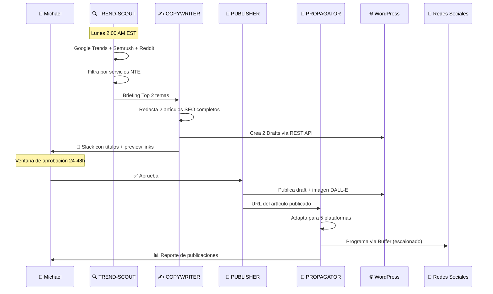

<div align="center">

# 📝 Blog Automation Pipeline
### Del Trend al Tweet — Completamente Automatizado

*4 agentes especializados · Activación semanal · Aprobación humana preservada*

</div>

---

## Vista General del Flujo



---

## Los 4 Agentes

| Agente | Rol | Modelo | Cuándo actúa |
|---|---|---|---|
| [🔍 NTE-TREND-SCOUT](./nte-trend-scout.md) | Investiga tendencias | Sonnet 4 | Lunes 2AM automático |
| [✍️ NTE-COPYWRITER](./nte-copywriter.md) | Redacta artículos | Sonnet 4 | Tras briefing de SCOUT |
| [🚀 NTE-PUBLISHER](./nte-publisher.md) | Publica en WordPress | Haiku 4 | Tras aprobación de Michael |
| [📡 NTE-PROPAGATOR](./nte-propagator.md) | Distribuye en RRSS | Sonnet 4 | Tras publicación en WP |

---

## Configuración de Aprobación en Slack

```
Michael puede aprobar de estas formas en el canal #nte-content:

✅ Reaccionar con emoji ✅ al mensaje del draft
💬 Responder "approved" o "publicar"
🔄 Responder "cambios:" seguido de las instrucciones
❌ Responder "rechazar" para descartar el artículo
```

> Si no hay respuesta en 48 horas, NTE-MAIN envía un recordatorio. Si tampoco hay respuesta en 72 horas, el draft se archiva y se notifica a Michael.

---

[← Todos los agentes](../../README.md) | [NTE-TREND-SCOUT →](./nte-trend-scout.md)
