# 📡 NTE-PROPAGATOR
### Social Media Propagation Agent

## 🎯 Qué hace

Toma cada artículo publicado y lo adapta creativamente para 5 plataformas distintas, programando las publicaciones de forma escalonada durante la semana para maximizar el alcance.

## 🎨 Adaptaciones por Plataforma

| Plataforma | Formato | Longitud | Estilo |
|---|---|---|---|
| **LinkedIn** | Extracto profesional + link | 300 palabras | Thought leadership · datos · insights |
| **Instagram** | Caption visual + hashtags | 150 palabras + 10 hashtags | Inspiracional · visual · CTA |
| **Facebook** | Post comunidad + pregunta | 200 palabras | Conversacional · engagement |
| **Twitter/X** | Hilo de 4-5 tweets | 280 chars × 5 | Directo · data points · thread |
| **YouTube Shorts** | Guión de 60 segundos | ~150 palabras | Dinámico · hook fuerte · CTA verbal |

## 📅 Programación Escalonada

```mermaid
gantt
    title Distribución semanal de contenido (artículo publicado el Lunes)
    dateFormat  DD
    axisFormat  Día %d
    section LinkedIn
    Post profesional        :01, 1d
    section Instagram
    Post + stories          :02, 1d
    stories día 3           :03, 1d
    section Facebook
    Post comunidad          :03, 1d
    section Twitter/X
    Hilo completo           :02, 1d
    Tweet de recordatorio   :05, 1d
    section YouTube
    Guión listo             :04, 1d
```

## 🛠️ Herramientas

- **Buffer API** — Programación en todas las plataformas
- **Meta Content API** — Publicación directa en FB/IG
- **LinkedIn API** — Posts profesionales
- **Twitter/X API v2** — Hilos y tweets

[← NTE-PUBLISHER](./nte-publisher.md) | [Lead Management →](../lead-management/README.md)
