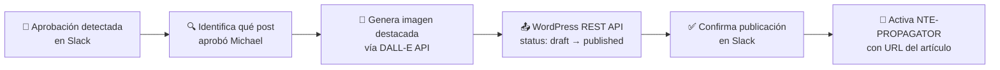

<div align="center">

# 🚀 NTE-PUBLISHER
### WordPress Publisher Agent


</div>

## 🎯 Qué hace

Monitorea el canal `#nte-content` en Slack esperando la aprobación de Michael. Cuando la detecta, publica el draft en WordPress, genera la imagen destacada con IA, y dispara NTE-PROPAGATOR.

## 🔍 Detección de Aprobación

NTE-PUBLISHER reconoce estas señales en Slack:
- Reacción emoji ✅ en el mensaje del draft
- Respuesta que contenga: "approved", "publicar", "adelante", "go"
- Mensaje directo: "publica el artículo X"

## ⚙️ Proceso de Publicación



## 🖼️ Generación de Imagen Destacada

```
Prompt DALL-E: "Professional technology illustration for blog post about 
[tema del artículo], corporate style, blue and white color palette, 
no text, modern minimalist, suitable for Nissi Technology Enterprises blog"
```

> **¿Por qué Haiku 4?** La tarea de NTE-PUBLISHER es simple: detectar un patrón en Slack y hacer 2-3 llamadas a APIs. No requiere razonamiento complejo. Haiku ejecuta esto perfectamente a una fracción del costo.

[← NTE-COPYWRITER](./nte-copywriter.md) | [NTE-PROPAGATOR →](./nte-propagator.md)
