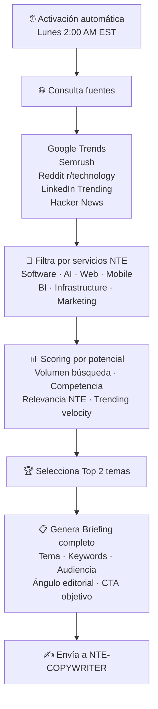

<div align="center">

# 🔍 NTE-TREND-SCOUT
### Trend Research Agent


</div>

## 🎯 Qué hace

Cada lunes a las 2:00 AM EST, NTE-TREND-SCOUT se activa y analiza el internet en busca de los temas tecnológicos más relevantes de la semana que estén alineados con los servicios de NTE.

## 🔎 Proceso de Investigación



## 📋 Formato del Briefing

```markdown
## BRIEFING SEMANAL NTE-TREND-SCOUT
Semana: [fecha]

### ARTÍCULO 1
- **Tema:** [título tentativo]
- **Keyword Principal:** [keyword con volumen X búsquedas/mes]
- **Keywords Secundarias:** [lista]
- **Audiencia Objetivo:** [perfil del lector ideal]
- **Ángulo Editorial:** [por qué es relevante AHORA para clientes NTE]
- **Servicios NTE Relacionados:** [qué servicios podemos vincular]
- **CTA Sugerido:** [qué acción queremos que tome el lector]
- **Longitud Recomendada:** [1200-1800 palabras]

### ARTÍCULO 2
[misma estructura]
```

## 🛠️ APIs Utilizadas

- **Google Trends API (Unofficial)** — Trending topics por región
- **Semrush API** — Volumen de búsqueda y dificultad de keyword
- **Reddit API** — Hilos más populares en subreddits tech
- **RSS Feeds** — Hacker News, TechCrunch, The Verge

[← Blog Pipeline](./README.md) | [NTE-COPYWRITER →](./nte-copywriter.md)
