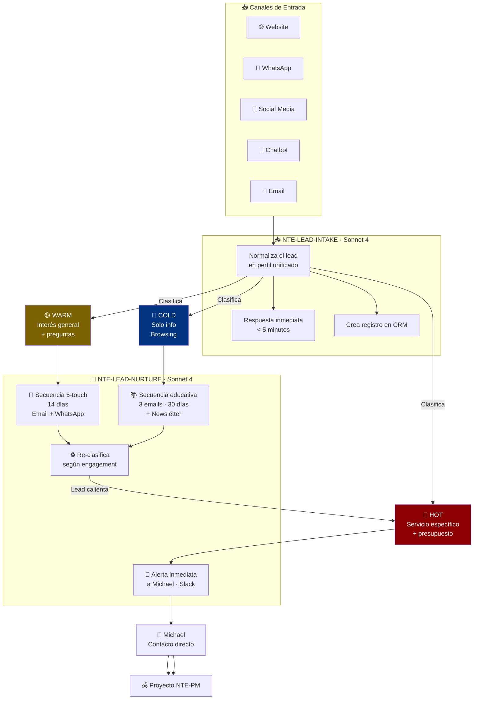

# 🎯 Lead Management Pipeline
### De Extraño a Cliente — Completamente Automatizado

*2 agentes especializados · Operación 24/7 · 3 niveles de clasificación*

---

## Flujo Completo

---

## Clasificación de Leads

### 🔴 HOT Lead — Acción Inmediata (< 15 min)
- Menciona un servicio específico ("necesito una app móvil")
- Tiene un presupuesto definido o timeline claro
- Ya tiene empresa establecida
- Fue referido por un cliente existente

### 🟡 WARM Lead — Nurturing 14 días
- Interés general en los servicios de NTE
- Hace preguntas pero no tiene claridad sobre lo que necesita
- Visitó el website varias veces (si se tiene tracking)
- Descargó un recurso o completó un formulario de contacto

### 🔵 COLD Lead — Educación 30 días
- Solo pidió información general
- No respondió preguntas de calificación
- Solo lee el blog o visita las redes sociales
- Muy temprano en su proceso de decisión

---

## Canales Monitoreados

| Canal | API | Tiempo de Respuesta |
|---|---|---|
| Website Forms | Webhook | < 2 min |
| WhatsApp Business | Twilio / Meta API | < 5 min |
| Facebook Messenger | Meta API | < 5 min |
| Instagram DMs | Meta API | < 5 min |
| Chat Web (Crisp) | Crisp Webhook | < 2 min |
| Email | Gmail API | < 10 min |

---

[← Todos los agentes](../../README.md) | [NTE-LEAD-INTAKE →](./nte-lead-intake.md)
