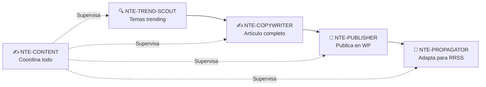

# ✍️ NTE-CONTENT
### Content & Marketing Agent

*La voz digital de NTE. Genera, programa y distribuye contenido alineado con la marca.*

---

## 🎯 Responsabilidades

Ejecuta el **calendario editorial mensual** de NTE de forma autónoma. Coordina con NTE-TREND-SCOUT para los artículos del blog y gestiona el contenido evergreen de las redes sociales.

---

## 📅 Calendario Editorial

| Canal | Frecuencia | Tipo de contenido |
|---|---|---|
| Blog WordPress | 2 artículos/semana | SEO · Educativo · Casos de uso |
| LinkedIn | 5 posts/semana | Profesional · Thought leadership |
| Instagram | 1 post + 3 stories/día | Visual · Tips · Behind the scenes |
| Facebook | 3 posts/semana | Comunidad · Noticias · Testimonios |
| Twitter/X | 2 tweets/día | Rápido · Tips · Noticias tech |
| Newsletter | 1 email/mes | Resumen + novedades NTE |

---

## 🔧 Pipeline de Contenido

---

## 🛠️ Herramientas & APIs

- **WordPress REST API** — Publicación del blog
- **Buffer API** — Programación de redes sociales
- **SendGrid / Mailchimp** — Newsletter mensual
- **DALL-E / Stable Diffusion** — Imágenes para contenido
- **Semrush API** — Keywords y análisis SEO

---

[← NTE-CX](./nte-cx.md) | [NTE-ANALYTICS →](./nte-analytics.md)
