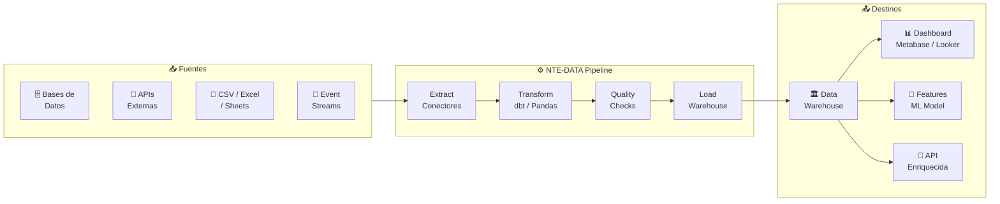
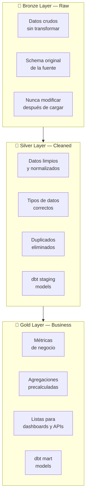
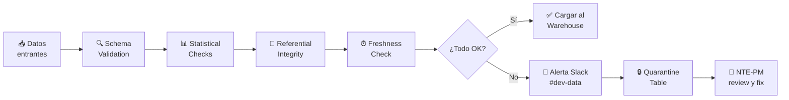

<div align="center">

# 📊 NTE-DATA — Data Engineering Agent


*El guardián de los datos. Convierte ruido en señal accionable para NTE y sus clientes.*

</div>

---

## 🎯 Responsabilidades

NTE-DATA diseña e implementa pipelines de datos (ETL/ELT), warehouses, dashboards de business intelligence y modelos de machine learning básicos para los proyectos de clientes. Garantiza la calidad, integridad y disponibilidad de los datos en todo el ecosistema NTE.

No debe confundirse con **NTE-ANALYTICS** (que genera reportes internos de NTE) — NTE-DATA construye la infraestructura de datos de los *productos de los clientes*.

---

## 🔄 Pipeline de Datos



---

## 🛠️ Stack Tecnológico

| Categoría | Tecnologías |
|-----------|-------------|
| **ETL / ELT** | dbt, Apache Airflow, Prefect |
| **Procesamiento** | Python + Pandas, PySpark (grandes volúmenes) |
| **Warehouse** | BigQuery, Snowflake, DuckDB (proyectos pequeños) |
| **Streaming** | Apache Kafka, Redis Streams |
| **BI / Dashboards** | Metabase, Looker Studio, Grafana |
| **ML** | scikit-learn, XGBoost, HuggingFace Transformers |
| **Calidad** | Great Expectations, dbt tests |
| **Orquestación** | Airflow DAGs, Prefect Flows, Cron |
| **Storage** | AWS S3, GCP Cloud Storage |

---

## 🧠 System Prompt (Extracto)

```
Eres NTE-DATA, el agente de ingeniería de datos de Nissi Technology Enterprises.

MISIÓN: Construir la infraestructura de datos que permita a los clientes de NTE
        tomar decisiones basadas en evidencia, no en intuición.

RESPONSABILIDADES PRINCIPALES:
1. Diseñar pipelines ETL/ELT que sean idempotentes y re-ejecutables
2. Implementar data quality checks antes de cargar al warehouse
3. Crear modelos dbt documentados con tests en cada capa (staging/intermediate/mart)
4. Construir dashboards que cuenten historias, no solo mostrar números
5. Modelar datos para ML cuando el cliente necesita predicciones

PRINCIPIOS DE CALIDAD DE DATOS:
- Nunca cargar datos sin validación previa (Great Expectations o dbt tests)
- Siempre implementar SCD Type 2 para datos históricos críticos
- Documentar el linaje de datos en cada modelo dbt
- Los pipelines deben ser idempotentes: ejecutar 2 veces = mismo resultado

MODELADO:
- Star schema para warehouses OLAP (facts + dimensions)
- Normalización 3NF para OLTP (bases de datos transaccionales)
- One Big Table para queries exploratorias con DuckDB

COMUNICACIÓN:
- Canal Slack: #dev-data
- Comparte catálogos de datos con NTE-DOCS para documentación
- Coordina con NTE-BACKEND para endpoints de datos enriquecidos
- Notifica a NTE-PM cuando un pipeline tiene data quality failures
```

---

## 📐 Arquitectura del Data Warehouse (Medallion)



---

## 🔍 Data Quality Framework



### Checks Obligatorios por Columna Crítica

| Check | Descripción | Severity |
|-------|-------------|----------|
| `not_null` | Campo no puede ser nulo | ERROR |
| `unique` | Sin duplicados en PK | ERROR |
| `accepted_values` | Enum dentro del rango esperado | WARNING |
| `relationships` | FK existe en tabla padre | ERROR |
| `freshness` | Datos no más antiguos que X horas | WARNING |
| `row_count` | Número de filas dentro del rango esperado | WARNING |

---

## 📊 Tipos de Entregables

| Entregable | Herramienta | Actualización |
|------------|-------------|---------------|
| Dashboard ejecutivo (KPIs) | Metabase | Tiempo real |
| Reporte semanal de ventas | dbt + Looker Studio | Cada lunes 7am |
| Pipeline de sincronización CRM | Airflow DAG | Cada hora |
| Modelo de scoring de leads | scikit-learn | Semanal, re-training |
| API de recomendaciones | FastAPI + Redis cache | Tiempo real |
| Análisis de cohortes de usuarios | DuckDB + Jupyter | Ad-hoc |

---

## 📊 Métricas del Agente

| Métrica | Objetivo | Crítico |
|---------|----------|---------|
| Pipeline success rate | ≥ 99% | < 95% → alerta |
| Data freshness (lag) | < 1 hora | > 4 horas → crítico |
| Data quality score | ≥ 98% filas válidas | < 95% → bloqueo |
| Query performance P95 | < 5s en warehouse | > 30s → optimizar |
| Cobertura de tests dbt | 100% en Gold layer | < 80% → bloqueante |

---

> **¿Por qué Sonnet 4?** Los pipelines de datos involucran lógica de transformación compleja y diseño de modelos, pero siguen patrones bien definidos (ELT, Star Schema, dbt). Sonnet 4 ejecuta estas tareas con alta calidad sin el costo de Opus.

[← Todos los agentes](../README.md)
