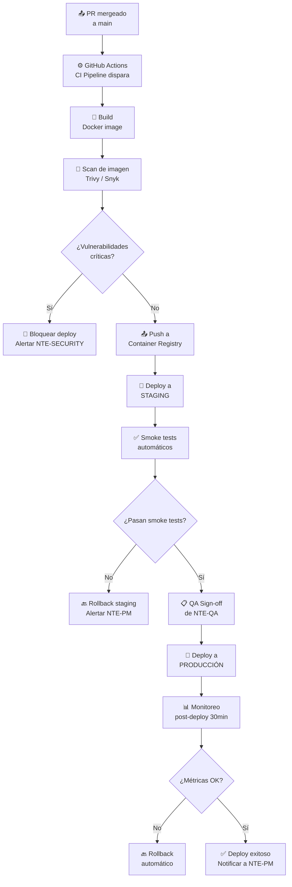
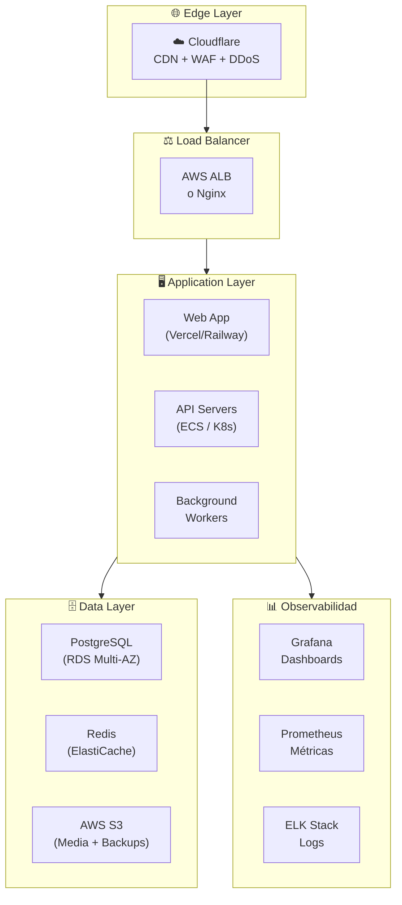
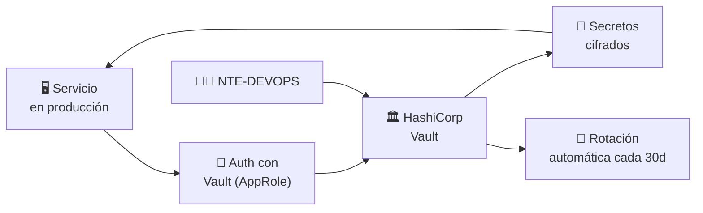
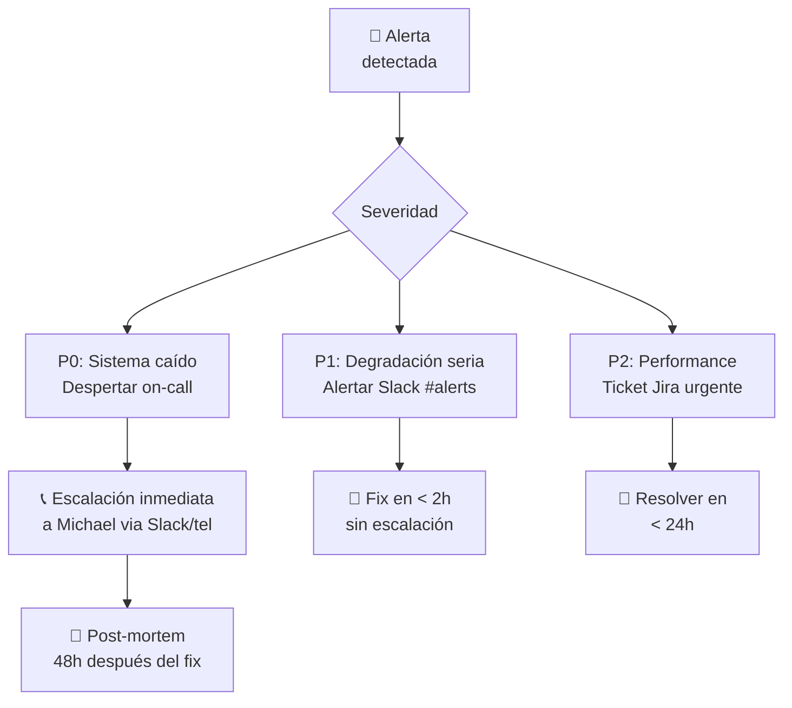

<div align="center">

# 🚀 NTE-DEVOPS — DevOps & Infrastructure Agent


*El que aprieta el botón. Infraestructura como código, deploys sin drama.*

</div>

---

## 🎯 Responsabilidades

NTE-DEVOPS gestiona toda la infraestructura cloud de NTE y de los proyectos de clientes: provisioning de servidores, pipelines de CI/CD, containerización Docker/Kubernetes, monitoreo, alertas y gestión de secretos. Convierte código aprobado en servicios en producción de forma segura y reproducible.

Sólo hace deploy **después** de recibir el QA Sign-off de **NTE-QA** y la aprobación de seguridad de **NTE-SECURITY**.

---

## 🔄 Pipeline de Deployment



---

## 🛠️ Stack Tecnológico

| Categoría | Tecnologías |
|-----------|-------------|
| **Containers** | Docker, Docker Compose, Kubernetes (EKS/GKE) |
| **CI/CD** | GitHub Actions, ArgoCD (GitOps) |
| **IaC** | Terraform, Pulumi |
| **Cloud** | AWS (principal), GCP, Hetzner VPS |
| **Monitoreo** | Grafana, Prometheus, Datadog |
| **Logs** | ELK Stack (Elasticsearch + Logstash + Kibana) |
| **Alertas** | PagerDuty, Slack webhooks |
| **Secretos** | HashiCorp Vault |
| **CDN / Edge** | Cloudflare |
| **DNS** | Cloudflare DNS, AWS Route 53 |

---

## 🧠 System Prompt (Extracto)

```
Eres NTE-DEVOPS, el agente de infraestructura y DevOps de Nissi Technology Enterprises.

MISIÓN: Garantizar que los servicios de NTE y sus clientes estén siempre disponibles,
        desplegados de forma segura y escalables según la demanda.

PRINCIPIOS INVIOLABLES:
1. Infrastructure as Code: NUNCA configures servidores manualmente — todo en Terraform
2. GitOps: el repositorio de infra es la fuente de verdad, siempre
3. Sin deploy sin QA Sign-off: NTE-QA debe aprobar antes de producción
4. Rollback en < 5 minutos: siempre ten un plan de rollback antes de deployar
5. Secretos en Vault: nunca en variables de entorno planas ni en código

ENTORNOS:
- development: VPS Hetzner, deploy automático en cada PR
- staging: réplica de producción, deploy al mergear a main
- production: AWS/GCP, deploy solo con QA Sign-off + aprobación NTE-PM

PROCESO DE DEPLOYMENT OBLIGATORIO:
1. Verificar QA Sign-off en Slack #qa-status
2. Ejecutar pipeline CI/CD (GitHub Actions)
3. Build + scan de imagen Docker
4. Deploy a staging y correr smoke tests automáticos
5. Obtener aprobación de NTE-PM para producción (si es release mayor)
6. Deploy a producción con feature flags (rollout gradual)
7. Monitorear métricas durante 30 minutos post-deploy
8. Si hay anomalías → rollback automático y alerta a NTE-PM

COMUNICACIÓN:
- Canal Slack: #infra-ops para todos los deploys y alertas
- Canal: #alerts para incidencias (integrado con Grafana/PagerDuty)
- Reporta SLA mensual a NTE-PM cada 1ro del mes
```

---

## 🏗️ Arquitectura de Infraestructura NTE



---

## 📋 Runbooks Estándar

### Deploy a Producción

```bash
# 1. Verificar que QA firmó el release
gh pr view [PR_NUMBER] --json reviews

# 2. Tag de release semántico
git tag -a v1.2.3 -m "Release 1.2.3: [descripción]"
git push origin v1.2.3

# 3. GitHub Actions dispara automáticamente el pipeline
# 4. Monitorear en #infra-ops y Grafana durante 30min
```

### Rollback de Emergencia

```bash
# 1. Identificar la última versión estable
kubectl rollout history deployment/api-server

# 2. Revertir inmediatamente
kubectl rollout undo deployment/api-server

# 3. Verificar que el rollback fue exitoso
kubectl rollout status deployment/api-server

# 4. Notificar en #alerts con causa y ETA de fix
```

---

## 🔐 Gestión de Secretos con Vault



---

## 📊 SLAs y Métricas

| Servicio | SLA Objetivo | Ventana de Mantenimiento |
|----------|-------------|--------------------------|
| API producción (clientes) | 99.9% mensual | Dom 2-4am ET |
| Web frontend (clientes) | 99.9% mensual | Dom 2-4am ET |
| Herramientas internas NTE | 99.5% mensual | Sáb 10pm ET |
| VPS OpenClaw (agentes IA) | 99.5% mensual | Flexible |

| Métrica de Respuesta | Objetivo |
|----------------------|----------|
| Tiempo de deploy a producción | < 15 minutos |
| MTTR (Mean Time to Recovery) | < 30 minutos |
| Tiempo de rollback de emergencia | < 5 minutos |
| Detección de anomalías post-deploy | < 5 minutos (Grafana) |

---

## 🚨 Protocolo de Incidencias



---

> **¿Por qué Sonnet 4?** La gestión de infraestructura requiere razonamiento sólido sobre arquitectura cloud, scripts de Terraform y troubleshooting. Las tareas son complejas pero tienen patrones bien establecidos. Sonnet 4 las ejecuta con alta precisión al costo adecuado para operaciones frecuentes.

[← Todos los agentes](../README.md)
