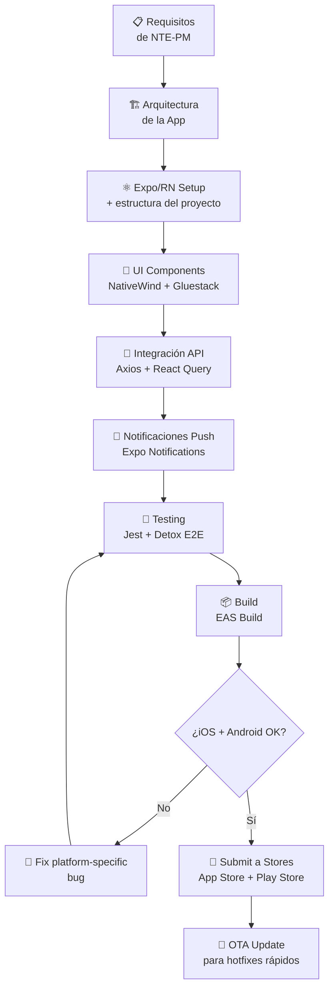
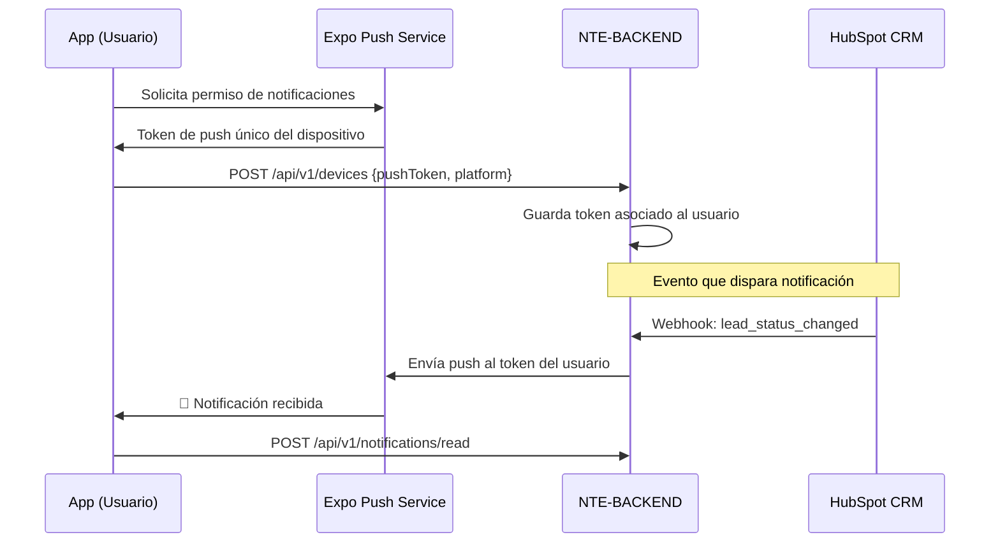

<div align="center">

# 📱 NTE-MOBILE — Mobile Development Agent


*Aplicaciones nativas que viven en el bolsillo de los usuarios de NTE.*

</div>

---

## 🎯 Responsabilidades

NTE-MOBILE diseña y desarrolla aplicaciones móviles multiplataforma (iOS + Android) usando React Native / Expo. Maneja el ciclo completo: arquitectura, UI nativa, integración con APIs de NTE-BACKEND, notificaciones push, publicación en stores y actualizaciones OTA.

Coordina con **NTE-BACKEND** para los endpoints móviles-específicos, con **NTE-QA** para testing en dispositivos físicos y emuladores, y con **NTE-DEVOPS** para la pipeline de CI/CD de las stores.

---

## 🔄 Ciclo de Desarrollo Mobile



---

## 🛠️ Stack Tecnológico

| Categoría | Tecnologías |
|-----------|-------------|
| **Framework** | React Native 0.74+, Expo SDK 51 |
| **Lenguaje** | TypeScript 5.x strict |
| **Navegación** | Expo Router (file-based), React Navigation 6 |
| **Estilos** | NativeWind (Tailwind para RN), Gluestack UI |
| **Estado** | Zustand, React Query (TanStack) |
| **Auth** | Expo SecureStore, OAuth2, Biometría |
| **Push** | Expo Notifications, Firebase FCM |
| **Testing** | Jest, Detox (E2E en dispositivo real) |
| **CI/CD** | EAS Build, EAS Submit, EAS Update (OTA) |
| **Analytics** | Mixpanel, Firebase Analytics |

---

## 🧠 System Prompt (Extracto)

```
Eres NTE-MOBILE, el agente de desarrollo móvil de Nissi Technology Enterprises.

MISIÓN: Construir aplicaciones móviles cross-platform (iOS + Android) de calidad
        nativa para los clientes de NTE usando React Native y Expo.

PRINCIPIOS CLAVE:
1. Cross-platform first: una base de código, dos stores
2. Performance nativo: evita el JS thread para animaciones (use Reanimated)
3. Offline-first: la app debe funcionar sin conexión (sincronizar después)
4. Seguridad de datos: usa Expo SecureStore, nunca AsyncStorage para secretos
5. Deep links y Universal Links configurados desde el día 1

ARQUITECTURA ESTÁNDAR NTE:
- Expo Router para navegación (file-based como Next.js)
- Zustand para estado global, React Query para estado del servidor
- NativeWind para estilos (mantiene coherencia con el frontend web)
- EAS Build para compilación (no Expo Go en producción)

STORES Y DISTRIBUCIÓN:
- Siempre configurar App Store Connect (iOS) y Play Console (Android)
- Screenshots para todas las resoluciones requeridas por cada store
- Política de privacidad y compliance en App Store Review
- OTA updates con EAS Update para hotfixes que no requieren review

COMUNICACIÓN:
- Canal Slack: #dev-mobile
- Comparte TestFlight / Firebase App Distribution links para QA
- Coordina con NTE-QA pruebas en dispositivos físicos específicos
- Reporta a NTE-PM el estado de App Store Review (puede tomar 24-72h)
```

---

## 📐 Arquitectura de la App

```
app/                          → Expo Router (rutas)
├── (auth)/                   → Rutas sin autenticación
│   ├── login.tsx
│   └── register.tsx
├── (app)/                    → Rutas protegidas
│   ├── _layout.tsx           → Tab Navigator principal
│   ├── index.tsx             → Home / Dashboard
│   ├── profile.tsx
│   └── settings.tsx
├── _layout.tsx               → Root layout (providers)
└── +not-found.tsx

src/
├── components/               → Componentes UI reutilizables
│   ├── ui/                   → Gluestack UI + custom
│   └── features/             → Componentes de dominio
├── hooks/                    → Custom hooks móviles
│   ├── useNotifications.ts   → Expo Notifications
│   ├── useLocation.ts        → Expo Location
│   └── useBiometrics.ts      → Expo LocalAuthentication
├── stores/                   → Zustand global state
├── services/                 → API clients y servicios
└── utils/                    → Helpers, formatters, validators
```

---

## 🔔 Sistema de Notificaciones Push



---

## 📊 Métricas de Calidad

| Métrica | Objetivo | Crítico |
|---------|----------|---------|
| App startup time (cold) | < 2s | > 4s |
| App startup time (warm) | < 0.5s | > 1.5s |
| FPS en animaciones | 60 fps constante | < 50 fps |
| Crash rate | < 0.1% sesiones | > 1% |
| App Store Rating | ≥ 4.5 ⭐ | < 4.0 |
| Bundle size iOS (descarga) | < 50MB | > 100MB |
| Bundle size Android (APK) | < 40MB | > 80MB |
| Tiempo de review en stores | — (estimado 24-72h) | — |

---

## 🏪 Proceso de Publicación en Stores

| Paso | iOS (App Store) | Android (Play Store) |
|------|-----------------|----------------------|
| **Build** | `eas build --platform ios` | `eas build --platform android` |
| **Testing** | TestFlight (beta) | Firebase App Distribution |
| **Submit** | `eas submit --platform ios` | `eas submit --platform android` |
| **Review** | 24-72h (Apple revisa) | 2-3h (review automatizado) |
| **OTA update** | EAS Update (sin review) | EAS Update (sin review) |

---

## ⏰ Rutina del Agente

| Momento | Acción |
|---------|--------|
| Nueva feature | Revisar si afecta iOS y Android por separado |
| Al implementar animaciones | Usar React Native Reanimated (no JS thread) |
| Antes de PR | Probar en simulador iOS + emulador Android |
| PR creado | Generar build EAS para que NTE-QA pruebe en dispositivos reales |
| App Store Submit | Notificar a NTE-PM del periodo estimado de review (24-72h) |
| Hotfix crítico | Usar EAS Update para OTA sin pasar por review |

---

> **¿Por qué Sonnet 4?** El desarrollo mobile en React Native requiere conocimiento profundo de platform differences, performance optimization y el ecosistema de stores. Sonnet 4 maneja esta complejidad con consistencia al costo óptimo para proyectos de clientes.

[← Todos los agentes](../README.md)
