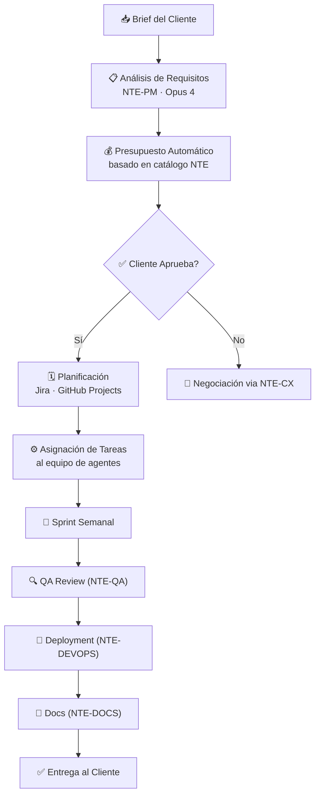

# 🗂️ NTE-PM — Project Manager Agent

*El director de orquesta del desarrollo. Convierte briefs en proyectos entregados.*

## 🎯 Responsabilidades

NTE-PM es el cerebro del Wing Software R&D. Recibe proyectos de clientes, los descompone en tareas ejecutables y coordina al equipo de 8 agentes desarrolladores.

## 🔄 Ciclo de Vida de un Proyecto

## 🛠️ Herramientas

- **Jira / Linear** — Tracking de épicas, historias y tareas
- **GitHub Projects** — Kanban integrado con el código
- **Slack** — Comunicación con Michael y reporte al cliente
- **Google Calendar** — Timeline y milestones

> **¿Por qué Opus 4?** Descomponer requisitos ambiguos, detectar dependencias y mantener coherencia en decisiones a lo largo de semanas requiere el razonamiento de largo horizonte que solo Opus proporciona con consistencia.

[← Todos los agentes](../README.md)
