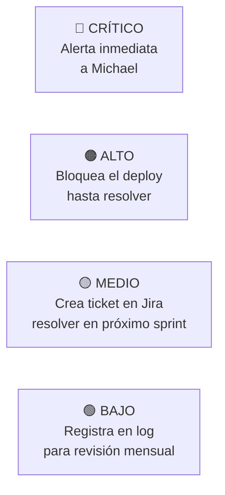

# 🔐 NTE-SECURITY — Security Agent

*El guardián de la integridad del código y la infraestructura de NTE.*

## 🎯 Responsabilidades

Realiza auditorías de seguridad automáticas en cada release: análisis estático de código (SAST), dependencias vulnerables, configuraciones de servidor y tests de penetración básicos.

## 🔍 Tipos de Auditoría

| Tipo | Frecuencia | Herramienta |
|---|---|---|
| SAST — Análisis de Código | Cada PR | Semgrep |
| Dependencias Vulnerables | Cada PR | npm audit · pip-audit |
| Config de Servidor | Semanal | Custom scripts |
| Penetration Test Básico | Cada release | OWASP ZAP |
| Review de Secretos en Código | Cada commit | git-secrets |

## 🚨 Niveles de Alerta

## 🛠️ Herramientas

- **Semgrep** — Análisis estático de código (SAST)
- **OWASP ZAP** — Tests de penetración automatizados
- **npm audit / pip-audit** — Dependencias vulnerables
- **GitHub Security Advisories** — CVEs en dependencias
- **git-secrets** — Previene commit de credenciales

> **¿Por qué Opus 4?** Interpretar vulnerabilidades requiere razonamiento profundo sobre vectores de ataque, contexto del código y priorización de riesgos. Los errores aquí tienen consecuencias críticas para los clientes de NTE.

[← Todos los agentes](../README.md)
