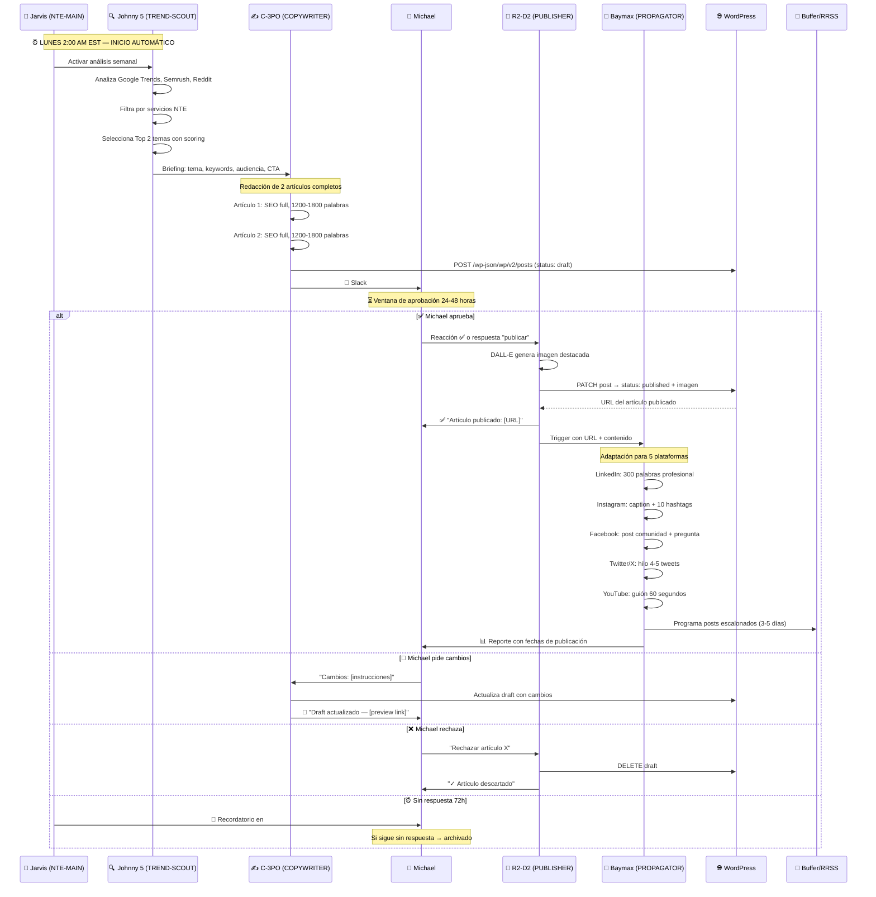

# 🔄 Flujo: Blog Semanal Automatizado
### Del Trend al Tweet en 48 horas

## Diagrama Secuencial Completo

## Timeline Típico

| Hora | Evento |
|---|---|
| Lunes 2:00 AM | Johnny 5 (NTE-TREND-SCOUT) inicia análisis |
| Lunes 2:30 AM | Briefing enviado a C-3PO (NTE-COPYWRITER) |
| Lunes 5:00 AM | 2 artículos redactados y subidos como drafts |
| Lunes 7:00 AM | Michael recibe notificación en Slack |
| Lunes/Martes | Michael revisa y aprueba |
| +30 min | Artículo publicado + imagen generada |
| Semana | Posts en RRSS distribuidos escalonadamente |

[← Todos los flujos](./README.md)
