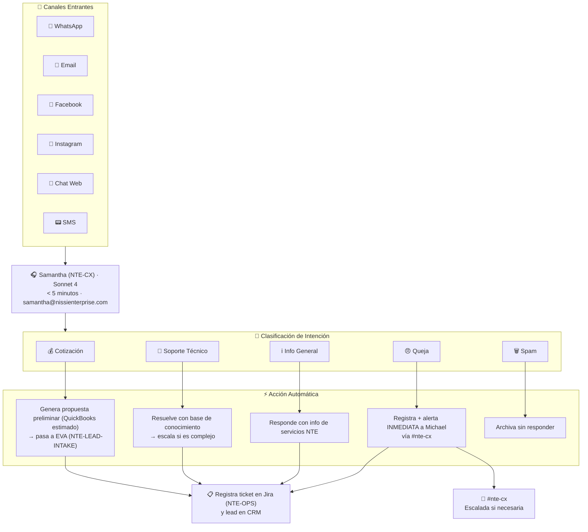

# 🎧 Flujo: Atención al Cliente Omnicanal
### Respuesta < 5 Minutos · 24/7 · En Todos los Canales

## Respuestas Tipo por Canal

**WhatsApp Business:**
> "¡Hola [Nombre]! 👋 Soy el asistente de Nissi Technology Enterprises. Recibí tu mensaje sobre [tema detectado]. Para darte la mejor atención, ¿puedes contarme un poco más sobre [pregunta de calificación]? Mientras tanto, aquí tienes información sobre nuestros servicios relacionados: [link]. ¡Un experto de nuestro equipo te contactará muy pronto!"

**Email (desde samantha@nissienterprise.com):**
> Asunto: Re: Tu consulta a Nissi Technology Enterprises
> "Hola [Nombre], gracias por contactarnos. He recibido tu mensaje y lo estoy procesando..."

[← Flujos](./README.md)
