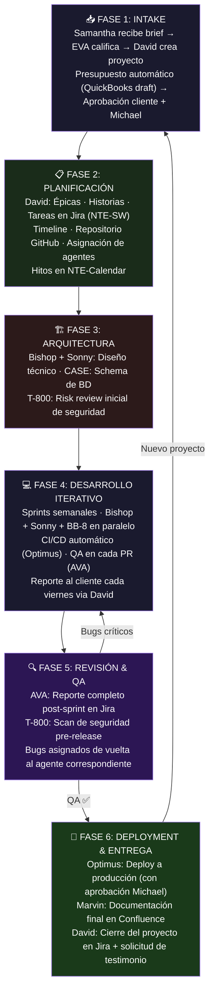

# ⚙️ Flujo: Desarrollo de Software Automatizado
### Las 6 Fases — De Brief a Entrega

## Roles por Fase

| Fase | Agentes Activos | Output |
|---|---|---|
| 1. Intake | Samantha (NTE-CX) · EVA (NTE-LEAD-INTAKE) · David (NTE-PM) | Brief estructurado + QuickBooks estimado aprobado |
| 2. Planificación | David (NTE-PM) | Jira board (NTE-SW) + repo GitHub + NTE-Calendar |
| 3. Arquitectura | David · Bishop · Sonny · T-800 | Documento de arquitectura técnica |
| 4. Desarrollo | Bishop · Sonny · BB-8 · CASE · AVA · Optimus | Código + CI/CD pipeline funcionando |
| 5. QA & Revisión | AVA (NTE-QA) · T-800 (NTE-SECURITY) | Reporte de bugs en Jira + security clearance |
| 6. Entrega | Optimus · Marvin · David | App en producción + documentación en Confluence |

---

## SCRUM: Detalle del Proceso

La Fase 4 (Desarrollo Iterativo) opera bajo **sprints semanales** con Jira (proyecto `NTE-SW`).

Consulta el documento completo del proceso SCRUM:

**[→ Workflow SCRUM Detallado: Ceremonias · Jira · Branches · Definition of Done](./flujo-scrum-detallado.md)**

Incluye:
- Sprint Planning, Daily Standup, Sprint Review, Retrospectiva
- Columnas del board Jira y lifecycle de tickets
- Convención de branches y commits (Conventional Commits)
- Definition of Done completo
- Gestión de hotfixes en producción
- KPIs del proceso ágil

[← Todos los flujos](./README.md)
