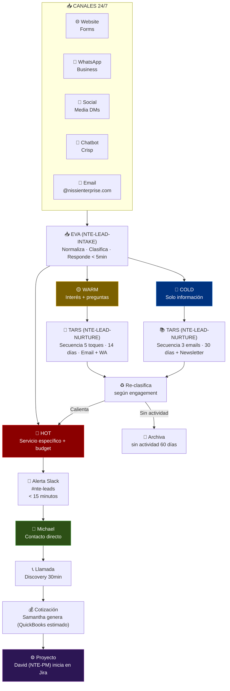

# 🎯 Flujo: Gestión de Leads Multicanal
### De Extraño a Cliente en Tiempo Real

## Diagrama del Ciclo de Vida del Lead

## Métricas del Pipeline

| Métrica | Meta |
|---|---|
| Tiempo de primera respuesta | < 5 minutos |
| Tasa de conversión COLD → WARM | > 20% en 30 días |
| Tasa de conversión WARM → HOT | > 15% en 14 días |
| HOT leads cerrados | > 30% |
| Consultas resueltas sin escalada | > 70% |

[← Todos los flujos](./README.md)
