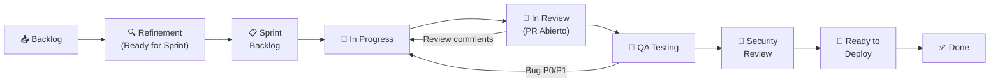
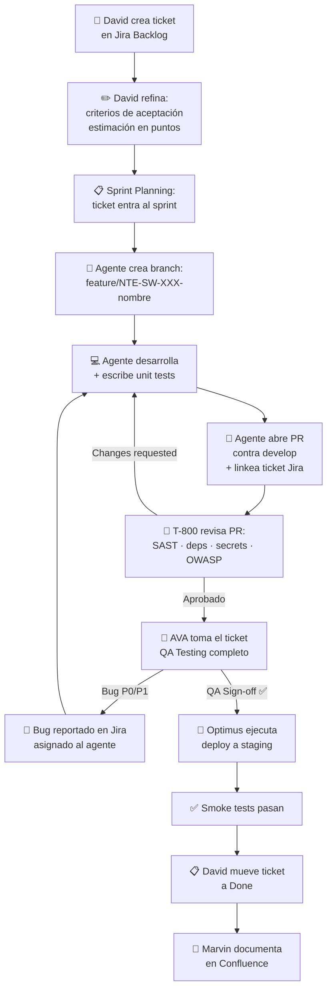
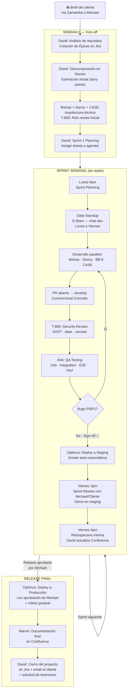
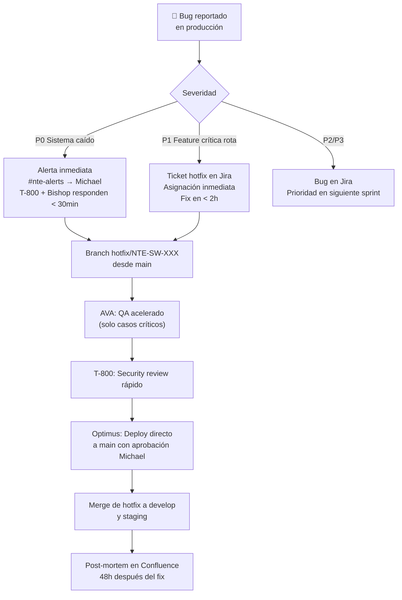

<div align="center">

# ⚙️ Workflow de Desarrollo: SCRUM con Jira
### Cómo el Wing Software R&D ejecuta proyectos de forma ágil

</div>

---

## 1. Estructura General del SCRUM en NTE

NTE opera con **sprints semanales** (lunes a viernes). Cada proyecto de cliente tiene su propio Jira board bajo el proyecto **`NTE-SW`**. David (NTE-PM) es el Scrum Master funcional y lleva la relación directa con Michael como Product Owner delegado.

```
Sprint = 1 semana (Lunes 9am → Viernes 5pm ET)
Jira Project: NTE-SW
Board type: Scrum
Slack channel: #nte-dev
```

---

## 2. Jerarquía de Tickets en Jira

```
Epic  →  Story  →  Task / Subtask  →  Bug
```

| Tipo | Prefijo | Descripción | Responsable |
|------|---------|-------------|-------------|
| **Epic** | `NTE-SW-XXX` | Módulo grande del proyecto (ej. "Autenticación de usuarios") | David (NTE-PM) |
| **Story** | `NTE-SW-XXX` | Feature entregable desde el punto de vista del usuario | David (NTE-PM) |
| **Task** | `NTE-SW-XXX` | Trabajo técnico concreto asignado a un agente | Agente asignado |
| **Subtask** | `NTE-SW-XXX` | Pasos internos de una Task | Agente asignado |
| **Bug** | `NTE-SW-XXX` | Defecto reportado por AVA o producción | AVA → agente correspondiente |

### Campos obligatorios en cada ticket

| Campo | Descripción |
|-------|-------------|
| `Assignee` | El agente responsable (ej. `bishop@nissienterprise.com`) |
| `Sprint` | Sprint activo al que pertenece |
| `Epic Link` | Epic padre |
| `Story Points` | Estimación en puntos (1, 2, 3, 5, 8, 13) |
| `Priority` | P0 / P1 / P2 / P3 / P4 |
| `Labels` | `backend`, `frontend`, `mobile`, `data`, `qa`, `security`, `devops`, `docs` |
| `Fix Version` | Versión semántica del release (ej. `v1.2.0`) |
| `Acceptance Criteria` | Criterios de aceptación en el campo Description |

---

## 3. Columnas del Board Jira (NTE-SW)



| Columna | Trigger de entrada | Responsable |
|---------|-------------------|-------------|
| **Backlog** | David crea el ticket | David (NTE-PM) |
| **Refinement** | Ticket estimado y con criterios de aceptación | David (NTE-PM) |
| **Sprint Backlog** | Sprint Planning lo incluye en el sprint activo | David (NTE-PM) |
| **In Progress** | Agente abre branch `feature/NTE-SW-XXX-descripcion` | Agente asignado |
| **In Review** | PR abierto contra `develop`, ticket linkeado | Agente asignado |
| **QA Testing** | T-800 aprueba el PR → AVA toma el ticket | AVA (NTE-QA) |
| **Security Review** | AVA da QA Sign-off → T-800 hace scan final | T-800 (NTE-SECURITY) |
| **Ready to Deploy** | T-800 aprueba → Optimus schedula deploy | Optimus (NTE-DEVOPS) |
| **Done** | Deploy a producción exitoso → Marvin documenta | David cierra ticket |

---

## 4. Ceremonias SCRUM

### 4.1 Sprint Planning — Lunes 9:00 AM ET

**Participantes:** David (NTE-PM) · Michael (Product Owner) · Agentes de desarrollo (pasivos)

**Agenda:**
1. David presenta el Sprint Goal propuesto
2. Michael aprueba prioridades del backlog refinado
3. David asigna Stories/Tasks a cada agente según capacidad
4. Se define el Sprint Backlog final en Jira
5. David confirma en `#nte-dev`: resumen del sprint + tickets asignados

**Output en Jira:**
- Sprint activo creado con nombre: `NTE-SW Sprint YYYY-WW` (ej. `NTE-SW Sprint 2026-18`)
- Todos los tickets movidos a columna **Sprint Backlog**
- Story points comprometidos documentados en la descripción del sprint

---

### 4.2 Daily Standup — Lunes a Viernes (Async, 9:30 AM ET)

**Canal:** `#nte-dev`

Cada agente activo publica su update en formato estándar:

```
🤖 [NOMBRE AGENTE] — NTE-SW Daily
✅ Completado: [qué terminé ayer / esta mañana]
🏃 En progreso: [en qué estoy trabajando] — [NTE-SW-XXX]
🚧 Bloqueadores: [impedimentos o dependencias] / Ninguno
📅 Plan hoy: [qué voy a completar hoy]
```

**Ejemplo real:**
```
🤖 BISHOP — NTE-SW Daily
✅ Completado: Endpoint POST /auth/login con JWT — NTE-SW-042
🏃 En progreso: Middleware de autorización por roles — NTE-SW-043
🚧 Bloqueadores: Esperando schema final de CASE para tabla users
📅 Plan hoy: Completar middleware + unit tests (≥ 80%)
```

David monitorea `#nte-dev` y escala a Michael cualquier bloqueador crítico via `#nte-alerts`.

---

### 4.3 Backlog Refinement — Miércoles 2:00 PM ET

**Participantes:** David (NTE-PM) · Michael (si hay nuevas historias del cliente)

**Agenda:**
1. David revisa tickets del backlog sin estimar
2. Agrega/clarifica criterios de aceptación
3. Asigna story points usando la serie Fibonacci (1, 2, 3, 5, 8, 13)
4. Prioriza con labels `must-have`, `should-have`, `nice-to-have`
5. Mueve tickets listos a columna **Refinement**

**Regla:** Nunca entra al sprint un ticket sin story points y sin criterios de aceptación.

---

### 4.4 Sprint Review — Viernes 3:00 PM ET

**Participantes:** David (NTE-PM) · Michael · (Cliente si corresponde)

**Agenda:**
1. David presenta los tickets completados en el sprint
2. Demo de features en ambiente staging (Optimus provee URL)
3. Michael/Cliente acepta o rechaza items
4. Tickets rechazados vuelven al Backlog con comentario
5. David actualiza velocidad del equipo (story points completados)
6. David envía email de reporte semanal al cliente via `david@nissienterprise.com`

**Template email de reporte:**
```
Asunto: [Proyecto X] — Reporte Sprint NTE-SW Sprint 2026-WW

Hola [Cliente],

Esta semana completamos:
• [Feature 1] — ✅ Disponible en staging
• [Feature 2] — ✅ Disponible en staging
• [Feature 3] — 🔄 En QA, disponible lunes

Próxima semana trabajaremos en:
• [Next Sprint items]

URL Staging: https://staging.[proyecto].nissienterprise.com
Próxima demo: [fecha]

Saludos,
Equipo NTE
```

---

### 4.5 Sprint Retrospectiva — Viernes 4:00 PM ET (Interna)

**Participantes:** David (NTE-PM) — reporta a Michael

**Formato (en Confluence, sección del proyecto):**

| ✅ Qué salió bien | 🔧 Qué mejorar | 💡 Acciones para próximo sprint |
|-------------------|----------------|--------------------------------|
| [Logros técnicos] | [Problemas detectados] | [Mejoras concretas] |

David guarda cada retrospectiva en Confluence bajo: `NTE > Software R&D > [Proyecto] > Retrospectivas`

---

## 5. Lifecycle Completo de un Ticket



---

## 6. Estrategia de Branches (Git Flow adaptado)

```
main          ← Producción. Solo Optimus hace merge aquí.
staging       ← Pre-producción. Requiere QA Sign-off.
develop       ← Integración continua. Target de todos los PRs de features.
│
├── feature/NTE-SW-042-auth-login-endpoint    ← Bishop (backend)
├── feature/NTE-SW-043-login-ui-form          ← Sonny (frontend)
├── feature/NTE-SW-044-auth-db-schema         ← CASE (data)
├── feature/NTE-SW-045-login-e2e-tests        ← AVA (qa)
└── hotfix/NTE-SW-099-fix-token-expiry        ← Emergencia en producción
```

### Convención de nombres de branch

```
feature/NTE-SW-[NÚMERO]-[descripcion-en-kebab-case]
bugfix/NTE-SW-[NÚMERO]-[descripcion-en-kebab-case]
hotfix/NTE-SW-[NÚMERO]-[descripcion-en-kebab-case]
```

### Convención de commits (Conventional Commits)

```
feat(NTE-SW-042): add JWT authentication endpoint
fix(NTE-SW-099): correct token expiry validation
test(NTE-SW-045): add E2E tests for login flow
docs(NTE-SW-001): update API authentication docs
chore(NTE-SW-010): upgrade dependencies to latest
```

### Reglas de PRs

| Regla | Detalle |
|-------|---------|
| Target branch | Siempre `develop` (nunca directo a `main` o `staging`) |
| Título del PR | `[NTE-SW-XXX] Descripción concisa` |
| Link Jira | Smart commit automático o link manual en el PR |
| Reviewers | T-800 (siempre) + David (en features críticas) |
| Checks requeridos | CI verde + T-800 approval + AVA sign-off |
| Squash commits | Sí, al hacer merge a `develop` |

---

## 7. Definition of Done (DoD)

Un ticket solo puede marcarse **Done** en Jira cuando cumple **todos** los criterios:

### Desarrollo
- [ ] Código implementado según criterios de aceptación del ticket
- [ ] Unit tests escritos con cobertura ≥ 80% (Jest / Pytest)
- [ ] Integration tests para todos los endpoints críticos
- [ ] Sin errores de linting (ESLint / Pylint)
- [ ] Sin secrets hardcodeados en el código
- [ ] Branch feature mergeada a `develop` mediante PR

### Revisión de Código
- [ ] T-800 aprobó el PR (SAST Semgrep + audit de dependencias)
- [ ] Sin vulnerabilidades críticas (CVE-7.0+) en dependencias
- [ ] Convenciones de commits seguidas (Conventional Commits)

### QA
- [ ] AVA ejecutó el plan de tests completo
- [ ] 0 bugs P0 o P1 abiertos relacionados al ticket
- [ ] Tests E2E pasando en browsers objetivo (Chrome, Safari, Firefox, Edge)
- [ ] Performance: Lighthouse ≥ 90 (si aplica a frontend)
- [ ] AVA emitió QA Sign-off en `#qa-status`

### Deployment
- [ ] Code mergeado a `staging` y desplegado por Optimus
- [ ] Smoke tests automáticos pasando en staging
- [ ] Métricas normales post-deploy (30 min monitoreo Grafana)

### Documentación
- [ ] Marvin actualizó documentación técnica en Confluence
- [ ] README del repo actualizado si cambia la arquitectura
- [ ] Changelog actualizado con la versión correspondiente

---

## 8. Roles de Cada Agente en el SCRUM

| Agente | Modelo | Rol SCRUM | Ceremonies que participa |
|--------|--------|-----------|--------------------------|
| **David** (NTE-PM) | Opus 4 | Scrum Master funcional | Todas |
| **Bishop** (NTE-BACKEND) | Sonnet 4 | Developer | Daily · Sprint Planning (pasivo) |
| **Sonny** (NTE-FRONTEND) | Sonnet 4 | Developer | Daily · Sprint Planning (pasivo) |
| **BB-8** (NTE-MOBILE) | Sonnet 4 | Developer | Daily · Sprint Planning (pasivo) |
| **CASE** (NTE-DATA) | Sonnet 4 | Developer | Daily · Sprint Planning (pasivo) |
| **AVA** (NTE-QA) | Sonnet 4 | QA Lead | Daily · Sprint Review (demo support) |
| **T-800** (NTE-SECURITY) | Opus 4 | Security Gate | PR reviews (continuo) · Sprint Review |
| **Optimus** (NTE-DEVOPS) | Sonnet 4 | DevOps | Sprint Review (staging deploy) |
| **Marvin** (NTE-DOCS) | Haiku 4 | Technical Writer | Sprint Review (docs al final) |
| **Michael** | — | Product Owner | Sprint Planning · Sprint Review |

---

## 9. Flujo Completo: Del Brief al Deploy



---

## 10. Integración Jira ↔ GitHub ↔ Slack

```mermaid
flowchart LR
    DEV["👨‍💻 Agente\nescribe código"] --> GIT["git commit\n'feat(NTE-SW-042): ...'"]
    GIT --> PR_OPEN["GitHub PR abierto"]
    PR_OPEN --> JIRA1["Jira: ticket → In Review\n(Smart commit automático)"]
    PR_OPEN --> SLACK1["Slack #nte-dev:\nnotificación de PR abierto"]
    JIRA1 --> T800_REVIEW["T-800 revisa PR"]
    T800_REVIEW --> GH_APPROVE["GitHub: PR approved"]
    GH_APPROVE --> AVA_NOTIF["Slack #qa-status:\nAVA notificada para QA"]
    AVA_NOTIF --> AVA_TEST["AVA ejecuta tests"]
    AVA_TEST --> SIGNOFF["AVA publica QA Sign-off\nen #qa-status"]
    SIGNOFF --> JIRA2["Jira: ticket → Ready to Deploy"]
    JIRA2 --> OPTIMUS["Optimus deploya a staging\nnotifica en #infra-ops"]
    OPTIMUS --> JIRA3["Jira: ticket → Done\ntras deploy a producción"]
    JIRA3 --> MARVIN["Marvin documenta\nen Confluence"]
```



### Slack Channels por función

| Channel | Uso |
|---------|-----|
| `#nte-dev` | Daily standups, updates del sprint, PRs, decisiones técnicas |
| `#qa-status` | AVA publica sign-offs y reportes de bugs |
| `#infra-ops` | Optimus publica deploys, alertas de infraestructura |
| `#nte-alerts` | Escalaciones críticas a Michael (P0, contratos, seguridad) |
| `#nte-reports` | Reportes semanales de David al cierre del sprint |

---

## 11. Gestión de Hotfixes (Bugs en Producción)



**Regla de oro:** Todo hotfix a `main` requiere aprobación explícita de Michael vía `#nte-alerts`.

---

## 12. KPIs del Proceso SCRUM

| Métrica | Objetivo | Crítico | Responsable |
|---------|----------|---------|-------------|
| **Velocity** (SP por sprint) | Creciente sprint a sprint | Caída > 30% dos sprints | David |
| **Sprint Commitment Rate** | ≥ 85% de SP comprometidos completados | < 70% | David |
| **Cycle Time** (In Progress → Done) | < 3 días para tasks estándar | > 5 días | David |
| **Defect Escape Rate** | < 2% de bugs llegan a producción | > 5% | AVA |
| **PR Review Time** (T-800) | < 4 horas | > 24 horas | T-800 |
| **Deploy Lead Time** (Done → Producción) | < 24 horas | > 72 horas | Optimus |
| **MTTR** (tiempo de recovery en P0) | < 30 minutos | > 2 horas | Optimus + Bishop |

David reporta estas métricas en el Sprint Review y en `#nte-reports` cada viernes.

---

## 13. Herramientas y Configuración

| Herramienta | Uso | Configuración |
|-------------|-----|---------------|
| **Jira** | Board NTE-SW, sprints, epics, stories, bugs | Proyecto tipo Scrum, sprints semanales |
| **Confluence** | Wiki técnica, retrospectivas, ADRs, docs finales | Space: NTE > Software R&D |
| **GitHub** | Código fuente, PRs, CI/CD | Branch protection: `main` y `staging` requieren PR + reviews |
| **GitHub Actions** | CI/CD pipeline automático | Corre en cada PR: build + tests + SAST |
| **Slack** | Comunicación async del equipo | Bots: Jira notificaciones, GitHub PR alerts |
| **Grafana** | Monitoreo post-deploy | Alertas integradas con `#infra-ops` |

---

[← Todos los flujos](./README.md)
