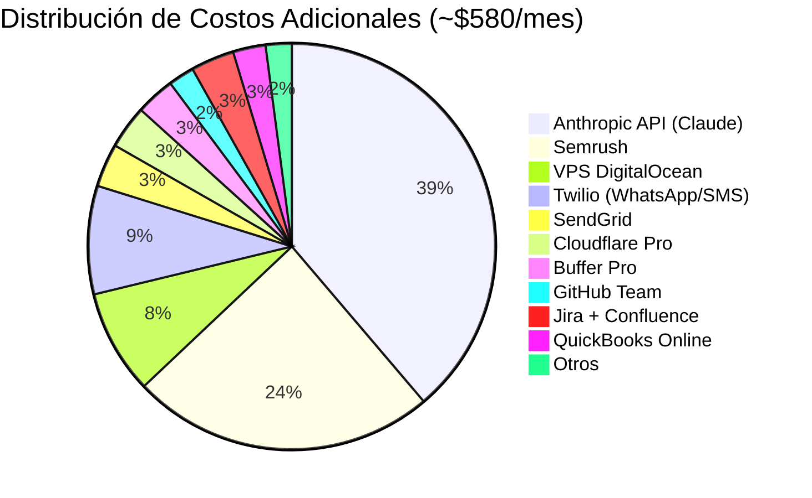

<div align="center">

# 🛠️ Stack Tecnológico Completo
### Todas las herramientas del ecosistema NTE-OpenClaw

</div>

---

## Motor Principal de IA

| Herramienta | Función | Agentes que la usan |
|---|---|---|
| OpenClaw (Claude Code SDK) | Motor de agentes en VPS | Todos |
| Claude Opus 4 | LLM para decisiones complejas | Jarvis · David · T-800 |
| Claude Sonnet 4 | LLM para operaciones estándar | 12 agentes |
| Claude Haiku 4 | LLM para tareas de alta frecuencia | HAL · R2-D2 · Marvin |

---

## Comunicación Hub

| Herramienta | Función | Costo |
|---|---|---|
| **Slack** | Hub central de comunicación humano-agente | $0 (plan free inicial) |
| **Twilio** | WhatsApp Business + SMS | ~$50/mes (pay-per-use) |
| **Meta API** | Facebook + Instagram Messenger | $0 |
| **Crisp** | Live chat en el website | $0-$25/mes |

---

## 📧 Email Corporativo — @nissienterprise.com

> ⚠️ **NO se usa Gmail** para ningún agente. Todos los emails corporativos usan el servidor propio de NTE.

| Componente | Detalle |
|---|---|
| **Servidor** | mail.nissienterprise.com |
| **Dominio** | @nissienterprise.com |
| **Protocolo envío** | SMTP/TLS — Puerto 587 |
| **Protocolo recepción** | IMAP/SSL — Puerto 993 |
| **Credenciales** | Azure Key Vault → `secret/nte-email-smtp` |
| **Proveedor hosting** | Servidor propio NTE (Plesk) |

### Emails de Agentes

| Agente | Email |
|---|---|
| Jarvis (NTE-MAIN) | jarvis@nissienterprise.com |
| Samantha (NTE-CX) | samantha@nissienterprise.com |
| WALL-E (NTE-CONTENT) | walle@nissienterprise.com |
| HAL (NTE-ANALYTICS) | hal@nissienterprise.com |
| Johnny 5 (NTE-TREND-SCOUT) | johnny5@nissienterprise.com |
| C-3PO (NTE-COPYWRITER) | c3po@nissienterprise.com |
| R2-D2 (NTE-PUBLISHER) | r2d2@nissienterprise.com |
| Baymax (NTE-PROPAGATOR) | baymax@nissienterprise.com |
| EVA (NTE-LEAD-INTAKE) | eva@nissienterprise.com |
| TARS (NTE-LEAD-NURTURE) | tars@nissienterprise.com |
| David (NTE-PM) | david@nissienterprise.com |
| Bishop (NTE-BACKEND) | bishop@nissienterprise.com |
| Sonny (NTE-FRONTEND) | sonny@nissienterprise.com |
| BB-8 (NTE-MOBILE) | bb8@nissienterprise.com |
| CASE (NTE-DATA) | case@nissienterprise.com |
| AVA (NTE-QA) | ava@nissienterprise.com |
| Optimus (NTE-DEVOPS) | optimus@nissienterprise.com |
| T-800 (NTE-SECURITY) | t800@nissienterprise.com |
| Marvin (NTE-DOCS) | marvin@nissienterprise.com |

---

## Gestión de Proyectos & Tareas

> ✅ **Stack oficial: Jira** — Es la única herramienta de tracking de proyectos y sprints de NTE.

| Herramienta | Función | Costo |
|---|---|---|
| **Jira** | Tracking de tareas, sprints, epics y proyectos | $10/usuario/mes |
| **Jira Automation** | Reglas automáticas de flujo de trabajo | Incluido |
| **Confluence** | Wiki del equipo y documentación técnica | $5/usuario/mes |

### Integración Jarvis ↔ Jira

- **David (NTE-PM)** crea y gestiona todos los tickets de Jira automáticamente.
- **Jarvis** consulta el estado de Jira para reportes semanales a Michael.
- **AVA (NTE-QA)** actualiza tickets con resultados de testing.
- **Optimus (NTE-DEVOPS)** cierra tickets automáticamente al completar deployments.
- **T-800 (NTE-SECURITY)** crea tickets de seguridad con clasificación `CRITICAL` o `HIGH`.

```
Workspace Jira:   https://[nte-workspace].atlassian.net
API Token:        Azure Key Vault → secret/jira-api-token
Proyectos:
  NTE-SW  → Wing Software R&D (sprints)
  NTE-MKT → Blog & Marketing
  NTE-OPS → Operaciones & Infraestructura
  NTE-SEC → Seguridad
```

---

## 💼 Finanzas — QuickBooks

Integración de QuickBooks Online para la gestión financiera automatizada de NTE.

| Función | Agente Responsable | Requiere Aprobación Michael |
|---|---|---|
| Generar invoice a cliente | TARS (draft) → Jarvis (envío) | ✅ Sí |
| Generar estimado/quote | Jarvis | ✅ Sí |
| Ver estado de cuentas por cobrar | Jarvis | ❌ No |
| Reportar ingresos mensuales | HAL (NTE-ANALYTICS) | ❌ No |
| Recordatorio de pago vencido | TARS | ✅ Sí (primer envío) |

```
QuickBooks:    Online (cloud)
API:           QuickBooks Online REST API v3
OAuth Token:   Azure Key Vault → secret/quickbooks-oauth-token
Ambiente:      Sandbox (Dev/Staging) · Production (Prod)
```

> ⚠️ **Regla de oro:** Ningún agente puede enviar una factura o cobrar sin aprobación explícita de Michael. Jarvis siempre escala via `#nte-alerts` antes de ejecutar cualquier transacción financiera.

---

## 📅 Calendario — Google Calendar + NTE-Calendar

| Componente | Detalle |
|---|---|
| **Plataforma** | Google Calendar |
| **Calendario principal** | NTE-Calendar (compartido con Michael) |
| **API Token** | Azure Key Vault → `secret/google-calendar-token` |
| **Agentes con acceso** | Jarvis, David, Samantha |

### Usos por Agente

- **Jarvis** → Programa hitos del roadmap, reuniones de sprint review
- **David** → Planifica sprints, deadlines de proyectos en NTE-Calendar
- **Samantha** → Agenda citas con clientes y prospects directamente en NTE-Calendar

---

## Desarrollo & DevOps

> ✅ **Todos los repositorios van en GitHub.**

| Herramienta | Función | Costo |
|---|---|---|
| **GitHub** | Control de versiones + Code Review (todos los repos) | $4/usuario |
| **GitHub Actions** | CI/CD pipelines automáticos | Incluido |
| **Docker + Compose** | Containerización de cada agente | $0 |

### Estructura de Repositorios en GitHub

```
GitHub Org: github.com/[NTE-org]
├── openclaw-nte          ← Este repo (config & documentación)
├── nte-[cliente]-[app]   ← Proyectos de clientes
├── nte-infra             ← Scripts de infraestructura
└── nte-agents-docker     ← Dockerfiles de cada agente
```

### Branches por Ambiente

| Branch | Ambiente | Protegido |
|---|---|---|
| `develop` | Development | ❌ Push libre |
| `staging` | Staging | ✅ PR requerido |
| `main` | Production | ✅ PR + AVA aprovado + T-800 clear |

---

## 🐳 Docker — Un Contenedor por Agente

Cada sub-agente tiene su propio Dockerfile en `nte-agents-docker`:

```
nte-agents-docker/
├── samantha/      ← NTE-CX
├── walle/         ← NTE-CONTENT
├── hal/           ← NTE-ANALYTICS
├── johnny5/       ← NTE-TREND-SCOUT
├── c3po/          ← NTE-COPYWRITER
├── r2d2/          ← NTE-PUBLISHER
├── baymax/        ← NTE-PROPAGATOR
├── eva/           ← NTE-LEAD-INTAKE
├── tars/          ← NTE-LEAD-NURTURE
├── david/         ← NTE-PM
├── bishop/        ← NTE-BACKEND
├── sonny/         ← NTE-FRONTEND
├── bb8/           ← NTE-MOBILE
├── case/          ← NTE-DATA
├── ava/           ← NTE-QA
├── optimus/       ← NTE-DEVOPS
├── t800/          ← NTE-SECURITY
└── marvin/        ← NTE-DOCS
```

---

## 🔐 Seguridad de Secretos — Azure Key Vault

> ✅ **Todos los secretos viven en Azure Key Vault.** Cero passwords en código o en este repositorio.

| Componente | Detalle |
|---|---|
| **Servicio** | Azure Key Vault |
| **Vault Name** | `nte-keyvault` |
| **Acceso** | Solo Jarvis tiene acceso directo (Managed Identity) |
| **Rotación** | Automática cada 90 días (por T-800) |

```bash
# Ejemplo: Obtener secreto desde Jarvis
az keyvault secret show \
  --name "anthropic-api-key" \
  --vault-name "nte-keyvault" \
  --query "value" -o tsv
```

---

## Marketing & Contenido

| Herramienta | Función | Costo |
|---|---|---|
| **WordPress REST API** | Publicación del blog | $0 |
| **Buffer Pro** | Programación de RRSS | $18/mes |
| **Semrush** | Investigación SEO + keywords | $140/mes |
| **SendGrid** | Email marketing + newsletter | $20/mes |
| **DALL-E API** | Imágenes generadas por IA | ~$0.04/imagen |

---

## Analíticas & BI

| Herramienta | Función | Costo |
|---|---|---|
| **Google Analytics 4** | Métricas web | $0 |
| **Search Console** | Rendimiento SEO | $0 |
| **Metabase** | Dashboards de BI | $0 (self-hosted) |
| **Looker Studio** | Reportes ejecutivos | $0 |

---

## Infraestructura de Hosting

| Herramienta | Función | Costo |
|---|---|---|
| **DigitalOcean** | VPS principal (OpenClaw) | ~$48/mes |
| **Cloudflare** | WAF + DDoS + SSL | $20/mes |
| **Fail2Ban** | Protección del VPS | $0 |
| **Plesk** | Hosting de apps de clientes + email @nissienterprise.com | Ya existente |

---

## Resumen de Costos Mensuales Estimados



---

[← Volver al inicio](../README.md) | [Roadmap →](../06-roadmap/implementacion-2026.md)
