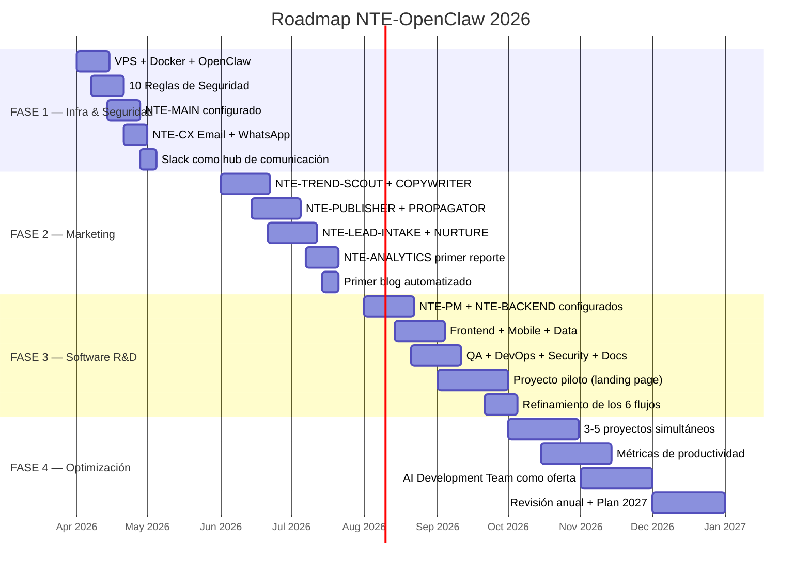

# 🗓️ Roadmap de Implementación 2026
### 4 Fases · Abril → Diciembre

## Hitos Clave

| Fecha | Hito | Indicador de Éxito |
|---|---|---|
| **Abril 30** | OpenClaw seguro y operativo | NTE-MAIN responde en Slack |
| **Mayo 31** | NTE-CX activo en todos los canales | Primer lead respondido automáticamente |
| **Julio 15** | Blog automation operativo | Primer artículo publicado automáticamente |
| **Agosto 1** | Pipeline de leads funcionando | 10 leads procesados sin intervención manual |
| **Septiembre 30** | Piloto de software completado | Landing page entregada a un cliente real |
| **Noviembre 30** | 3 proyectos simultáneos activos | Ingresos adicionales cubriendo costos |
| **Diciembre 31** | Revisión anual y plan 2027 | ROI > 300% sobre inversión en automatización |

## Criterios de Éxito por Fase

### ✅ FASE 1 — Infraestructura (Abril-Mayo)
- [ ] VPS con Ubuntu 22.04 operativo
- [ ] Las 10 reglas de seguridad aplicadas y verificadas
- [ ] NTE-MAIN respondiendo a comandos de Michael en Slack
- [ ] NTE-CX respondiendo mensajes en email y WhatsApp < 5 min
- [ ] Primer lead capturado y registrado en CRM

### ✅ FASE 2 — Marketing (Junio-Julio)
- [ ] Primer artículo de blog publicado automáticamente
- [ ] Adaptaciones de RRSS programadas via Buffer
- [ ] Pipeline de leads activo en todos los canales
- [ ] Reporte semanal de Google Analytics automatizado
- [ ] Newsletter mensual enviada automáticamente

### ✅ FASE 3 — Software R&D (Agosto-Septiembre)
- [ ] Los 9 agentes de desarrollo configurados y comunicándose
- [ ] GitHub Actions con CI/CD funcionando
- [ ] Proyecto piloto completado y entregado al cliente
- [ ] Playbooks documentados para cada agente

### ✅ FASE 4 — Optimización (Octubre-Diciembre)
- [ ] 3+ proyectos de software en paralelo
- [ ] AI Development Team lanzado como oferta comercial
- [ ] ROI calculado y documentado
- [ ] Plan 2027 listo

[← Stack Tecnológico](../05-stack-tecnologico/herramientas.md) | [Prompts →](../07-prompts/nte-main-system-prompt.md)
