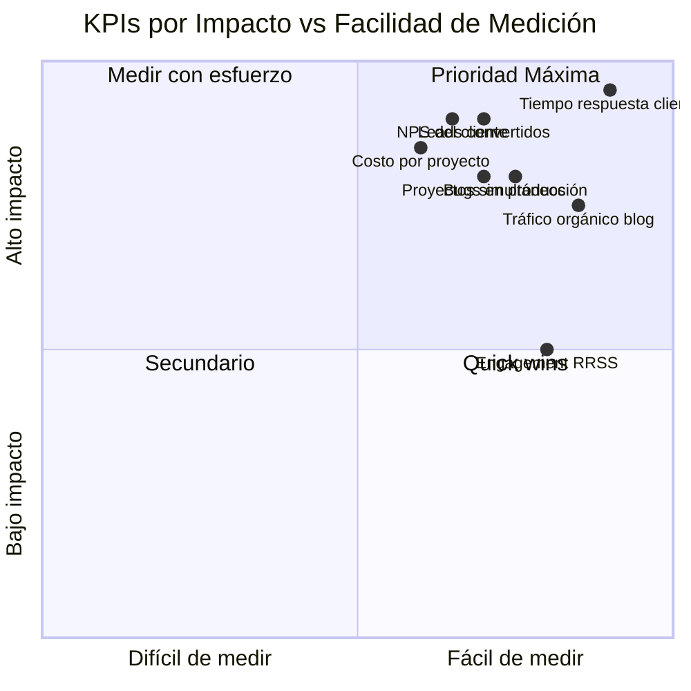
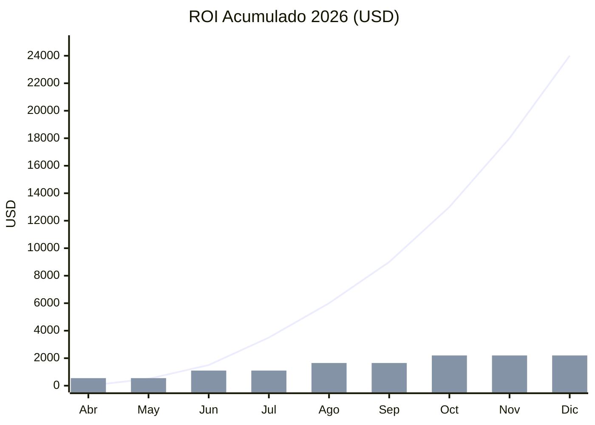

<div align="center">

# 📊 KPIs & Métricas de Éxito
### El Tablero de Control de NTE-OpenClaw 2026

</div>

## Dashboard de KPIs Principales



## KPIs Administrativos

| KPI | Línea Base | Meta 2026 | Agente Responsable | Frecuencia |
|---|---|---|---|---|
| ⏱️ Tiempo de respuesta al cliente | Días | **< 5 minutos** | NTE-CX | Tiempo real |
| ✅ Consultas resueltas sin escalada | 0% | **> 70%** | NTE-CX | Semanal |
| 📝 Artículos de blog publicados | 0/mes | **8/mes** | NTE-COPYWRITER | Mensual |
| 📈 Tráfico orgánico (GA4) | Base actual | **+15%/mes** | NTE-ANALYTICS | Semanal |
| 📱 Engagement en RRSS | Base actual | **+20%/mes** | NTE-PROPAGATOR | Semanal |
| 📧 Tasa de apertura newsletter | - | **> 25%** | NTE-CONTENT | Mensual |
| 🔑 Keywords top 10 Google | Base actual | **+5 keywords/mes** | NTE-ANALYTICS | Mensual |

## KPIs de Lead Management

| KPI | Meta | Agente | Nota |
|---|---|---|---|
| ⚡ Tiempo primer contacto | < 5 min | NTE-LEAD-INTAKE | 24/7 |
| 🔄 COLD → WARM conversion | > 20% en 30 días | NTE-LEAD-NURTURE | |
| 🔥 WARM → HOT conversion | > 15% en 14 días | NTE-LEAD-NURTURE | |
| 💰 HOT leads cerrados | > 30% | Michael + NTE-PM | |
| 📊 Leads calificados/mes | > 20 | NTE-LEAD-INTAKE | |

## KPIs de Software R&D

| KPI | Línea Base | Meta 2026 | Agente Responsable |
|---|---|---|---|
| ⏰ Tiempo de entrega por proyecto | 100% | **Reducción 60%** | NTE-PM |
| 💰 Costo de mano de obra por proyecto | 100% | **Reducción 70%** | Todos los agentes dev |
| 🐛 Bugs en producción | - | **< 2% de features** | NTE-QA |
| 🧪 Cobertura de tests | - | **> 80%** | NTE-QA |
| 📦 Proyectos simultáneos | 1-2 | **5+ para Q4 2026** | NTE-PM |
| ⭐ NPS del cliente | - | **> 8/10** | NTE-PM + NTE-CX |
| 🔐 Vulnerabilidades en producción | - | **0 críticas** | NTE-SECURITY |

## ROI Proyectado



*Línea: Ahorro/ingresos acumulados. Barras: Costo mensual adicional de automatización.*

## Reporte Automático Semanal (ejemplo)

```
📊 REPORTE SEMANAL NTE — Semana del 28 Mar 2026

🟢 MARKETING
  • Blog: 2 artículos publicados ✓ | Tráfico: +12% vs semana anterior
  • RRSS: 35 posts programados | Engagement promedio: 4.2%
  • Newsletter: 847 suscriptores | Apertura: 28.3%

🟡 LEADS
  • Leads recibidos: 14 | HOT: 3 | WARM: 7 | COLD: 4
  • Tiempo resp. promedio: 3.2 min ✓
  • 2 HOT leads escalados a Michael (pendiente seguimiento)

🟢 SOFTWARE R&D
  • Proyectos activos: 2 | Sprints en curso: 2
  • PRs mergeados: 23 | Bugs detectados: 4 | Bugs resueltos: 4
  • NTE-SECURITY: 0 vulnerabilidades críticas esta semana

🟡 INFRAESTRUCTURA
  • VPS: 98.7% uptime | API Cost: $187/mes (dentro del presupuesto)
  • Alerta: Semrush subscription vence en 12 días — renovar

⚡ ACCIONES REQUERIDAS DE MICHAEL:
  1. Revisar 2 artículos de blog en draft (link)
  2. Contactar HOT lead: Ana García / García Dental (WhatsApp)
  3. Aprobar presupuesto de $3,200 para cliente López Marketing
```

[← Prompts](../07-prompts/nte-main-system-prompt.md) | [Presupuesto →](../09-presupuesto/costos-estimados.md)
