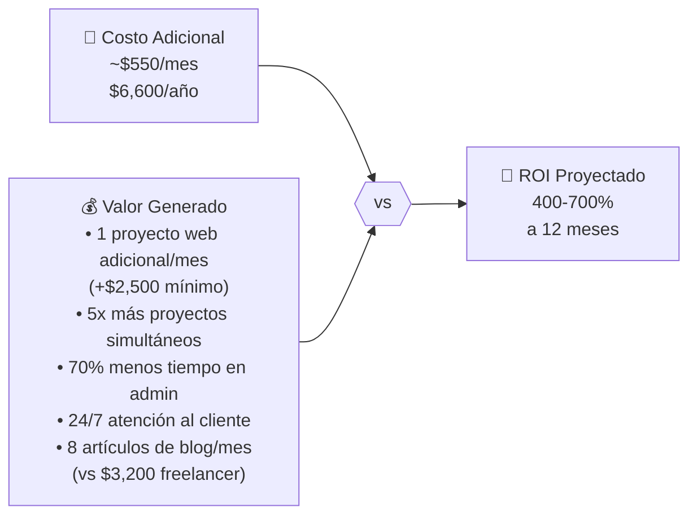

# 💰 Presupuesto & ROI
### Inversión en Automatización vs. Retorno Esperado

## Costos Adicionales Mensuales

| Categoría | Herramienta | Costo/Mes | Notas |
|---|---|---|---|
| ☁️ Infraestructura | VPS DigitalOcean 4vCPU/8GB | $48 | Suficiente para iniciar |
| 🤖 IA | Anthropic API (Claude) | ~$150-300 | Depende del volumen de tokens |
| 🔧 DevOps | GitHub Team | $12 | 3 usuarios × $4 |
| 📱 Marketing | Buffer Pro | $18 | Hasta 100 canales sociales |
| 🔍 SEO | Semrush Starter | $140 | Puede bajarse a plan básico |
| 📧 Email | SendGrid Essentials | $20 | Hasta 100K emails/mes |
| 🗂️ PM/CRM | Jira Standard | $30 | 3 usuarios × $10 |
| 🔒 Seguridad | Cloudflare Pro | $20 | WAF + DDoS básico |
| 🔐 Secretos | HashiCorp Vault Cloud | $0 | Plan gratuito disponible |
| 💬 Comunicación | Twilio (WhatsApp + SMS) | ~$50 | Pay-as-you-go |
| **TOTAL** | | **~$488-638/mes** | |

## ROI Esperado

## Punto de Equilibrio

> **Un solo proyecto web adicional al mes ($1,800-$3,500) cubre el costo completo de toda la infraestructura de automatización.**

Con el sistema activo, NTE puede manejar **5x más proyectos** sin contratar personal adicional.

## Proyección de Ingresos Adicionales

| Fuente | Proyección Mensual (Q4 2026) |
|---|---|
| Proyectos web adicionales (×2) | +$5,000 |
| Proyectos software (×1 adicional) | +$8,000 |
| Leads convertidos por automatización | +$3,000 |
| Ahorro en marketing freelance | +$3,200 |
| **Total adicional estimado** | **+$19,200/mes** |

*Inversión mensual: ~$550 → ROI: ~3,400%*

## Optimización de Costos de API

Para mantenerse en el rango $150-$300/mes de API:

| Estrategia | Impacto |
|---|---|
| Usar Haiku para tareas de alta frecuencia | -40% del costo total |
| Cache de respuestas comunes en NTE-CX | -15% |
| Límites de tokens por agente | -10% |
| Alerta automática a Michael si supera $400 | Previene sorpresas |

[← KPIs](../08-kpis/metricas-exito.md) | [Volver al inicio](../README.md)
