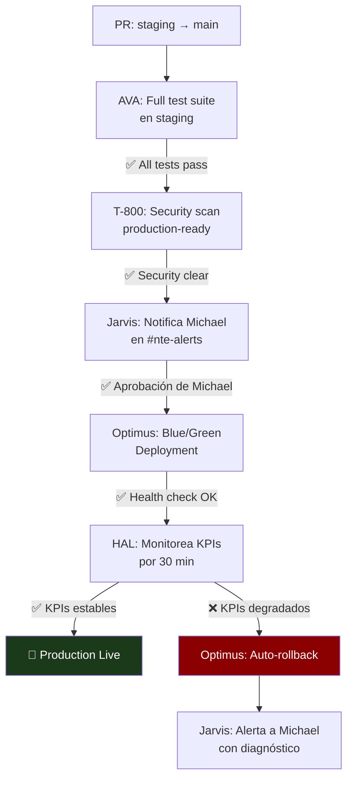

<div align="center">

# 🌿 Los 3 Ambientes del Sistema
### Development · Staging · Production

> **Regla de oro:** Nunca saltar un ambiente. Nunca probar directamente en Production.

</div>

---

## Visión General

```mermaid
flowchart LR
    subgraph DEV["🔧 DEVELOPMENT\nFake Data · Branch: develop"]
        D1["Configurar agentes"]
        D2["Probar flujos\ncon datos ficticios"]
        D3["Debuggear\nintegraciones"]
    end

    subgraph STG["🧪 STAGING\nData Real · Branch: staging"]
        S1["Tests automatizados\n(AVA)"]
        S2["Demos a Michael\ny clientes"]
        S3["Validación con\ndata real"]
    end

    subgraph PROD["🚀 PRODUCTION\nData Real · Branch: main"]
        P1["Sistema en\nvivo 24/7"]
        P2["Agentes activos\ncon clientes reales"]
        P3["Monitoreo\ncontinuo (HAL)"]
    end

    DEV -->|"PR develop → staging\n✅ Aprobado por AVA"| STG
    STG -->|"PR staging → main\n✅ Aprobado por AVA + T-800\n✅ Sign-off de Michael"| PROD

    style DEV fill:#1a3a5c,color:#fff
    style STG fill:#2c1654,color:#fff
    style PROD fill:#1a3a1a,color:#fff
```



---

## Tabla Comparativa

| Característica | Development | Staging | Production |
|---|---|---|---|
| **Propósito** | Desarrollo y configuración | Testing y demos | Sistema en vivo |
| **Datos** | Fake data / fixtures | Data real | Data real |
| **Git Branch** | `develop` | `staging` | `main` |
| **URL Interna** | dev.nte-internal.com | staging.nte-internal.com | prod.nte-internal.com |
| **Acceso Michael** | Libre | Por invitación | Solo lectura |
| **Agentes activos** | Seleccionados | Todos | Todos |
| **QuickBooks** | Sandbox mode | Sandbox mode | Production |
| **Jira** | Proyecto NTE-DEV | Proyecto NTE-STG | Proyectos reales |
| **Email** | dev@... (no envía realmente) | Staging real (envía) | @nissienterprise.com |
| **GitHub Actions** | Tests básicos | Full test suite | Deploy bloqueado hasta aprob. |
| **Azure Key Vault prefix** | `dev/` | `staging/` | `prod/` |
| **Docker** | Containers locales | Containers en VPS staging | Containers en VPS prod |

---

## 🔧 DEVELOPMENT

**Objetivo:** Donde construimos y rompemos cosas. Sin miedo. Con datos falsos.

### Cuándo usar Development

- Configurar un nuevo agente por primera vez
- Probar una nueva integración (QuickBooks, Jira, etc.)
- Desarrollar y testear nuevos flujos de trabajo
- Hacer experimentos con prompts de agentes
- Debuggear errores en un flujo existente

### Reglas de Development

- Los datos son **100% fake** — nunca datos de clientes reales
- Los agentes pueden fallar sin consecuencias
- Los emails no salen al exterior (usar mailtrap o redirigir a test@nissienterprise.com)
- QuickBooks en **sandbox mode** — sin transacciones reales
- GitHub branch: `develop` — push libre sin protección
- Los Jira tickets son en el proyecto `NTE-DEV`

### Configuración de Secretos para Development

```bash
# Prefijo: dev/ en Azure Key Vault
VAULT="nte-keyvault"

# Los secretos de dev usan cuentas sandbox/test
az keyvault secret set --vault-name $VAULT \
  --name "dev/anthropic-api-key" --value "sk-ant-[dev-key]"

az keyvault secret set --vault-name $VAULT \
  --name "dev/quickbooks-oauth-token" --value "[sandbox-token]"

az keyvault secret set --vault-name $VAULT \
  --name "dev/nte-email-smtp-user" --value "test@nissienterprise.com"
```

### Activar ambiente Development

```bash
export NTE_ENV=development
export AKV_PREFIX=dev

# Cargar secretos de desarrollo
source /workspace/scripts/load-secrets.sh

# Levantar agentes en modo dev
docker-compose -f docker-compose.dev.yml up
```

---

## 🧪 STAGING

**Objetivo:** El ambiente más importante. Aquí se valida que todo funciona con data real antes de ir a Producción.

### Cuándo usar Staging

- Antes de cada deployment a Producción
- Para hacer demos a Michael o a clientes potenciales
- Para correr el suite completo de tests de AVA
- Para validar que las integraciones funcionan con datos reales
- Para hacer pruebas de carga o estrés de los agentes

### Reglas de Staging

- Usa **data real** pero en un entorno controlado
- Los emails **sí se envían** — usar con cuidado
- QuickBooks en **sandbox mode** — sin transacciones reales que afecten contabilidad
- GitHub branch: `staging` — requiere **Pull Request** desde `develop`
- Los Jira tickets son en el proyecto `NTE-STG`
- AVA debe correr y aprobar el test suite antes de cualquier merge
- T-800 debe hacer un security scan antes de aprobar el PR

### Flujo de PR para Staging

```
develop → staging (Pull Request)
  ✅ AVA: Tests automatizados pasan
  ✅ T-800: Security scan limpio
  ✅ Optimus: Deployment exitoso en staging VPS
  → Merge aprobado por David o Jarvis
```

### Configuración de Secretos para Staging

```bash
# Prefijo: staging/ en Azure Key Vault
VAULT="nte-keyvault"

# Staging usa las cuentas reales pero en modo sandbox donde aplica
az keyvault secret set --vault-name $VAULT \
  --name "staging/anthropic-api-key" --value "sk-ant-[staging-key]"

az keyvault secret set --vault-name $VAULT \
  --name "staging/quickbooks-oauth-token" --value "[sandbox-token]"

# Email sí funciona en staging
az keyvault secret set --vault-name $VAULT \
  --name "staging/nte-email-smtp-user" --value "staging@nissienterprise.com"
```

### Activar ambiente Staging

```bash
export NTE_ENV=staging
export AKV_PREFIX=staging

# Cargar secretos de staging
source /workspace/scripts/load-secrets.sh

# Levantar agentes en modo staging
docker-compose -f docker-compose.staging.yml up
```

---

## 🚀 PRODUCTION

**Objetivo:** El sistema en vivo. Aquí trabajan los agentes con clientes reales y datos reales. Máxima estabilidad.

### Cuándo se hace deployment a Production

- Solo desde `staging` via Pull Request
- Requiere aprobación explícita de Michael en `#nte-alerts`
- AVA debe haber corrido el test suite completo en staging
- T-800 debe haber dado el security clearance
- Optimus ejecuta el deployment (nunca manualmente)
- Solo en horarios de bajo tráfico (11 PM - 5 AM EST)

### Reglas de Production

- **Solo lectura** para Michael — no se hacen cambios manuales
- Todos los secretos usan las cuentas de producción reales
- QuickBooks en **Production mode** — las transacciones son reales
- GitHub branch: `main` — **totalmente protegido**
- Zero-downtime deployment (blue/green o rolling update)
- Rollback automatizado si HAL detecta degradación de KPIs

### Flujo de Deployment a Production



### Configuración de Secretos para Production

```bash
# Prefijo: prod/ en Azure Key Vault
VAULT="nte-keyvault"

# Producción usa todas las cuentas reales
az keyvault secret set --vault-name $VAULT \
  --name "prod/anthropic-api-key" --value "sk-ant-[prod-key]"

az keyvault secret set --vault-name $VAULT \
  --name "prod/quickbooks-oauth-token" --value "[production-token]"

az keyvault secret set --vault-name $VAULT \
  --name "prod/nte-email-smtp-user" --value "jarvis@nissienterprise.com"
```

---

## 📋 Naming Convention por Ambiente

Para evitar confusión entre ambientes, todos los recursos siguen esta convención:

| Recurso | Development | Staging | Production |
|---|---|---|---|
| Docker containers | `nte-dev-[agente]` | `nte-stg-[agente]` | `nte-[agente]` |
| Jira projects | `NTE-DEV-*` | `NTE-STG-*` | `NTE-SW-*` / `NTE-MKT-*` |
| GitHub branches | `develop` | `staging` | `main` |
| Azure KV secrets | `dev/[secreto]` | `staging/[secreto]` | `prod/[secreto]` |
| Logs directory | `/workspace/logs/dev/` | `/workspace/logs/stg/` | `/workspace/logs/prod/` |
| Email sender | `dev@nissienterprise.com` | `staging@nissienterprise.com` | `[agente]@nissienterprise.com` |

---

## 🔐 Acceso por Ambiente

| Quién | Development | Staging | Production |
|---|---|---|---|
| **Michael** | Full access | Full access | Solo lectura + aprobaciones |
| **Jarvis** | Full access | Full access | Full access (orquestador) |
| **David** | Full access | Full access | Read + ticket management |
| **Optimus** | Full access | Full access | Deploy + monitoring only |
| **T-800** | Full access | Full access | Security scan + read |
| **Otros agentes** | Según tarea | Según tarea | Solo su scope |

---

[← Volver al inicio](../README.md) | [Stack Tecnológico →](../05-stack-tecnologico/herramientas.md)
