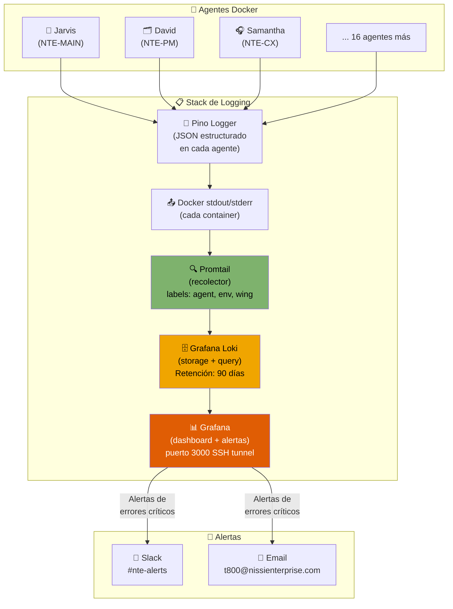

<div align="center">

# 📋 Sistema de Logging NTE
### Observabilidad Total del Ecosistema de Agentes

> *"Si no lo puedes medir, no lo puedes mejorar."*

</div>

---

## Stack Tecnológico

```
┌──────────────────────────────────────────────────────────────┐
│                     LOGGING STACK NTE                        │
│                                                              │
│  🤖 Agentes Docker ──► 📤 Promtail ──► 🗄️ Loki ──► 📊 Grafana │
│  (stdout JSON)         (recolector)   (storage)  (dashboard) │
│                                                              │
│  + Pino (logger en cada agente — output JSON estructurado)   │
└──────────────────────────────────────────────────────────────┘
```

| Componente | Rol | Puerto | Recurso |
|---|---|---|---|
| **Pino** | Logger JSON en cada agente | — | ~0 MB overhead |
| **Promtail** | Recolecta logs de Docker | — | ~50 MB RAM |
| **Loki** | Almacena y queries de logs | 3100 (interno) | ~200 MB RAM |
| **Grafana** | Dashboard y alertas | 3000 (SSH tunnel) | ~150 MB RAM |

**Total overhead del sistema de logging: ~400 MB RAM** — muy aceptable para un VPS de 8 GB.

---

## ¿Por qué este stack?

| Alternativa | RAM requerida | ¿Por qué NO? |
|---|---|---|
| ELK Stack (Elasticsearch) | 4-8 GB | No cabe en el VPS junto a 19 agentes Docker |
| Datadog | $15+/host/mes | Costo innecesario con todo lo que tenemos |
| CloudWatch | Depende de uso | Lock-in con AWS, caro en volumen alto |
| **Loki + Grafana ✅** | ~400 MB | Ligero, Docker-native, open source, potente |

---

## Arquitectura del Sistema de Logs



---

## Esquema de Log — Cada Entrada Registra:

```json
{
  "timestamp":    "2026-03-29T10:30:00.123Z",
  "trace_id":     "a3f9-bc12-...",       // ID único que une TODO un flujo multi-agente
  "span_id":      "f1e2-4d89-...",       // ID de esta operación específica
  "level":        "INFO",                // DEBUG | INFO | WARN | ERROR | CRITICAL
  "event_type":   "ACTION",             // Ver tabla de tipos abajo
  "agent_name":   "Jarvis",             // Nombre del personaje
  "agent_id":     "NTE-MAIN",           // ID técnico
  "agent_email":  "jarvis@nissienterprise.com",
  "wing":         "orchestrator",        // orchestrator | administrativa | software | blog | leads
  "environment":  "production",          // development | staging | production
  "message":      "Delegating blog pipeline to Johnny 5",
  "details": {
    "target_agent": "NTE-TREND-SCOUT",
    "input": "weekly_blog_trigger",
    "output": null
  },
  "duration_ms":  142,                   // Tiempo que tomó la operación
  "status":       "success",             // success | failure | pending | escalated
  "triggered_by": "heartbeat",           // heartbeat | michael | [agent_id] | webhook
  "parent_trace": null                   // trace_id del flujo padre (si fue invocado por otro agente)
}
```

### Tipos de Eventos (`event_type`)

| Tipo | Descripción | Ejemplo |
|---|---|---|
| `HEARTBEAT` | Tarea programada ejecutada | Jarvis activa a Johnny 5 los lunes 2AM |
| `ACTION` | Agente ejecuta una acción interna | C-3PO redacta artículo |
| `COMMAND` | Agente ejecuta un comando del sistema | Optimus hace `docker restart` |
| `API_CALL` | Llamada a API externa | TARS llama a QuickBooks API |
| `INTER_AGENT` | Un agente invoca a otro | David asigna tarea a Bishop |
| `DECISION` | Agente toma una decisión | EVA clasifica lead como HOT |
| `ESCALATION` | Agente escala a Michael | Jarvis alerta en #nte-alerts |
| `SECRET_ACCESS` | Acceso a Azure Key Vault | Jarvis obtiene credencial |
| `JIRA_EVENT` | Operación en Jira | David crea ticket NTE-SW-142 |
| `QB_EVENT` | Operación en QuickBooks | Jarvis draft de invoice #INV-001 |
| `EMAIL_SENT` | Email enviado desde agente | Samantha responde a cliente |
| `DEPLOY` | Deployment ejecutado | Optimus hace deploy a staging |
| `SECURITY_SCAN` | Scan de seguridad | T-800 reporta vulnerabilidad |
| `ERROR` | Error no fatal | Johnny 5 falla al acceder a Semrush |
| `CRITICAL` | Error crítico, requiere atención | T-800 detecta intrusión |

---

## Labels de Promtail (para filtrar en Grafana)

Cada log entry tiene estas labels automáticas que permiten filtrar:

| Label | Valores posibles |
|---|---|
| `agent` | jarvis, samantha, walle, hal, johnny5, c3po, r2d2, baymax, eva, tars, david, bishop, sonny, bb8, case, ava, optimus, t800, marvin |
| `agent_id` | NTE-MAIN, NTE-CX, NTE-PM, etc. |
| `wing` | orchestrator, administrativa, software, blog, leads |
| `environment` | development, staging, production |
| `level` | DEBUG, INFO, WARN, ERROR, CRITICAL |
| `event_type` | ACTION, COMMAND, API_CALL, INTER_AGENT, DECISION, ESCALATION, ERROR, CRITICAL... |

---

## Dashboards Disponibles en Grafana

| Dashboard | Descripción |
|---|---|
| **NTE Overview** | Vista general — todos los agentes, errores, actividad en tiempo real |
| **NTE por Agente** | Drilldown de un agente específico — todas sus acciones |
| **NTE Flujos (Traces)** | Visualizar un workflow completo usando el `trace_id` |
| **NTE Errores** | Solo logs ERROR y CRITICAL de todos los agentes |
| **NTE API Calls** | Todas las llamadas a APIs externas (QuickBooks, Jira, GitHub, etc.) |
| **NTE Escalaciones** | Historial de todas las escalaciones a Michael |
| **NTE Seguridad** | Logs de T-800 — security scans, accesos a Azure KV |

---

## Acceso a Grafana

```bash
# Desde tu máquina local — SSH tunnel
ssh -L 3000:localhost:3000 openclaw@TU_VPS_IP

# Luego en el navegador:
# http://localhost:3000
# Usuario: admin
# Password: [Azure Key Vault → secret/grafana-admin-password]
```

---

## Archivos del Sistema de Logging

```
workspace/logging/
├── nte-logger.js              ← Logger central (importar en cada agente)
├── docker-compose.logging.yml ← Stack completo: Loki + Grafana + Promtail
├── loki-config.yml            ← Configuración de Loki (retención 90 días)
├── promtail-config.yml        ← Recolección de logs Docker por agente
└── grafana/
    ├── provisioning/
    │   ├── datasources/
    │   │   └── loki.yml       ← Loki como datasource de Grafana
    │   └── dashboards/
    │       └── dashboards.yml ← Auto-load de dashboards
    └── dashboards/
        └── nte-overview.json  ← Dashboard principal NTE
```

---

## Comandos Útiles

```bash
# Ver logs en tiempo real de un agente específico
docker logs -f nte-samantha

# Query en Loki via CLI (LogQL)
# Todos los errores de las últimas 24h
logcli query '{environment="production"} |= "ERROR"' --since=24h

# Logs de un trace_id específico (seguir un flujo)
logcli query '{environment="production"} |= "a3f9-bc12"'

# Todos los logs de Jarvis hoy
logcli query '{agent="jarvis", environment="production"}'

# Ver escalaciones de las últimas 2h
logcli query '{event_type="ESCALATION"}' --since=2h

# Iniciar el stack de logging
docker-compose -f workspace/logging/docker-compose.logging.yml up -d

# Ver status del stack
docker-compose -f workspace/logging/docker-compose.logging.yml ps
```

---

## 📁 Documentos de Esta Sección

| Documento | Contenido |
|---|---|
| [README.md](./README.md) | Visión general, stack recomendado, esquema de logs |
| [02-nte-logger.md](./02-nte-logger.md) | API del logger · Métodos disponibles · Ejemplos de uso · trace_id |
| [03-infraestructura.md](./03-infraestructura.md) | Docker Compose · Loki config · Promtail config · Labels por agente |
| [04-grafana.md](./04-grafana.md) | Dashboards · LogQL de referencia · Alertas · Provisioning |

---

[← Volver al inicio](../README.md) | [Ambientes →](../10-ambientes/ambientes.md)
