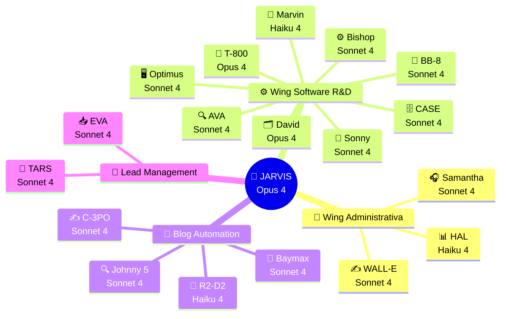

<div align="center">

# 🧠 NTE · OpenClaw Intelligence Hub

### Documentación Oficial del Sistema de Automatización con IA
**Nissi Technology Enterprises Inc. · Miami, FL · 2026**

---

*"La tecnología no es un fin, sino el medio por el cual transformamos organizaciones y comunidades."*
**— Nissi Technology Enterprises**

---

[](./03-agentes/)
[](./05-stack-tecnologico/)
[](./02-infraestructura/)
[](./06-roadmap/)
[](./02-infraestructura/)
[](./05-stack-tecnologico/)

</div>

---

## 📖 ¿Qué es este repositorio?

Este es el **hub central de documentación** del proyecto de automatización total de Nissi Technology Enterprises utilizando **OpenClaw** — una instancia del Claude Agent SDK desplegada en un VPS seguro en la nube.

Aquí encontrarás todo lo necesario para entender, operar, expandir y mantener el ecosistema de **19 agentes de IA** que automatizan las operaciones administrativas, de marketing y de desarrollo de software de NTE.

---

## 🗺️ Mapa de la Documentación

```
documentacion/
│
├── 📌 README.md                    ← Estás aquí
│
├── 🏢 01-empresa/
│   ├── mision-vision-valores.md    ← ADN de NTE que guía todos los agentes
│   └── servicios.md                ← Catálogo de servicios (base de conocimiento)
│
├── 🖥️  02-infraestructura/
│   ├── vps-setup.md                ← VPS Ubuntu 22.04 + Docker + Azure Key Vault
│   └── seguridad.md                ← Las 10 reglas de seguridad de OpenClaw
│
├── 🤖 03-agentes/
│   ├── README.md                   ← Diagrama completo + tabla de todos los agentes
│   ├── jarvis.md                   ← JARVIS — Agente Principal Orquestador
│   │
│   ├── wing-administrativa/
│   │   ├── samantha.md             ← SAMANTHA — Customer Experience
│   │   ├── walle.md                ← WALL-E — Content & Marketing
│   │   └── hal.md                  ← HAL — Analytics & Reporting
│   │
│   ├── wing-software/
│   │   ├── david.md                ← DAVID — Project Manager
│   │   ├── bishop.md               ← BISHOP — Backend Developer
│   │   ├── sonny.md                ← SONNY — Frontend Developer
│   │   ├── bb8.md                  ← BB-8 — Mobile Developer
│   │   ├── case.md                 ← CASE — Data Engineer
│   │   ├── ava.md                  ← AVA — QA & Tester
│   │   ├── optimus.md              ← OPTIMUS — DevOps & Sysadmin
│   │   ├── t800.md                 ← T-800 — Security Agent
│   │   └── marvin.md               ← MARVIN — Technical Writer
│   │
│   └── flujos-especializados/
│       ├── blog-automation/
│       │   ├── README.md           ← Flujo completo blog semanal
│       │   ├── johnny5.md          ← JOHNNY 5 — Investigador de tendencias
│       │   ├── c3po.md             ← C-3PO — Redactor de artículos
│       │   ├── r2d2.md             ← R2-D2 — Publicador en WordPress
│       │   └── baymax.md           ← BAYMAX — Distribuidor en redes sociales
│       │
│       └── lead-management/
│           ├── README.md           ← Flujo completo de leads
│           ├── eva.md              ← EVA — Captador multicanal de leads
│           └── tars.md             ← TARS — Nurturing y seguimiento
│
├── 🔄 04-flujos/
│   ├── flujo-blog-semanal.md       ← Diagrama secuencial del blog
│   ├── flujo-leads.md              ← Diagrama del ciclo de vida de leads
│   ├── flujo-desarrollo-software.md← Las 6 fases de desarrollo automatizado
│   └── flujo-customer-service.md   ← Flujo omnicanal de atención
│
├── 🛠️  05-stack-tecnologico/
│   └── herramientas.md             ← Jira, QuickBooks, GitHub, Azure KV, email NTE
│
├── 🗓️  06-roadmap/
│   └── implementacion-2026.md      ← 4 fases · Abril → Diciembre 2026
│
├── 💬 07-prompts/
│   ├── nte-main-system-prompt.md   ← System prompt completo de JARVIS
│   └── prompts-por-agente.md       ← Guías de prompt para cada agente
│
├── 📊 08-kpis/
│   └── metricas-exito.md           ← KPIs y metas del proyecto
│
├── 💰 09-presupuesto/
│   └── costos-estimados.md         ← Desglose de costos y ROI proyectado
│
├── 🌿 10-ambientes/
│   └── ambientes.md                ← Development · Staging · Production
│
└── 📋 11-logging/
    ├── README.md                   ← Stack recomendado · Arquitectura · Esquema de logs
    ├── 02-nte-logger.md            ← API del logger central · trace_id · Ejemplos de uso
    ├── 03-infraestructura.md       ← Loki · Promtail · Docker Compose · Labels Docker
    └── 04-grafana.md               ← Dashboards · LogQL · Alertas · Provisioning
```

---

## ⚡ Vista Rápida: Los 19 Agentes



---

## 🚀 Inicio Rápido

| Si quieres... | Ve a... |
|---|---|
| Entender la visión completa | [01-empresa/mision-vision-valores.md](./01-empresa/mision-vision-valores.md) |
| Ver todos los agentes y su jerarquía | [03-agentes/README.md](./03-agentes/README.md) |
| Configurar el servidor por primera vez | [02-infraestructura/vps-setup.md](./02-infraestructura/vps-setup.md) |
| Ver el protocolo de seguridad | [02-infraestructura/seguridad.md](./02-infraestructura/seguridad.md) |
| Ver el prompt de JARVIS | [07-prompts/nte-main-system-prompt.md](./07-prompts/nte-main-system-prompt.md) |
| Entender los 3 ambientes del sistema | [10-ambientes/ambientes.md](./10-ambientes/ambientes.md) |
| Ver el sistema de logging y observabilidad | [11-logging/README.md](./11-logging/README.md) |
| Ver el stack tecnológico completo | [05-stack-tecnologico/herramientas.md](./05-stack-tecnologico/herramientas.md) |
| Entender el flujo del blog automatizado | [04-flujos/flujo-blog-semanal.md](./04-flujos/flujo-blog-semanal.md) |
| Ver el pipeline de gestión de leads | [04-flujos/flujo-leads.md](./04-flujos/flujo-leads.md) |
| Revisar el roadmap de implementación | [06-roadmap/implementacion-2026.md](./06-roadmap/implementacion-2026.md) |
| Ver los KPIs y métricas de éxito | [08-kpis/metricas-exito.md](./08-kpis/metricas-exito.md) |

---

## 🧭 Principios de Diseño del Sistema

> **1. Sandbox First** — Todos los sub-agentes corren en contenedores Docker efímeros. Jarvis (NTE-MAIN) es el único con acceso al filesystem del VPS.

> **2. Human-in-the-Loop** — El sistema nunca toma decisiones críticas sin aprobación de Michael. Escala automáticamente por Slack.

> **3. Modelo Mínimo Suficiente** — Cada agente usa el modelo de menor costo que cumpla su tarea con calidad. Opus solo donde el razonamiento complejo es imprescindible.

> **4. Fe & Integridad** — Ningún agente ejecuta acciones que contradigan los valores cristianos de NTE. Esto está codificado en el system prompt de cada agente.

> **5. Observabilidad Total** — Cada acción queda registrada. HAL (NTE-ANALYTICS) reporta KPIs semanalmente a Michael.

> **6. Secretos en Azure Key Vault** — Cero passwords en código o en repositorios. Todo secreto vive en Azure Key Vault.

> **7. Comunicación Inter-Agente** — Los agentes se pasan trabajo entre sí directamente a través del protocolo de mensajería interna de OpenClaw.

> **8. Tres Ambientes** — Development (fake data), Staging (data real + demos), Production (producción).

---

<div align="center">

**Nissi Technology Enterprises Inc.**
Miami, FL · Fundada 2016 · Vianney & Michael Rodriguez

*Automatización con Propósito · Fe · Integridad · Innovación · Excelencia*

</div>
