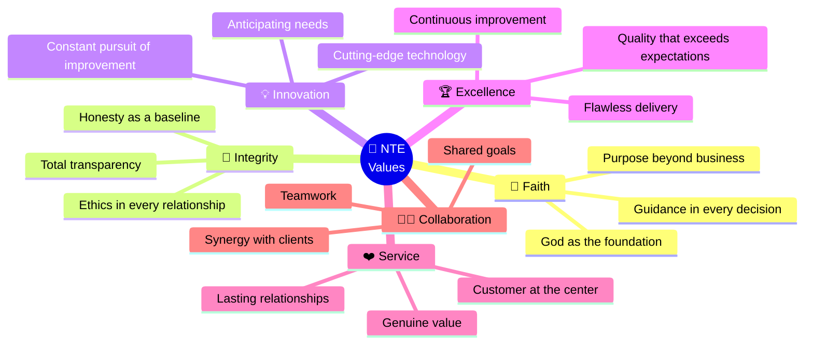
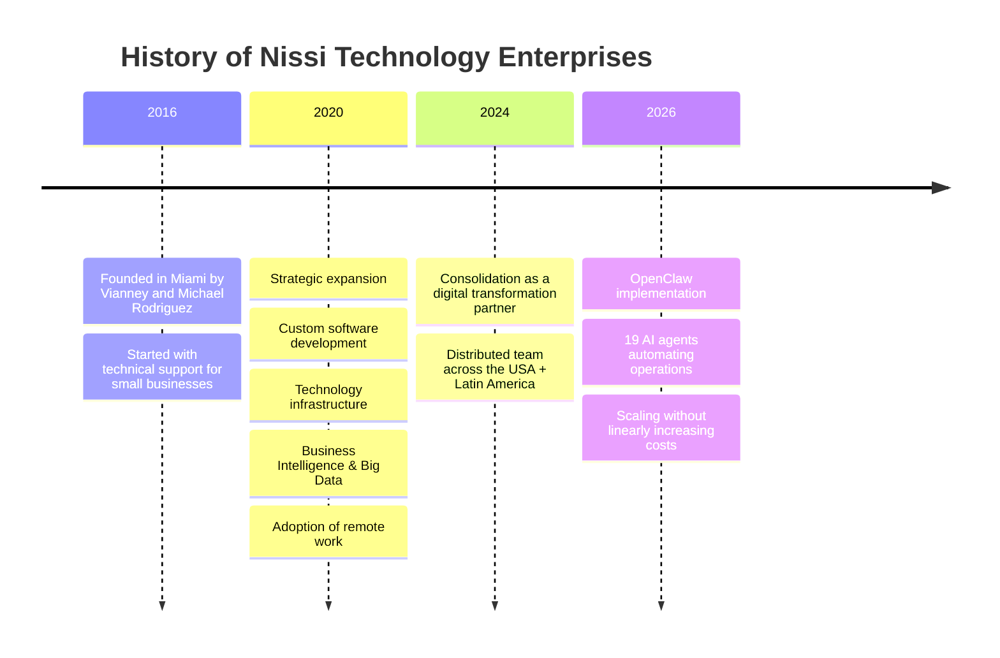
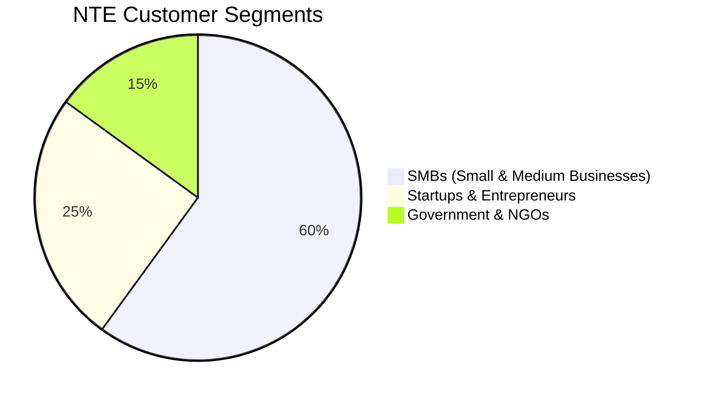

# 🏢 Nissi Technology Enterprises
### Mission · Vision · Values · Purpose

*The identity that guides every decision made by every agent in the system*

---

## ⚡ Mission

> **To empower businesses of all sizes by offering innovative, reliable, and personalized technology solutions that improve efficiency, drive growth, and generate sustainable impact — always guided by Christian values and a commitment to excellence.**

---

## 🌟 Vision

> **To transform the way businesses and communities experience technology by integrating faith, innovation, and excellence. We envision a world where digital transformation empowers people, strengthens organizations, and closes the digital divide across the Americas.**

---

## 🎯 Purpose

At Nissi Technology Enterprises we believe technology is not just a tool, but **a way to serve, empower, and transform lives**.

We do what we do because we are passionate about helping organizations grow through innovation, integrity, and excellence.

Our purpose is **to bridge technology and human potential**, creating solutions that not only solve problems but inspire progress.

---

## 💎 Core Values

| Value | Definition | How it applies to the Agents |
|---|---|---|
| 🙏 **Faith** | We acknowledge God as the foundation of every decision | Agents do not perform actions that contradict ethical values. This is hardcoded into NTE-MAIN's system prompt |
| 🤝 **Integrity** | Transparency, ethics, and honesty in every relationship | Every action by every agent is logged. No hidden actions or manipulation |
| 💡 **Innovation** | Constant pursuit of better ways of operating | The agent system itself IS the innovation. It is updated quarterly |
| 🏆 **Excellence** | Solutions of the highest quality | Claude Opus/Sonnet models for premium-quality outputs. Automated QA |
| ❤️ **Service** | The customer at the center of everything | NTE-CX responds in < 5 min. NTE-LEAD-NURTURE provides personalized follow-up |
| 🤜🤛 **Collaboration** | Team and clients working toward shared goals | The 19 agents collaborate with each other as a cohesive team |

---

## 📅 NTE History

---

## 🎯 Target Market

### Segment A: SMBs
They represent 99% of businesses in the U.S. They seek to optimize processes, automate tasks, and improve their digital presence. NTE offers them accessible, scalable solutions.

### Segment B: Startups & Entrepreneurs
They need to launch tech products, eCommerce platforms, CRMs, and mobile apps. NTE accelerates their time-to-market with agile solutions.

### Segment C: Government & NGOs
They invest in digital modernization, data security, and operational efficiency. NTE accesses federal and state contracts thanks to its Minority-Owned and Women-Owned certifications.

---

## 🌎 Positioning

> NTE positions itself as a **boutique, human-centered company**, with competitive pricing and a strong orientation toward Christian values and community service — differentiating itself from firms like Globant, Wizeline, or Koombea.

**Key differentiators:**
- Comprehensive offering: Software + Marketing + Infrastructure + AI + BI under a single brand
- Authentic corporate values built into the culture
- USA + LATAM remote model that reduces costs without sacrificing quality
- Direct, personalized customer attention

---

[← Back to home](../README.md) | [Services →](./services.md)
