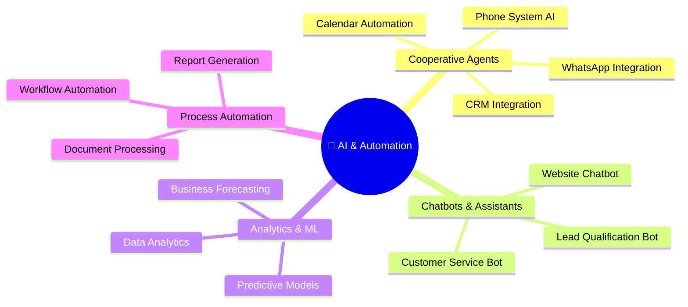

# 🛠️ NTE Service Catalog
### Knowledge Base for the AI Agents

*All agents must know this catalog to quote, respond, and generate aligned content*

---

## Division 1 · Software & Digital Development

### 🌐 Web Development

| Service | Base Price | Stack | Lead Agent |
|---|---|---|---|
| Basic Landing Page | $800 – $1,500 | WordPress + AI | NTE-FRONTEND |
| Professional Landing Page | $1,500 – $2,500 | WordPress + AI | NTE-FRONTEND |
| Standard Corporate Site | $2,000 – $3,500 | WordPress + AI | NTE-FRONTEND |
| Premium Corporate Site | $3,500 – $5,000 | WordPress + AI | NTE-FRONTEND |
| Basic eCommerce | $3,500 – $5,500 | WooCommerce + AI | NTE-FRONTEND + NTE-BACKEND |
| Professional eCommerce | $5,500 – $9,000 | WooCommerce + AI | NTE-FRONTEND + NTE-BACKEND |
| Enterprise eCommerce | $9,000 – $15,000 | WooCommerce + AI | NTE-FRONTEND + NTE-BACKEND |

### 💻 Software Development

| Service | Base Price | Stack | Lead Agent |
|---|---|---|---|
| Basic Web App | $5,000 – $8,000 | Laravel + Vue + AI | NTE-BACKEND + NTE-FRONTEND |
| Professional Web App | $8,000 – $15,000 | Laravel + Vue + AI | NTE-BACKEND + NTE-FRONTEND |
| Enterprise Web App | $15,000 – $30,000 | Laravel + Vue + Cloud + AI | Full Team |
| SaaS Solution | $20,000 – $50,000+ | Laravel + Vue + Cloud + Full AI | Full Team |
| Custom CRM / ERP | $10,000 – $25,000 | Custom Stack | Full Team |
| Custom WordPress Plugins | $500 – $3,000 | PHP + WordPress API | NTE-BACKEND |

### 📱 Mobile Apps

| Service | Base Price | Stack | Lead Agent |
|---|---|---|---|
| iOS / Android Mobile App | $5,000 – $10,000 | React Native / Flutter | NTE-MOBILE |
| App with Full Backend | $10,000 – $20,000 | React Native + Node.js | NTE-MOBILE + NTE-BACKEND |

---

## Division 2 · Artificial Intelligence & Automation

| Service | Base Price | Description |
|---|---|---|
| AI Cooperative Agents | $3,000 – $5,000 | Agents integrated with WhatsApp, calendar, website, CRM |
| Basic AI Chatbot | $1,500 – $3,000 | Customer service bot with basic NLP |
| Advanced AI Chatbot | $3,000 – $6,000 | Bot with ML, conversation history, and CRM integration |
| Data Analytics & ML | $5,000 – $15,000 | Predictive and analytical models for strategic decisions |
| Process Automation | $2,000 – $8,000 | Automated workflows with API integrations |

---

## Division 3 · Technology Infrastructure & Networks

| Service | Price | Description |
|---|---|---|
| Network Design & Security | Per project | Design and implementation of secure enterprise networks |
| Active Directory Setup | Per project | AD configuration, servers, and security cameras |
| Hardware Procurement | Per project | Supply and installation of technology equipment |
| Cloud Migration | Per project | Migration to AWS, Azure, or Google Cloud |
| Server Management | $200 – $500/month | Maintenance and management of cloud or physical servers |
| Virtualization Setup | Per project | Deployment of virtual environments (VMware, Hyper-V) |

---

## Division 4 · Digital Marketing & Multimedia

### 📱 Social Media & SEO

| Service | Monthly Price | Includes |
|---|---|---|
| Basic SEO | $450/month | On-page optimization + monthly reports |
| Professional SEO | $900/month | On-page + Off-page + content + reports |
| Enterprise SEO | $1,500/month | Full strategy + 4 articles/month + link building |
| Basic Social Media | $500/month | 3 platforms + 12 posts/month |
| Pro Social Media | $1,000/month | 5 platforms + daily posts + stories |
| Enterprise Social Media | $2,000/month | Full management + paid campaigns + analytics |

### 🎬 Nissi Media Services

| Service | Price | Description |
|---|---|---|
| Corporate Photography | Per session | Professional photos for brand and team |
| Institutional Video | Per project | High-production corporate video |
| Streaming & Events | Per event | Live streaming of corporate events |

---

## Division 5 · Business Intelligence & Big Data

| Service | Base Price | Tools |
|---|---|---|
| Power BI Dashboard | $2,000 – $5,000 | Power BI + Data Sources |
| Data Warehouse (ETL) | $5,000 – $15,000 | Python + dbt + PostgreSQL/BigQuery |
| SharePoint Site | $1,500 – $4,000 | SharePoint + Microsoft 365 |
| BI Consulting | $150/hour | Analysis + Data strategy |
| BI Maintenance | $300 – $800/month | Dashboard updates + new reports |

---

## 📋 Web Maintenance Plans

| Plan | Price | Includes |
|---|---|---|
| **Basic** | $150/month | Updates, backups, uptime monitoring |
| **Pro** | $300/month | Basic + basic SEO + 2 changes/month + support |
| **Enterprise** | $600/month | Pro + advanced SEO + unlimited changes + priority |

---

## 💡 Quoting Rules for Agents

> **NTE-CX and NTE-LEAD-INTAKE** must use this knowledge base to generate preliminary quotes. Always present a range, not a fixed price, and escalate to Michael for projects > $5,000.

**Factors that increase the price:**
- Integrations with legacy systems (+20-40%)
- Aggressive/urgent timeline (+25-50%)
- Advanced AI features (+30-60%)
- 24/7 support required (+20%)

**Available discounts:**
- Referred client: -10%
- Annual maintenance contract: -15%
- Startup / NGO: -20% (case by case, Michael's approval)
- Full upfront payment: -5%

---

[← Mission & Values](./mission-vision-values.md) | [Back to home](../README.md) | [Infrastructure →](../02-infrastructure/vps-setup.md)
