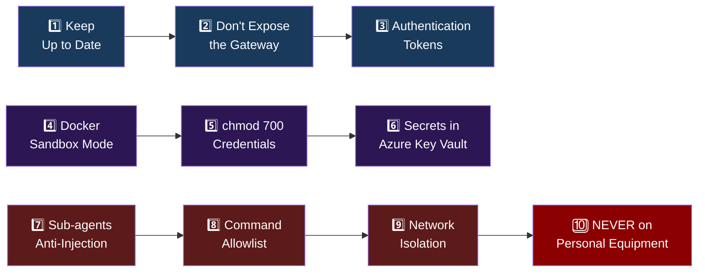
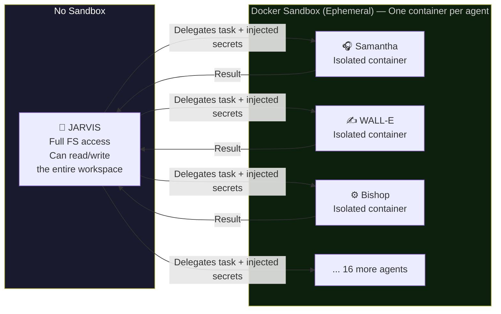

<div align="center">

# 🔒 OpenClaw's 10 Security Rules
### Mandatory Security Protocol — NTE

> ⚠️ **CRITICAL:** Apply ALL rules before putting any agent into production.

</div>

---



---

## Rule 1 · Always Keep Updated

```bash
# Run weekly (automated via Optimus)
sudo apt update && sudo apt upgrade -y
npm update -g @anthropic-ai/claude-code
```

> Security patches are critical. An outdated server can be compromised within hours. Optimus (NTE-DEVOPS) has this command in its weekly heartbeat.

---

## Rule 2 · Don't Expose the Gateway (Port 18789)

```bash
# ✅ CORRECT — localhost only
gateway.host = "127.0.0.1"

# ❌ INCORRECT — exposes it to the world
gateway.host = "0.0.0.0"
```

**Always access via SSH tunnel:**
```bash
ssh -L 18789:localhost:18789 openclaw@YOUR_VPS_IP
```

---

## Rule 3 · Authentication Tokens

```json
// ~/.openclaw/config.json
{
  "auth_mode": "token",
  "token": "AUTO_GENERATED_DO_NOT_EDIT"
}
```

> Never leave access open without a token. The token must rotate every 90 days. T-800 (NTE-SECURITY) generates an automatic reminder.

---

## Rule 4 · Sandbox Mode with Docker ⭐ The most important rule

NTE uses **`non_main`** mode (recommended for normal operations):



```bash
# non_main mode: Jarvis has FS access, sub-agents run in Docker
docker run --rm --network none \
  -v /workspace:/workspace:ro \
  openclaw-sandbox:latest
```

---

## Rule 5 · Credential Protection with chmod

```bash
# Apply immediately after installation
chmod 700 -R ~/.openclaw

# Verify permissions
ls -la ~/.openclaw
# drwx------ (700) — only the openclaw user can access it
```

> **NEVER** store API keys in plain text with open permissions. If someone compromises the server, `.openclaw` with chmod 700 is the last line of defense.

---

## Rule 6 · All Secrets in Azure Key Vault ⭐ MANDATORY

> ✅ **NTE uses Azure Key Vault** as the sole secrets manager. **Zero passwords in code, in GitHub repositories, or in configuration files.**

```bash
# ✅ CORRECT — Retrieve secret from Azure Key Vault
export ANTHROPIC_API_KEY=$(az keyvault secret show \
  --name "anthropic-api-key" \
  --vault-name "nte-keyvault" \
  --query "value" -o tsv)

# ❌ INCORRECT — API key in the config file
{
  "anthropic_key": "sk-ant-..."  // NEVER DO THIS
}

# ❌ INCORRECT — API key hardcoded in Docker environment variables
ENV ANTHROPIC_API_KEY="sk-ant-..."  // NEVER DO THIS
```

**Azure Key Vault configuration for NTE:**
```bash
# Vault name: nte-keyvault
# Resource Group: nte-production-rg
# Region: East US 2

# Create a secret
az keyvault secret set \
  --vault-name "nte-keyvault" \
  --name "anthropic-api-key" \
  --value "sk-ant-..."

# Grant Jarvis access via Managed Identity
az keyvault set-policy \
  --name "nte-keyvault" \
  --object-id [managed-identity-id] \
  --secret-permissions get list
```

**Mandatory secrets in Azure Key Vault:**

| Secret Name | Description |
|---|---|
| `anthropic-api-key` | Claude API key |
| `slack-bot-token` | Slack bot token (xoxb-...) |
| `slack-app-token` | Slack app token (xapp-...) |
| `jira-api-token` | Jira API token |
| `quickbooks-oauth-token` | QuickBooks OAuth 2.0 token |
| `quickbooks-refresh-token` | QuickBooks refresh token |
| `github-token` | GitHub Personal Access Token |
| `nte-email-smtp` | SMTP credentials for @nissienterprise.com |
| `google-calendar-token` | Google Calendar OAuth token |
| `wordpress-api-key` | WordPress REST API key |
| `semrush-api-key` | Semrush API key |
| `buffer-api-key` | Buffer Pro API key |
| `openclaw-gateway-token` | OpenClaw gateway token |
| `db-connection-string` | Database connection string |

---

## Rule 7 · Mitigate Prompt Injection with Sub-agents

> Agents that browse the web or read third-party documents are the most vulnerable to prompt injection.

**NTE's strategy:**
- Johnny 5 (browses the web) → always in Docker with restricted network access
- Samantha (reads messages from strangers) → Docker with an action allowlist
- EVA (processes external forms) → Docker with no filesystem access

```bash
# Sub-agent with network access limited to specific APIs
docker run --rm \
  --network=nte-restricted \  # Only allows IPs of approved APIs
  -e ANTHROPIC_API_KEY \
  openclaw-sandbox:latest
```

---

## Rule 8 · Command Control with Allowlist

```json
// Example allowlist for Optimus (NTE-DEVOPS)
{
  "allowed_commands": [
    "git pull",
    "docker ps",
    "docker restart",
    "nginx -t",
    "systemctl restart nginx",
    "certbot renew"
  ],
  "ask_on_miss": true,   // Requests Slack approval for commands not on the list
  "block_patterns": [
    "rm -rf",
    "DROP TABLE",
    "chmod 777"
  ]
}
```

---

## Rule 9 · Network Isolation and Auditing

```bash
# Review audit logs (automated by T-800)
tail -f /workspace/logs/openclaw-audit.log

# Enable full logging
export OPENCLAW_LOG_LEVEL=audit
export OPENCLAW_LOG_FILE=/workspace/logs/openclaw-audit.log
```

**T-800 (NTE-SECURITY) reviews these logs:**
- Every Sunday at 6 AM (weekly security report)
- Immediately if injection patterns are detected
- Monthly for a full audit (report to Michael)

---

## Rule 10 · NEVER on Personal Equipment

| ✅ Correct | ❌ Incorrect |
|---|---|
| OpenClaw on an isolated VPS | OpenClaw on your MacBook |
| Dedicated VPS with no personal data | Server shared with other projects |
| `openclaw` user with no root permissions | Running as root |
| If the VPS is compromised → limited loss | If your Mac is compromised → total loss |

> If the instance is compromised, the attacker only gains access to the isolated VPS. **NEVER grant root permissions to OpenClaw.**

---

## 📋 Pre-Production Security Checklist

```
□ Operating system updated (apt upgrade)
□ OpenClaw updated to the latest version
□ Gateway on 127.0.0.1 (NOT 0.0.0.0)
□ Authentication token configured
□ non_main sandbox mode enabled
□ chmod 700 applied to ~/.openclaw
□ Azure Key Vault configured with all secrets
□ Jarvis's Managed Identity has access to Azure Key Vault
□ Command allowlist defined for Optimus (NTE-DEVOPS)
□ Audit logs enabled
□ UFW Firewall active
□ Fail2Ban installed and configured
□ Cloudflare WAF active
□ Automatic backups configured
□ T-800 (NTE-SECURITY) configured for weekly review
□ Secret rotation scheduled (90 days) in Azure Key Vault
□ Docker containers configured with network isolation
□ Environment variables for the 3 environments separated in Azure KV
```

---

[← VPS Setup](./vps-setup.md) | [Back to home](../README.md) | [Agents →](../03-agents/README.md)
