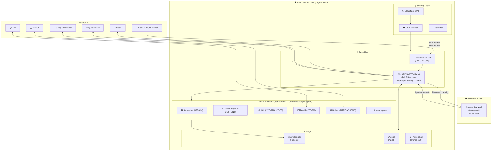

<div align="center">

# 🖥️ Base Infrastructure
### VPS + OpenClaw + Docker + Azure Key Vault — Setup and Deployment

</div>

---

## Server Specifications

| Component | Minimum Requirement | NTE Recommended |
|---|---|---|
| **CPU** | 2 vCPUs | 4 vCPUs |
| **RAM** | 4 GB | 8 GB |
| **Storage** | 40 GB SSD | 80 GB NVMe SSD |
| **Operating System** | Ubuntu 20.04 | **Ubuntu 22.04 LTS** |
| **Bandwidth** | 2 TB/month | 4 TB/month |
| **Provider** | Any | DigitalOcean Droplet (~$48/month) |

---

## System Architecture



---

## Installation Commands

### 1. Server Preparation

```bash
# Update the system
sudo apt update && sudo apt upgrade -y

# Install dependencies
sudo apt install -y docker.io docker-compose git curl ufw fail2ban

# Install Azure CLI
curl -sL https://aka.ms/InstallAzureCLIDeb | sudo bash

# Create dedicated user (NEVER use root)
sudo adduser openclaw --disabled-password
sudo usermod -aG docker openclaw

# Configure firewall
sudo ufw default deny incoming
sudo ufw default allow outgoing
sudo ufw allow ssh
sudo ufw enable
```

### 2. Install OpenClaw

```bash
# As the openclaw user
su - openclaw

# Install OpenClaw (Claude Code SDK)
npm install -g @anthropic-ai/claude-code

# Set restrictive permissions
chmod 700 -R ~/.openclaw
```

### 3. Configure Azure Key Vault (Managed Identity)

```bash
# On the VPS — Configure access to Azure Key Vault
# (use the VPS's Managed Identity if it's on Azure, or a Service Principal for DigitalOcean)

# Login with Service Principal
az login --service-principal \
  --username [app-id] \
  --password [client-secret] \
  --tenant [tenant-id]

# Verify access to the vault
az keyvault secret list --vault-name "nte-keyvault"

# Retrieve a secret (example)
export ANTHROPIC_API_KEY=$(az keyvault secret show \
  --name "anthropic-api-key" \
  --vault-name "nte-keyvault" \
  --query "value" -o tsv)
```

### 4. Secure Gateway Configuration

```bash
# ~/.openclaw/config.json
{
  "gateway": {
    "host": "127.0.0.1",      # NEVER 0.0.0.0
    "port": 18789,
    "auth_mode": "token"
  },
  "sandbox": {
    "mode": "non_main",        # Jarvis has FS access, sub-agents run in Docker
    "docker_image": "openclaw-sandbox:latest"
  }
}
```

### 5. Access via SSH Tunnel (from your local machine)

```bash
# Connect to the gateway securely
ssh -L 18789:localhost:18789 openclaw@YOUR_VPS_IP

# Then in the browser:
# http://localhost:18789?token=YOUR_TOKEN
```

### 6. Secret Injection from Azure Key Vault

```bash
# Startup script — loads secrets from Azure KV into the environment
#!/bin/bash

VAULT="nte-keyvault"

export ANTHROPIC_API_KEY=$(az keyvault secret show --name "anthropic-api-key" --vault-name $VAULT --query "value" -o tsv)
export SLACK_BOT_TOKEN=$(az keyvault secret show --name "slack-bot-token" --vault-name $VAULT --query "value" -o tsv)
export JIRA_API_TOKEN=$(az keyvault secret show --name "jira-api-token" --vault-name $VAULT --query "value" -o tsv)
export QUICKBOOKS_TOKEN=$(az keyvault secret show --name "quickbooks-oauth-token" --vault-name $VAULT --query "value" -o tsv)
export GITHUB_TOKEN=$(az keyvault secret show --name "github-token" --vault-name $VAULT --query "value" -o tsv)
export NTE_SMTP_USER=$(az keyvault secret show --name "nte-email-smtp-user" --vault-name $VAULT --query "value" -o tsv)
export NTE_SMTP_PASS=$(az keyvault secret show --name "nte-email-smtp-pass" --vault-name $VAULT --query "value" -o tsv)

echo "✅ Secrets loaded from Azure Key Vault"
```

---

## 🐳 Docker — One Container per Agent

Each sub-agent runs in its own Docker container. This guarantees:
- **Total isolation** — if one agent is compromised, it doesn't affect the others
- **Controlled resources** — CPU and RAM limits per agent
- **Reproducibility** — same behavior across Dev, Staging, and Production

```bash
# Build an agent's image
docker build -t nte-samantha:latest ./nte-agents-docker/samantha/

# Launch agent with injected secrets (nothing hardcoded)
docker run --rm \
  --name nte-samantha \
  --network nte-restricted \
  --memory="512m" \
  --cpus="0.5" \
  -e ANTHROPIC_API_KEY \
  -e NTE_SMTP_USER \
  -e NTE_SMTP_PASS \
  nte-samantha:latest

# View running agents
docker ps --filter "name=nte-"
```

### Docker Compose for the full team

```yaml
# /workspace/docker-compose.yml
version: '3.8'
services:
  samantha:
    image: nte-samantha:latest
    restart: unless-stopped
    networks: [nte-restricted]
    environment:
      - ANTHROPIC_API_KEY
      - NTE_SMTP_USER
      - NTE_SMTP_PASS
    deploy:
      resources:
        limits:
          memory: 512M
          cpus: '0.5'

  walle:
    image: nte-walle:latest
    restart: unless-stopped
    networks: [nte-restricted]
    environment:
      - ANTHROPIC_API_KEY
      - NTE_SMTP_USER
      - NTE_SMTP_PASS
      - WORDPRESS_API_KEY
      - BUFFER_API_KEY

  # ... (one service per sub-agent)

networks:
  nte-restricted:
    driver: bridge
    # Only allows outbound traffic to specific IPs/domains via firewall rules
```

---

## 🌿 Configuration by Environment

```bash
# Secrets are separated by environment in Azure Key Vault
# Prefixes: dev/, staging/, prod/

# Development
az keyvault secret set --vault-name "nte-keyvault" \
  --name "dev/anthropic-api-key" --value "sk-ant-..."

# Staging
az keyvault secret set --vault-name "nte-keyvault" \
  --name "staging/anthropic-api-key" --value "sk-ant-..."

# Production
az keyvault secret set --vault-name "nte-keyvault" \
  --name "prod/anthropic-api-key" --value "sk-ant-..."
```

See the full environments guide → [../10-environments/environments.md](../10-environments/environments.md)

---

## Directory Structure

```
/home/openclaw/
├── .openclaw/              ← chmod 700 | OpenClaw config
│   ├── config.json
│   └── tokens/
│
/workspace/
├── projects/               ← Client projects
│   ├── client-001/
│   └── client-002/
├── agents/                 ← Agent configurations
│   ├── jarvis/
│   ├── administrative-wing/
│   └── software-wing/
├── content/                ← Blog articles in draft
├── leads/                  ← Lead database (encrypted)
└── logs/                   ← Audit log of all actions
    ├── openclaw-audit.log
    └── agent-comms.log     ← Inter-agent communications
```

---

[← Back to home](../README.md) | [Security →](./security.md)
