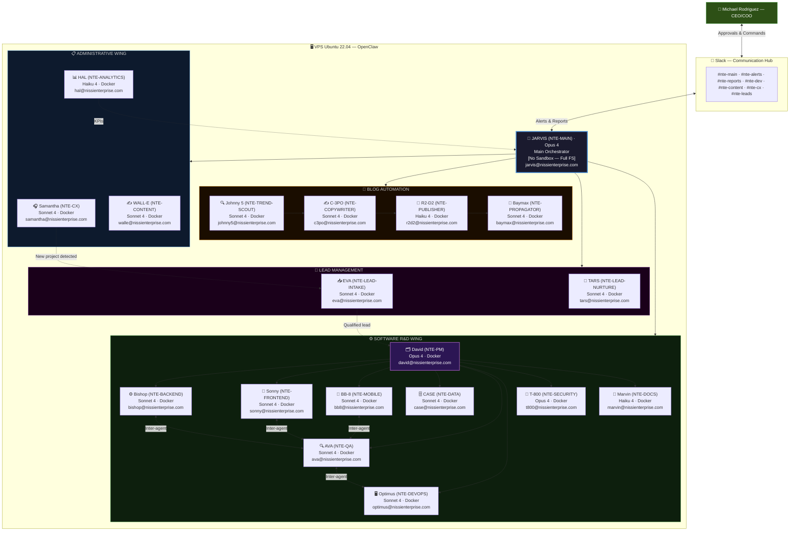
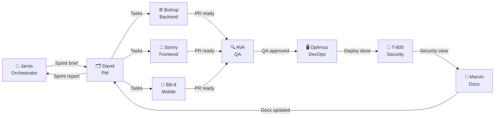
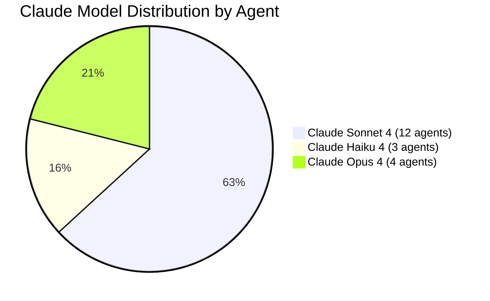

<div align="center">

# 🤖 OpenClaw Agent Ecosystem — NTE
### The 19 Agents of Nissi Technology Enterprises

</div>

---

## General Architecture



---

## 🔀 Inter-Agent Communication

Agents are not islands. They hand off work directly to each other without requiring Jarvis to mediate every step:



**Inter-agent communication protocol:**
- Each agent can directly invoke another using OpenClaw's messaging system.
- All inter-agent communications are logged in `/workspace/logs/agent-comms.log`.
- Jarvis monitors status but does not block the flow between lower-level agents.
- If an agent cannot complete its task, it escalates to David (Software Wing) or to Jarvis (any wing).

---

## Table of All Agents

| # | Name | Technical ID | Email | Role | Model | Sandbox | Frequency |
|---|---|---|---|---|---|---|---|
| 01 | [🧠 **Jarvis**](./jarvis.md) | NTE-MAIN | jarvis@nissienterprise.com | Main Orchestrator | Opus 4 | ❌ Full FS | 24/7 + Heartbeat |
| — | **ADMINISTRATIVE WING** | | | | | | |
| 02 | [🎧 **Samantha**](./administrative-wing/samantha.md) | NTE-CX | samantha@nissienterprise.com | Customer Experience | Sonnet 4 | ✅ Docker | 24/7 Continuous |
| 03 | [✍️ **WALL-E**](./administrative-wing/walle.md) | NTE-CONTENT | walle@nissienterprise.com | Content & Marketing | Sonnet 4 | ✅ Docker | High (daily) |
| 04 | [📊 **HAL**](./administrative-wing/hal.md) | NTE-ANALYTICS | hal@nissienterprise.com | Analytics & Reporting | Haiku 4 | ✅ Docker | Weekly + alerts |
| — | **BLOG AUTOMATION** | | | | | | |
| 05 | [🔍 **Johnny 5**](./specialized-flows/blog-automation/johnny5.md) | NTE-TREND-SCOUT | johnny5@nissienterprise.com | Trend Researcher | Sonnet 4 | ✅ Docker | Weekly (Mon 2AM) |
| 06 | [✍️ **C-3PO**](./specialized-flows/blog-automation/c3po.md) | NTE-COPYWRITER | c3po@nissienterprise.com | Article Writer | Sonnet 4 | ✅ Docker | 2x/week |
| 07 | [🚀 **R2-D2**](./specialized-flows/blog-automation/r2d2.md) | NTE-PUBLISHER | r2d2@nissienterprise.com | WordPress Publisher | Haiku 4 | ✅ Docker | On-demand |
| 08 | [📡 **Baymax**](./specialized-flows/blog-automation/baymax.md) | NTE-PROPAGATOR | baymax@nissienterprise.com | Social Media Distributor | Sonnet 4 | ✅ Docker | Post-publication |
| — | **LEAD MANAGEMENT** | | | | | | |
| 09 | [📥 **EVA**](./specialized-flows/lead-management/eva.md) | NTE-LEAD-INTAKE | eva@nissienterprise.com | Multichannel Capture | Sonnet 4 | ✅ Docker | 24/7 Continuous |
| 10 | [🌱 **TARS**](./specialized-flows/lead-management/tars.md) | NTE-LEAD-NURTURE | tars@nissienterprise.com | Nurturing & Follow-up | Sonnet 4 | ✅ Docker | 24/7 Continuous |
| — | **SOFTWARE R&D WING** | | | | | | |
| 11 | [🗂️ **David**](./software-wing/david.md) | NTE-PM | david@nissienterprise.com | Project Manager | Opus 4 | ✅ Docker | Per Sprint |
| 12 | [⚙️ **Bishop**](./software-wing/bishop.md) | NTE-BACKEND | bishop@nissienterprise.com | Backend Developer | Sonnet 4 | ✅ Docker | Active during sprints |
| 13 | [🎨 **Sonny**](./software-wing/sonny.md) | NTE-FRONTEND | sonny@nissienterprise.com | Frontend Developer | Sonnet 4 | ✅ Docker | Active during sprints |
| 14 | [📱 **BB-8**](./software-wing/bb8.md) | NTE-MOBILE | bb8@nissienterprise.com | Mobile Developer | Sonnet 4 | ✅ Docker | Per mobile project |
| 15 | [🗄️ **CASE**](./software-wing/case.md) | NTE-DATA | case@nissienterprise.com | Data Engineer | Sonnet 4 | ✅ Docker | Per BI project |
| 16 | [🔍 **AVA**](./software-wing/ava.md) | NTE-QA | ava@nissienterprise.com | QA & Tester | Sonnet 4 | ✅ Docker | Every PR/commit |
| 17 | [🖥️ **Optimus**](./software-wing/optimus.md) | NTE-DEVOPS | optimus@nissienterprise.com | DevOps & Sysadmin | Sonnet 4 | ✅ Docker | Per deployment |
| 18 | [🔐 **T-800**](./software-wing/t800.md) | NTE-SECURITY | t800@nissienterprise.com | Security Agent | Opus 4 | ✅ Docker | Per release |
| 19 | [📝 **Marvin**](./software-wing/marvin.md) | NTE-DOCS | marvin@nissienterprise.com | Technical Writer | Haiku 4 | ✅ Docker | Post-commit |

---

## 📧 Corporate Email Server

All agents use NTE's email server. Gmail is not used.

```
Domain:     @nissienterprise.com
Server:     mail.nissienterprise.com
Secrets:    Azure Key Vault → secret/nte-email-smtp
Protocol:   SMTP/TLS (port 587) + IMAP (port 993)
```

Agents send email notifications when warranted:
- **Samantha** → appointment confirmations, customer replies, escalations
- **TARS** → nurturing sequences, lead follow-ups
- **WALL-E** → monthly newsletter, announcements
- **David** → sprint reports to stakeholders
- **Optimus** → deployment and downtime alerts
- **T-800** → security reports and critical alerts

---

## 🌿 Environments per Agent

Each agent operates in 3 separate environments:

| Environment | Purpose | Data |
|---|---|---|
| **Development** | Building and configuring agents | Fake data |
| **Staging** | Testing and demos with real data | Real data |
| **Production** | Live 24/7 system | Real data |

See full details → [../10-environments/environments.md](../10-environments/environments.md)

---

## Model Distribution



---

[← Security](../02-infrastructure/security.md) | [Back to home](../README.md) | [Jarvis →](./jarvis.md)
