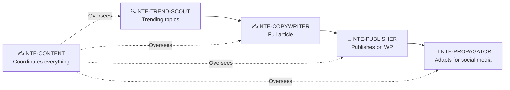

# ✍️ NTE-CONTENT
### Content & Marketing Agent

*NTE's digital voice. Generates, schedules, and distributes content aligned with the brand.*

---

## 🎯 Responsibilities

Autonomously runs NTE's **monthly editorial calendar**. Coordinates with NTE-TREND-SCOUT for blog articles and manages evergreen social media content.

---

## 📅 Editorial Calendar

| Channel | Frequency | Content type |
|---|---|---|
| WordPress Blog | 2 articles/week | SEO · Educational · Use cases |
| LinkedIn | 5 posts/week | Professional · Thought leadership |
| Instagram | 1 post + 3 stories/day | Visual · Tips · Behind the scenes |
| Facebook | 3 posts/week | Community · News · Testimonials |
| Twitter/X | 2 tweets/day | Quick · Tips · Tech news |
| Newsletter | 1 email/month | Summary + NTE updates |

---

## 🔧 Content Pipeline

---

## 🛠️ Tools & APIs

- **WordPress REST API** — Blog publishing
- **Buffer API** — Social media scheduling
- **SendGrid / Mailchimp** — Monthly newsletter
- **DALL-E / Stable Diffusion** — Content images
- **Semrush API** — Keywords and SEO analysis

---

[← NTE-CX](./nte-cx.md) | [NTE-ANALYTICS →](./nte-analytics.md)
