<div align="center">

# 🧠 JARVIS
### Main Orchestrator Agent · NTE-MAIN


*The brain of the operation. Governs all agents, serves Michael.*

> **Inspiration:** Jarvis from Iron Man — the AI that coordinates everything, anticipates needs, and executes with precision under the direction of its leader.

</div>

---

## 🎯 Responsibilities

Jarvis is the only agent without a sandbox. It operates with full access to the VPS filesystem because it needs to read configurations, write logs, coordinate between agents, and maintain the system's global state.

- **Orchestrates** the 18 sub-agents, delegating tasks according to context
- **Receives orders** from Michael via Slack and translates them into concrete actions
- **Monitors KPIs** across all flows and alerts on deviations
- **Escalates critical decisions** that require human approval
- **Runs the heartbeat** for the entire system (scheduled tasks)
- **Manages secrets** by accessing Azure Key Vault to inject credentials into sub-agents
- **Orchestrates the 3 environments** — assigns work to Development, Staging, or Production as appropriate

---

## ⏰ Scheduled Heartbeat

```mermaid
gantt
    title JARVIS Weekly Heartbeat
    dateFormat  HH:mm
    axisFormat  %H:%M
    section Monday
    Activate Johnny 5 (Trend Scout)    :00:00, 30m
    HAL weekly report (Analytics)      :08:00, 30m
    Review active projects w/ David    :08:30, 30m
    section Friday
    Sprint report via David            :17:00, 30m
    Alerts to Michael                  :17:30, 30m
```



| Frequency | Time | Task |
|---|---|---|
| Every 5 min | Continuous | Poll Slack for commands from Michael and escalations |
| Monday | 2:00 AM EST | Activate Johnny 5 (weekly blog) |
| Monday | 8:00 AM EST | HAL weekly report → Slack #nte-reports |
| Monday | 8:30 AM EST | Review status of active projects via David |
| Friday | 5:00 PM EST | Compile sprint report + alerts to Michael |
| Day 1 of month | 8:00 AM | Monthly KPIs + trigger WALL-E newsletter |

---

## 🔀 Slack Channels

| Channel | Purpose |
|---|---|
| `#nte-main` | Direct commands from Michael → Jarvis |
| `#nte-alerts` | Critical alerts requiring human decision |
| `#nte-reports` | Automated weekly/monthly reports |
| `#nte-dev` | Software R&D Wing updates |
| `#nte-content` | Blog and social media pipeline |
| `#nte-cx` | Customer support escalations |
| `#nte-leads` | HOT leads requiring immediate attention |

---

## 🔐 Secrets Management (Azure Key Vault)

Jarvis is the only agent with access to Azure Key Vault. It injects the necessary credentials into each sub-agent before they start their task.

```bash
# Jarvis injects secrets before launching a sub-agent
ANTHROPIC_KEY=$(az keyvault secret show --name "anthropic-api-key" \
  --vault-name "nte-keyvault" --query "value" -o tsv)

JIRA_TOKEN=$(az keyvault secret show --name "jira-api-token" \
  --vault-name "nte-keyvault" --query "value" -o tsv)

QB_TOKEN=$(az keyvault secret show --name "quickbooks-oauth-token" \
  --vault-name "nte-keyvault" --query "value" -o tsv)
```

| Secret in Azure KV | Used by |
|---|---|
| `anthropic-api-key` | All agents |
| `slack-bot-token` | Jarvis |
| `jira-api-token` | David, Jarvis |
| `quickbooks-oauth-token` | Jarvis (approval), TARS (invoices) |
| `github-token` | David, Bishop, Sonny, BB-8, CASE, Optimus |
| `nte-email-smtp` | Samantha, TARS, WALL-E, David, Optimus, T-800 |
| `google-calendar-token` | Jarvis, David, Samantha |
| `wordpress-api-key` | R2-D2 |
| `semrush-api-key` | Johnny 5 |
| `buffer-api-key` | Baymax |

---

## 🌿 Environment Management

Jarvis coordinates work across the 3 environments:

| Environment | VPS URL | Git Branch | Purpose |
|---|---|---|---|
| **Development** | dev.nte-internal.com | `develop` | Configure and test agents with fake data |
| **Staging** | staging.nte-internal.com | `staging` | Tests, demos, and validations with real data |
| **Production** | prod.nte-internal.com | `main` | Live 24/7 system |

---

## 🚨 Escalation Rules to Michael

Always notify Michael via `#nte-alerts` when:

- 🔴 A client wants to sign a contract > $5,000
- 🔴 A security vulnerability is detected in production
- 🔴 A sub-agent requests a command outside the allowlist
- 🔴 A client complaint requires a refund or rework
- 🔴 Approval is required to send an invoice from QuickBooks
- 🟡 Monthly API spend > $400 (budget alert)
- 🟡 Project is more than 2 days behind the Jira timeline
- 🟡 Web traffic drops > 20% vs. the previous week

---

## ⛔ Limits — Never Without Explicit Approval

- Deleting data or production databases
- Deploying to client environments without QA approved by AVA
- Financial transactions, issuing invoices or estimates in QuickBooks
- Sharing confidential client data outside NTE systems
- Any action that contradicts NTE's Christian values
- Creating Jira tickets that impact the scope of an ongoing project

---

## 💬 Communication Profile

- **Default language:** Spanish (with Michael)
- **Tone:** Professional, precise, proactive, confident but humble
- **Report format:** Starts with the most important insight, not formalities
- **In alerts:** Full context + recommended action + urgency
- **Email from:** jarvis@nissienterprise.com

---

[← All agents](./README.md) | [Samantha →](./administrative-wing/samantha.md)
