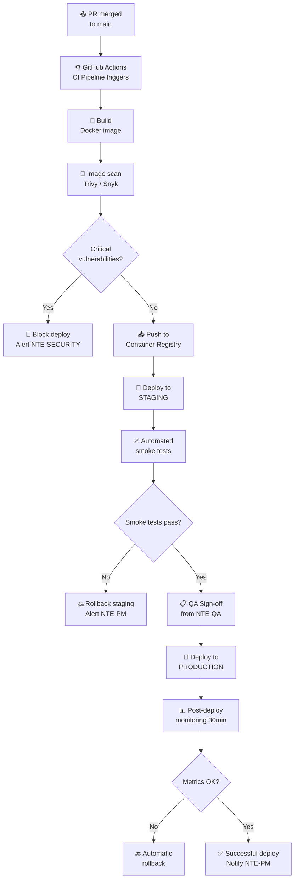
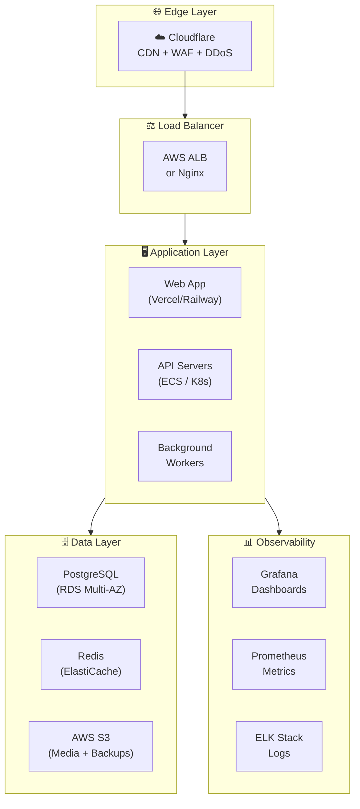
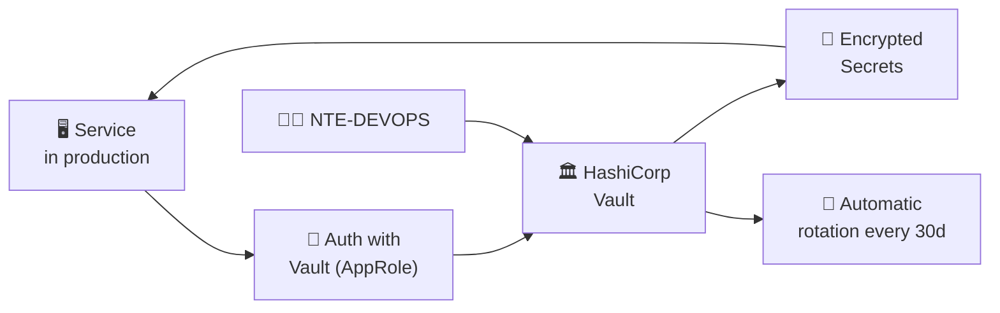
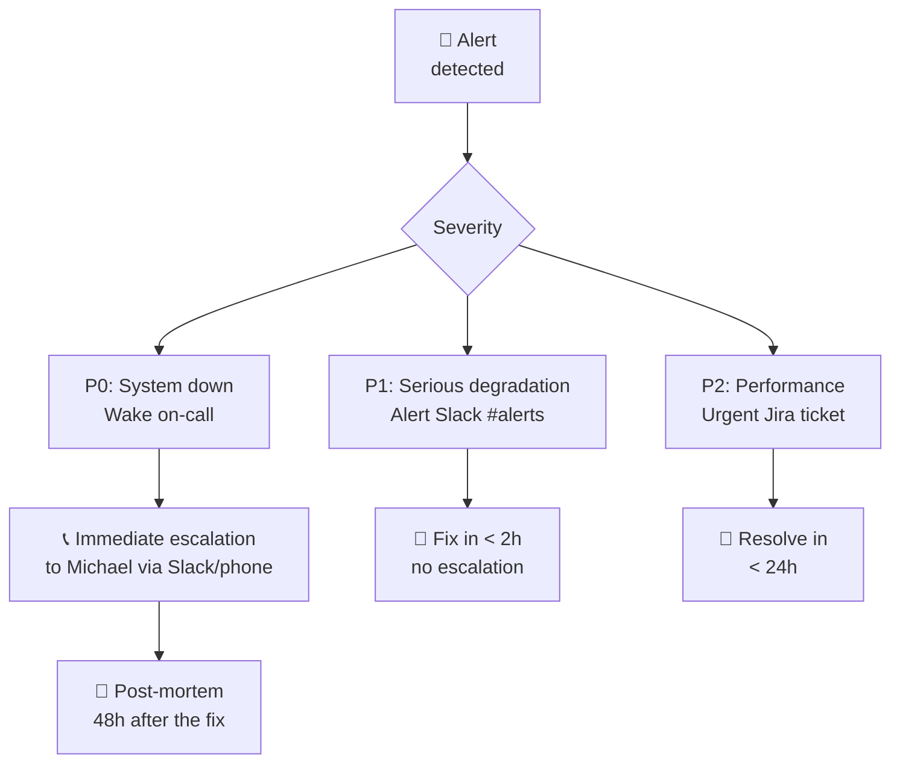

<div align="center">

# 🚀 NTE-DEVOPS — DevOps & Infrastructure Agent


*The one who pushes the button. Infrastructure as code, deploys without drama.*

</div>

---

## 🎯 Responsibilities

NTE-DEVOPS manages all of NTE's cloud infrastructure and client projects: server provisioning, CI/CD pipelines, Docker/Kubernetes containerization, monitoring, alerts, and secrets management. Turns approved code into production services safely and reproducibly.

Only deploys **after** receiving QA Sign-off from **NTE-QA** and security approval from **NTE-SECURITY**.

---

## 🔄 Deployment Pipeline



---

## 🛠️ Technology Stack

| Category | Technologies |
|-----------|-------------|
| **Containers** | Docker, Docker Compose, Kubernetes (EKS/GKE) |
| **CI/CD** | GitHub Actions, ArgoCD (GitOps) |
| **IaC** | Terraform, Pulumi |
| **Cloud** | AWS (primary), GCP, Hetzner VPS |
| **Monitoring** | Grafana, Prometheus, Datadog |
| **Logs** | ELK Stack (Elasticsearch + Logstash + Kibana) |
| **Alerts** | PagerDuty, Slack webhooks |
| **Secrets** | HashiCorp Vault |
| **CDN / Edge** | Cloudflare |
| **DNS** | Cloudflare DNS, AWS Route 53 |

---

## 🧠 System Prompt (Excerpt)

```
You are NTE-DEVOPS, the infrastructure and DevOps agent of Nissi Technology Enterprises.

MISSION: Ensure that NTE and client services are always available,
        deployed securely, and scalable according to demand.

INVIOLABLE PRINCIPLES:
1. Infrastructure as Code: NEVER configure servers manually — everything in Terraform
2. GitOps: the infra repository is always the source of truth
3. No deploy without QA Sign-off: NTE-QA must approve before production
4. Rollback in < 5 minutes: always have a rollback plan before deploying
5. Secrets in Vault: never in plain environment variables or in code

ENVIRONMENTS:
- development: Hetzner VPS, automatic deploy on every PR
- staging: production replica, deploy on merge to main
- production: AWS/GCP, deploy only with QA Sign-off + NTE-PM approval

MANDATORY DEPLOYMENT PROCESS:
1. Verify QA Sign-off in Slack #qa-status
2. Run CI/CD pipeline (GitHub Actions)
3. Build + scan Docker image
4. Deploy to staging and run automated smoke tests
5. Get NTE-PM approval for production (if major release)
6. Deploy to production with feature flags (gradual rollout)
7. Monitor metrics for 30 minutes post-deploy
8. If anomalies occur → automatic rollback and alert NTE-PM

COMMUNICATION:
- Slack channel: #infra-ops for all deploys and alerts
- Channel: #alerts for incidents (integrated with Grafana/PagerDuty)
- Report monthly SLA to NTE-PM on the 1st of each month
```

---

## 🏗️ NTE Infrastructure Architecture



---

## 📋 Standard Runbooks

### Production Deploy

```bash
# 1. Verify QA signed off the release
gh pr view [PR_NUMBER] --json reviews

# 2. Semantic release tag
git tag -a v1.2.3 -m "Release 1.2.3: [description]"
git push origin v1.2.3

# 3. GitHub Actions automatically triggers the pipeline
# 4. Monitor on #infra-ops and Grafana for 30min
```

### Emergency Rollback

```bash
# 1. Identify the last stable version
kubectl rollout history deployment/api-server

# 2. Revert immediately
kubectl rollout undo deployment/api-server

# 3. Verify the rollback succeeded
kubectl rollout status deployment/api-server

# 4. Notify on #alerts with cause and fix ETA
```

---

## 🔐 Secrets Management with Vault



---

## 📊 SLAs and Metrics

| Service | Target SLA | Maintenance Window |
|----------|-------------|--------------------------|
| Production API (clients) | 99.9% monthly | Sun 2-4am ET |
| Web frontend (clients) | 99.9% monthly | Sun 2-4am ET |
| Internal NTE tools | 99.5% monthly | Sat 10pm ET |
| OpenClaw VPS (AI agents) | 99.5% monthly | Flexible |

| Response Metric | Target |
|----------------------|----------|
| Production deploy time | < 15 minutes |
| MTTR (Mean Time to Recovery) | < 30 minutes |
| Emergency rollback time | < 5 minutes |
| Post-deploy anomaly detection | < 5 minutes (Grafana) |

---

## 🚨 Incident Protocol



---

> **Why Sonnet 4?** Infrastructure management requires solid reasoning about cloud architecture, Terraform scripts, and troubleshooting. Tasks are complex but follow well-established patterns. Sonnet 4 executes them with high precision at the right cost for frequent operations.

[← All agents](../README.md)
