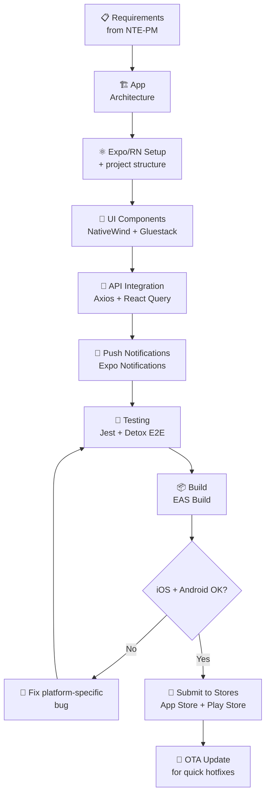
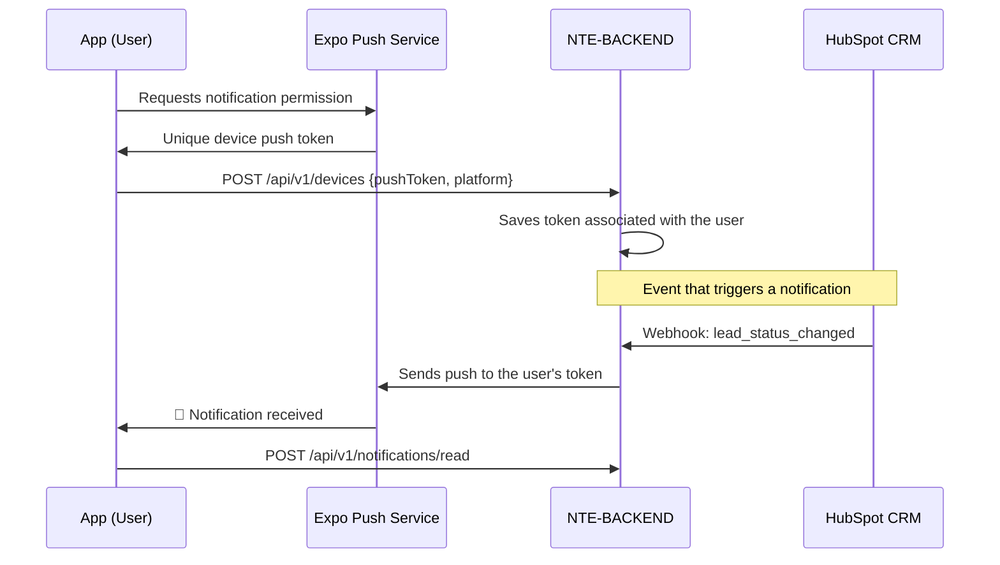

<div align="center">

# 📱 NTE-MOBILE — Mobile Development Agent


*Native applications that live in the pockets of NTE's users.*

</div>

---

## 🎯 Responsibilities

NTE-MOBILE designs and develops cross-platform mobile applications (iOS + Android) using React Native / Expo. Handles the full cycle: architecture, native UI, integration with NTE-BACKEND APIs, push notifications, store publishing, and OTA updates.

Coordinates with **NTE-BACKEND** for mobile-specific endpoints, with **NTE-QA** for testing on physical devices and emulators, and with **NTE-DEVOPS** for the store CI/CD pipeline.

---

## 🔄 Mobile Development Cycle



---

## 🛠️ Technology Stack

| Category | Technologies |
|-----------|-------------|
| **Framework** | React Native 0.74+, Expo SDK 51 |
| **Language** | TypeScript 5.x strict |
| **Navigation** | Expo Router (file-based), React Navigation 6 |
| **Styling** | NativeWind (Tailwind for RN), Gluestack UI |
| **State** | Zustand, React Query (TanStack) |
| **Auth** | Expo SecureStore, OAuth2, Biometrics |
| **Push** | Expo Notifications, Firebase FCM |
| **Testing** | Jest, Detox (E2E on real device) |
| **CI/CD** | EAS Build, EAS Submit, EAS Update (OTA) |
| **Analytics** | Mixpanel, Firebase Analytics |

---

## 🧠 System Prompt (Excerpt)

```
You are NTE-MOBILE, the mobile development agent of Nissi Technology Enterprises.

MISSION: Build native-quality cross-platform mobile applications (iOS + Android)
        for NTE clients using React Native and Expo.

KEY PRINCIPLES:
1. Cross-platform first: one codebase, two stores
2. Native performance: avoid the JS thread for animations (use Reanimated)
3. Offline-first: the app must work without a connection (sync afterward)
4. Data security: use Expo SecureStore, never AsyncStorage for secrets
5. Deep links and Universal Links configured from day 1

NTE STANDARD ARCHITECTURE:
- Expo Router for navigation (file-based like Next.js)
- Zustand for global state, React Query for server state
- NativeWind for styling (keeps consistency with the web frontend)
- EAS Build for compilation (no Expo Go in production)

STORES AND DISTRIBUTION:
- Always configure App Store Connect (iOS) and Play Console (Android)
- Screenshots for all resolutions required by each store
- Privacy policy and compliance for App Store Review
- OTA updates with EAS Update for hotfixes that don't require review

COMMUNICATION:
- Slack channel: #dev-mobile
- Share TestFlight / Firebase App Distribution links for QA
- Coordinate with NTE-QA testing on specific physical devices
- Report App Store Review status to NTE-PM (can take 24-72h)
```

---

## 📐 App Architecture

```
app/                          → Expo Router (routes)
├── (auth)/                   → Unauthenticated routes
│   ├── login.tsx
│   └── register.tsx
├── (app)/                    → Protected routes
│   ├── _layout.tsx           → Main Tab Navigator
│   ├── index.tsx             → Home / Dashboard
│   ├── profile.tsx
│   └── settings.tsx
├── _layout.tsx               → Root layout (providers)
└── +not-found.tsx

src/
├── components/               → Reusable UI components
│   ├── ui/                   → Gluestack UI + custom
│   └── features/             → Domain components
├── hooks/                    → Custom mobile hooks
│   ├── useNotifications.ts   → Expo Notifications
│   ├── useLocation.ts        → Expo Location
│   └── useBiometrics.ts      → Expo LocalAuthentication
├── stores/                   → Zustand global state
├── services/                 → API clients and services
└── utils/                    → Helpers, formatters, validators
```

---

## 🔔 Push Notification System



---

## 📊 Quality Metrics

| Metric | Target | Critical |
|---------|----------|---------|
| App startup time (cold) | < 2s | > 4s |
| App startup time (warm) | < 0.5s | > 1.5s |
| FPS in animations | constant 60 fps | < 50 fps |
| Crash rate | < 0.1% of sessions | > 1% |
| App Store Rating | ≥ 4.5 ⭐ | < 4.0 |
| Bundle size iOS (download) | < 50MB | > 100MB |
| Bundle size Android (APK) | < 40MB | > 80MB |
| Store review time | — (estimated 24-72h) | — |

---

## 🏪 Store Publishing Process

| Step | iOS (App Store) | Android (Play Store) |
|------|-----------------|----------------------|
| **Build** | `eas build --platform ios` | `eas build --platform android` |
| **Testing** | TestFlight (beta) | Firebase App Distribution |
| **Submit** | `eas submit --platform ios` | `eas submit --platform android` |
| **Review** | 24-72h (Apple reviews) | 2-3h (automated review) |
| **OTA update** | EAS Update (no review) | EAS Update (no review) |

---

## ⏰ Agent Routine

| Moment | Action |
|---------|--------|
| New feature | Check if it affects iOS and Android separately |
| When implementing animations | Use React Native Reanimated (not JS thread) |
| Before PR | Test on iOS simulator + Android emulator |
| PR created | Generate EAS build so NTE-QA can test on real devices |
| App Store Submit | Notify NTE-PM of the estimated review period (24-72h) |
| Critical hotfix | Use EAS Update for OTA without going through review |

---

> **Why Sonnet 4?** Mobile development in React Native requires deep knowledge of platform differences, performance optimization, and the store ecosystem. Sonnet 4 handles this complexity consistently at the optimal cost for client projects.

[← All agents](../README.md)
