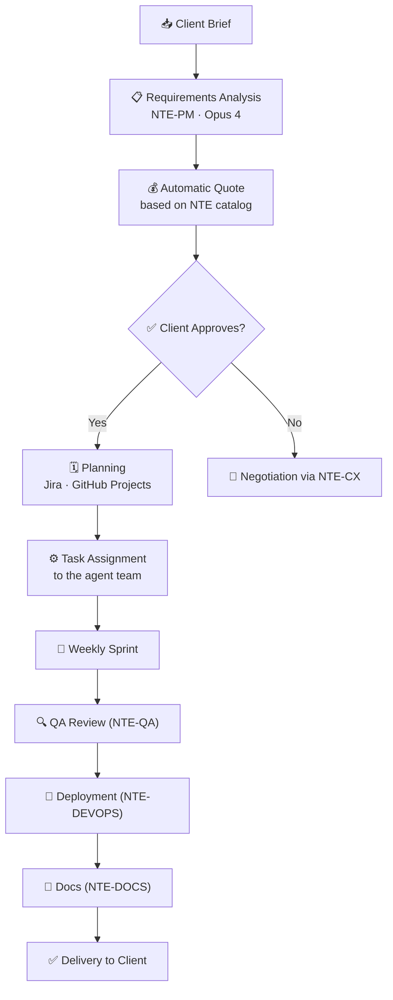

# 🗂️ NTE-PM — Project Manager Agent

*The conductor of development. Turns briefs into delivered projects.*

## 🎯 Responsibilities

NTE-PM is the brain of the Software R&D Wing. Receives client projects, breaks them down into executable tasks, and coordinates the team of 8 developer agents.

## 🔄 Project Lifecycle

## 🛠️ Tools

- **Jira / Linear** — Tracking of epics, stories, and tasks
- **GitHub Projects** — Kanban integrated with the code
- **Slack** — Communication with Michael and client reporting
- **Google Calendar** — Timeline and milestones

> **Why Opus 4?** Breaking down ambiguous requirements, detecting dependencies, and maintaining decision coherence over weeks requires the long-horizon reasoning that only Opus delivers consistently.

[← All agents](../README.md)
