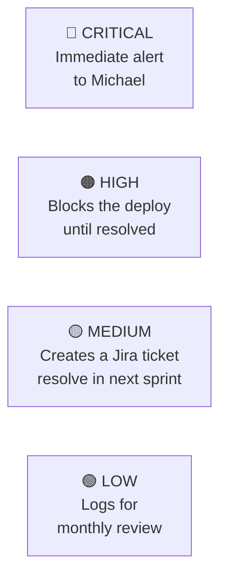

# 🔐 NTE-SECURITY — Security Agent

*The guardian of NTE's code and infrastructure integrity.*

## 🎯 Responsibilities

Performs automatic security audits on every release: static code analysis (SAST), vulnerable dependencies, server configurations, and basic penetration tests.

## 🔍 Audit Types

| Type | Frequency | Tool |
|---|---|---|
| SAST — Code Analysis | Every PR | Semgrep |
| Vulnerable Dependencies | Every PR | npm audit · pip-audit |
| Server Configuration | Weekly | Custom scripts |
| Basic Penetration Test | Every release | OWASP ZAP |
| Secrets-in-Code Review | Every commit | git-secrets |

## 🚨 Alert Levels

## 🛠️ Tools

- **Semgrep** — Static code analysis (SAST)
- **OWASP ZAP** — Automated penetration tests
- **npm audit / pip-audit** — Vulnerable dependencies
- **GitHub Security Advisories** — CVEs in dependencies
- **git-secrets** — Prevents committing credentials

> **Why Opus 4?** Interpreting vulnerabilities requires deep reasoning about attack vectors, code context, and risk prioritization. Mistakes here have critical consequences for NTE's clients.

[← All agents](../README.md)
