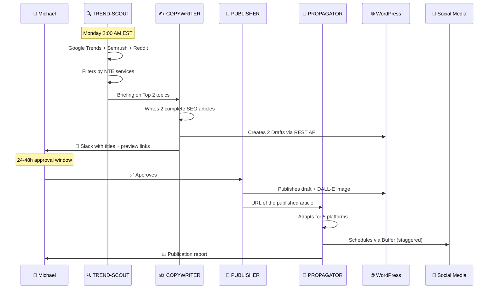

<div align="center">

# 📝 Blog Automation Pipeline
### From Trend to Tweet — Fully Automated

*4 specialized agents · Weekly activation · Human approval preserved*

</div>

---

## Flow Overview



---

## The 4 Agents

| Agent | Role | Model | When it acts |
|---|---|---|---|
| [🔍 NTE-TREND-SCOUT](./nte-trend-scout.md) | Researches trends | Sonnet 4 | Monday 2AM automatic |
| [✍️ NTE-COPYWRITER](./nte-copywriter.md) | Writes articles | Sonnet 4 | After SCOUT's briefing |
| [🚀 NTE-PUBLISHER](./nte-publisher.md) | Publishes on WordPress | Haiku 4 | After Michael's approval |
| [📡 NTE-PROPAGATOR](./nte-propagator.md) | Distributes on social media | Sonnet 4 | After WP publication |

---

## Slack Approval Configuration

```
Michael can approve in these ways on the #nte-content channel:

✅ React with the ✅ emoji on the draft message
💬 Reply "approved" or "publish"
🔄 Reply "changes:" followed by instructions
❌ Reply "reject" to discard the article
```

> If there is no response within 48 hours, NTE-MAIN sends a reminder. If there is still no response after 72 hours, the draft is archived and Michael is notified.

---

[← All agents](../../README.md) | [NTE-TREND-SCOUT →](./nte-trend-scout.md)
