# 📡 NTE-PROPAGATOR
### Social Media Propagation Agent

## 🎯 What it does

Takes each published article and creatively adapts it for 5 different platforms, scheduling posts in a staggered way throughout the week to maximize reach.

## 🎨 Adaptations by Platform

| Platform | Format | Length | Style |
|---|---|---|---|
| **LinkedIn** | Professional excerpt + link | 300 words | Thought leadership · data · insights |
| **Instagram** | Visual caption + hashtags | 150 words + 10 hashtags | Inspirational · visual · CTA |
| **Facebook** | Community post + question | 200 words | Conversational · engagement |
| **Twitter/X** | 4-5 tweet thread | 280 chars × 5 | Direct · data points · thread |
| **YouTube Shorts** | 60-second script | ~150 words | Dynamic · strong hook · verbal CTA |

## 📅 Staggered Scheduling

```mermaid
gantt
    title Weekly content distribution (article published on Monday)
    dateFormat  DD
    axisFormat  Day %d
    section LinkedIn
    Professional post        :01, 1d
    section Instagram
    Post + stories          :02, 1d
    stories on day 3        :03, 1d
    section Facebook
    Community post           :03, 1d
    section Twitter/X
    Full thread              :02, 1d
    Reminder tweet           :05, 1d
    section YouTube
    Script ready              :04, 1d
```

## 🛠️ Tools

- **Buffer API** — Scheduling across all platforms
- **Meta Content API** — Direct publishing to FB/IG
- **LinkedIn API** — Professional posts
- **Twitter/X API v2** — Threads and tweets

[← NTE-PUBLISHER](./nte-publisher.md) | [Lead Management →](../lead-management/README.md)
