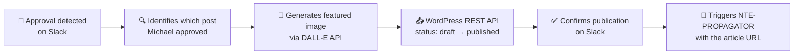

<div align="center">

# 🚀 NTE-PUBLISHER
### WordPress Publisher Agent


</div>

## 🎯 What it does

Monitors the `#nte-content` Slack channel waiting for Michael's approval. Once detected, it publishes the draft on WordPress, generates the featured image with AI, and triggers NTE-PROPAGATOR.

## 🔍 Approval Detection

NTE-PUBLISHER recognizes these signals on Slack:
- ✅ emoji reaction on the draft message
- A reply containing: "approved", "publish", "go ahead", "go"
- Direct message: "publish article X"

## ⚙️ Publishing Process



## 🖼️ Featured Image Generation

```
DALL-E Prompt: "Professional technology illustration for blog post about 
[article topic], corporate style, blue and white color palette, 
no text, modern minimalist, suitable for Nissi Technology Enterprises blog"
```

> **Why Haiku 4?** NTE-PUBLISHER's task is simple: detect a pattern on Slack and make 2-3 API calls. It does not require complex reasoning. Haiku executes this perfectly at a fraction of the cost.

[← NTE-COPYWRITER](./nte-copywriter.md) | [NTE-PROPAGATOR →](./nte-propagator.md)
