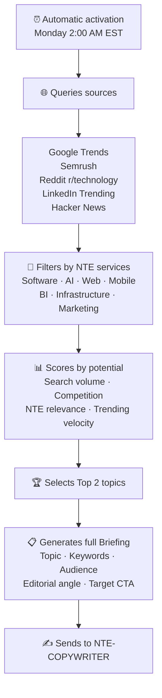

<div align="center">

# 🔍 NTE-TREND-SCOUT
### Trend Research Agent


</div>

## 🎯 What it does

Every Monday at 2:00 AM EST, NTE-TREND-SCOUT activates and scans the internet for the most relevant technology topics of the week that align with NTE's services.

## 🔎 Research Process



## 📋 Briefing Format

```markdown
## NTE-TREND-SCOUT WEEKLY BRIEFING
Week: [date]

### ARTICLE 1
- **Topic:** [tentative title]
- **Primary Keyword:** [keyword with volume X searches/month]
- **Secondary Keywords:** [list]
- **Target Audience:** [profile of the ideal reader]
- **Editorial Angle:** [why it's relevant NOW for NTE clients]
- **Related NTE Services:** [which services we can tie in]
- **Suggested CTA:** [what action we want the reader to take]
- **Recommended Length:** [1200-1800 words]

### ARTICLE 2
[same structure]
```

## 🛠️ APIs Used

- **Google Trends API (Unofficial)** — Trending topics by region
- **Semrush API** — Search volume and keyword difficulty
- **Reddit API** — Most popular threads in tech subreddits
- **RSS Feeds** — Hacker News, TechCrunch, The Verge

[← Blog Pipeline](./README.md) | [NTE-COPYWRITER →](./nte-copywriter.md)
