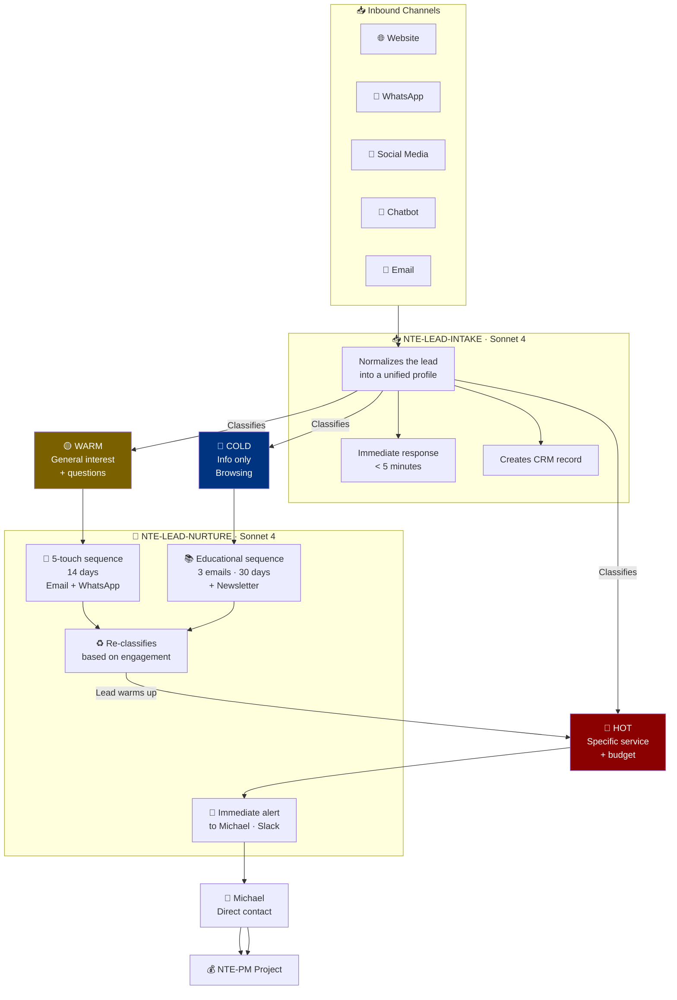

# 🎯 Lead Management Pipeline
### From Stranger to Client — Fully Automated

*2 specialized agents · 24/7 operation · 3 classification levels*

---

## Full Flow

---

## Lead Classification

### 🔴 HOT Lead — Immediate Action (< 15 min)
- Mentions a specific service ("I need a mobile app")
- Has a defined budget or clear timeline
- Already has an established company
- Was referred by an existing client

### 🟡 WARM Lead — 14-day Nurturing
- General interest in NTE services
- Asks questions but lacks clarity on what they need
- Visited the website multiple times (if tracking is available)
- Downloaded a resource or filled out a contact form

### 🔵 COLD Lead — 30-day Education
- Only requested general information
- Did not respond to qualification questions
- Only reads the blog or visits social media
- Very early in their decision process

---

## Monitored Channels

| Channel | API | Response Time |
|---|---|---|
| Website Forms | Webhook | < 2 min |
| WhatsApp Business | Twilio / Meta API | < 5 min |
| Facebook Messenger | Meta API | < 5 min |
| Instagram DMs | Meta API | < 5 min |
| Web Chat (Crisp) | Crisp Webhook | < 2 min |
| Email | Gmail API | < 10 min |

---

[← All agents](../../README.md) | [NTE-LEAD-INTAKE →](./nte-lead-intake.md)
