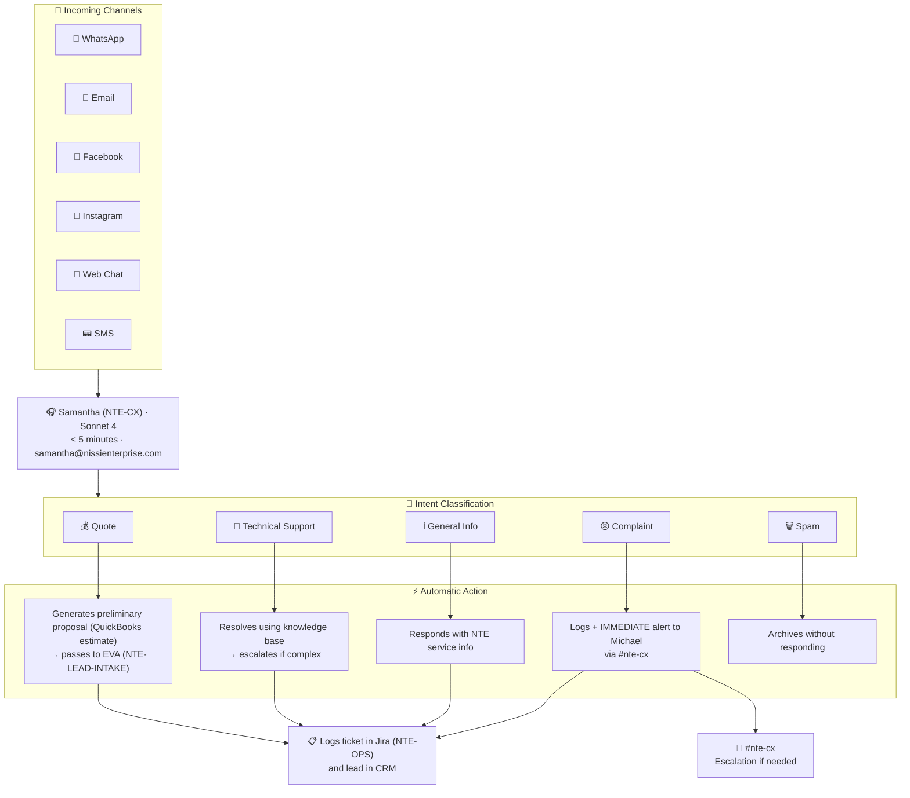

# 🎧 Flow: Omnichannel Customer Service
### Response < 5 Minutes · 24/7 · Across All Channels

## Sample Responses by Channel

**WhatsApp Business:**
> "Hi [Name]! 👋 I'm the assistant for Nissi Technology Enterprises. I received your message about [detected topic]. To give you the best assistance, can you tell me a bit more about [qualifying question]? In the meantime, here's information about our related services: [link]. An expert from our team will contact you very soon!"

**Email (from samantha@nissienterprise.com):**
> Subject: Re: Your inquiry to Nissi Technology Enterprises
> "Hi [Name], thank you for reaching out. I've received your message and am processing it..."

[← Flows](./README.md)
