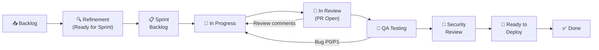
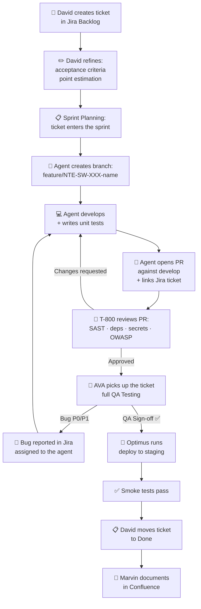
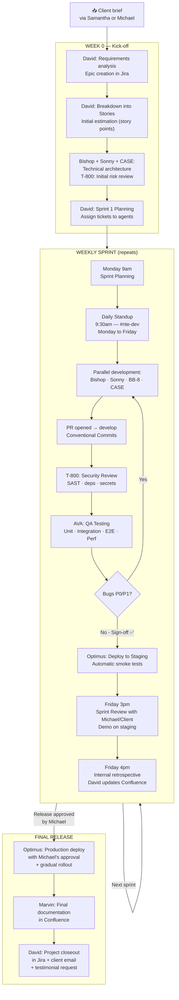
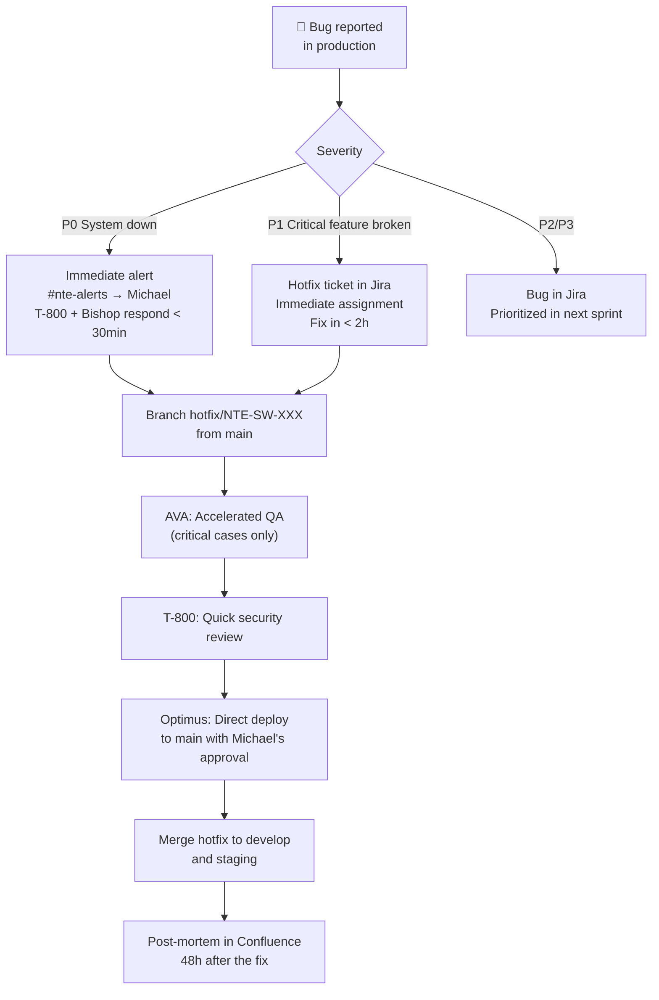

<div align="center">

# ⚙️ Development Workflow: SCRUM with Jira
### How the Software R&D Wing executes projects in an agile way

</div>

---

## 1. General SCRUM Structure at NTE

NTE operates with **weekly sprints** (Monday to Friday). Each client project has its own Jira board under the **`NTE-SW`** project. David (NTE-PM) is the functional Scrum Master and maintains the direct relationship with Michael as the delegated Product Owner.

```
Sprint = 1 week (Monday 9am → Friday 5pm ET)
Jira Project: NTE-SW
Board type: Scrum
Slack channel: #nte-dev
```

---

## 2. Jira Ticket Hierarchy

```
Epic  →  Story  →  Task / Subtask  →  Bug
```

| Type | Prefix | Description | Owner |
|------|---------|-------------|-------------|
| **Epic** | `NTE-SW-XXX` | Large project module (e.g. "User Authentication") | David (NTE-PM) |
| **Story** | `NTE-SW-XXX` | Deliverable feature from the user's perspective | David (NTE-PM) |
| **Task** | `NTE-SW-XXX` | Concrete technical work assigned to an agent | Assigned agent |
| **Subtask** | `NTE-SW-XXX` | Internal steps of a Task | Assigned agent |
| **Bug** | `NTE-SW-XXX` | Defect reported by AVA or production | AVA → corresponding agent |

### Mandatory fields on every ticket

| Field | Description |
|-------|-------------|
| `Assignee` | The responsible agent (e.g. `bishop@nissienterprise.com`) |
| `Sprint` | Active sprint it belongs to |
| `Epic Link` | Parent Epic |
| `Story Points` | Point estimate (1, 2, 3, 5, 8, 13) |
| `Priority` | P0 / P1 / P2 / P3 / P4 |
| `Labels` | `backend`, `frontend`, `mobile`, `data`, `qa`, `security`, `devops`, `docs` |
| `Fix Version` | Semantic release version (e.g. `v1.2.0`) |
| `Acceptance Criteria` | Acceptance criteria in the Description field |

---

## 3. Jira Board Columns (NTE-SW)



| Column | Entry trigger | Owner |
|---------|-------------------|-------------|
| **Backlog** | David creates the ticket | David (NTE-PM) |
| **Refinement** | Ticket estimated with acceptance criteria | David (NTE-PM) |
| **Sprint Backlog** | Sprint Planning includes it in the active sprint | David (NTE-PM) |
| **In Progress** | Agent opens branch `feature/NTE-SW-XXX-description` | Assigned agent |
| **In Review** | PR opened against `develop`, ticket linked | Assigned agent |
| **QA Testing** | T-800 approves the PR → AVA picks up the ticket | AVA (NTE-QA) |
| **Security Review** | AVA gives QA Sign-off → T-800 does final scan | T-800 (NTE-SECURITY) |
| **Ready to Deploy** | T-800 approves → Optimus schedules deploy | Optimus (NTE-DEVOPS) |
| **Done** | Successful production deploy → Marvin documents | David closes the ticket |

---

## 4. SCRUM Ceremonies

### 4.1 Sprint Planning — Monday 9:00 AM ET

**Participants:** David (NTE-PM) · Michael (Product Owner) · Development agents (passive)

**Agenda:**
1. David presents the proposed Sprint Goal
2. Michael approves priorities of the refined backlog
3. David assigns Stories/Tasks to each agent based on capacity
4. The final Sprint Backlog is defined in Jira
5. David confirms in `#nte-dev`: sprint summary + assigned tickets

**Output in Jira:**
- Active sprint created with name: `NTE-SW Sprint YYYY-WW` (e.g. `NTE-SW Sprint 2026-18`)
- All tickets moved to the **Sprint Backlog** column
- Committed story points documented in the sprint description

---

### 4.2 Daily Standup — Monday to Friday (Async, 9:30 AM ET)

**Channel:** `#nte-dev`

Each active agent posts its update in standard format:

```
🤖 [AGENT NAME] — NTE-SW Daily
✅ Completed: [what I finished yesterday / this morning]
🏃 In progress: [what I'm working on] — [NTE-SW-XXX]
🚧 Blockers: [impediments or dependencies] / None
📅 Plan today: [what I'm going to complete today]
```

**Real example:**
```
🤖 BISHOP — NTE-SW Daily
✅ Completed: POST /auth/login endpoint with JWT — NTE-SW-042
🏃 In progress: Role-based authorization middleware — NTE-SW-043
🚧 Blockers: Waiting on final schema from CASE for users table
📅 Plan today: Complete middleware + unit tests (≥ 80%)
```

David monitors `#nte-dev` and escalates any critical blocker to Michael via `#nte-alerts`.

---

### 4.3 Backlog Refinement — Wednesday 2:00 PM ET

**Participants:** David (NTE-PM) · Michael (if there are new client stories)

**Agenda:**
1. David reviews unestimated backlog tickets
2. Adds/clarifies acceptance criteria
3. Assigns story points using the Fibonacci series (1, 2, 3, 5, 8, 13)
4. Prioritizes with labels `must-have`, `should-have`, `nice-to-have`
5. Moves ready tickets to the **Refinement** column

**Rule:** No ticket enters the sprint without story points and acceptance criteria.

---

### 4.4 Sprint Review — Friday 3:00 PM ET

**Participants:** David (NTE-PM) · Michael · (Client if applicable)

**Agenda:**
1. David presents the tickets completed in the sprint
2. Feature demo on the staging environment (Optimus provides URL)
3. Michael/Client accepts or rejects items
4. Rejected tickets return to the Backlog with comments
5. David updates team velocity (completed story points)
6. David sends weekly report email to the client via `david@nissienterprise.com`

**Report email template:**
```
Subject: [Project X] — NTE-SW Sprint Report Sprint 2026-WW

Hi [Client],

This week we completed:
• [Feature 1] — ✅ Available on staging
• [Feature 2] — ✅ Available on staging
• [Feature 3] — 🔄 In QA, available Monday

Next week we will work on:
• [Next Sprint items]

Staging URL: https://staging.[project].nissienterprise.com
Next demo: [date]

Regards,
NTE Team
```

---

### 4.5 Sprint Retrospective — Friday 4:00 PM ET (Internal)

**Participants:** David (NTE-PM) — reports to Michael

**Format (in Confluence, project section):**

| ✅ What went well | 🔧 What to improve | 💡 Actions for next sprint |
|-------------------|----------------|--------------------------------|
| [Technical achievements] | [Issues detected] | [Concrete improvements] |

David saves each retrospective in Confluence under: `NTE > Software R&D > [Project] > Retrospectives`

---

## 5. Complete Ticket Lifecycle



---

## 6. Branching Strategy (Adapted Git Flow)

```
main          ← Production. Only Optimus merges here.
staging       ← Pre-production. Requires QA Sign-off.
develop       ← Continuous integration. Target of all feature PRs.
│
├── feature/NTE-SW-042-auth-login-endpoint    ← Bishop (backend)
├── feature/NTE-SW-043-login-ui-form          ← Sonny (frontend)
├── feature/NTE-SW-044-auth-db-schema         ← CASE (data)
├── feature/NTE-SW-045-login-e2e-tests        ← AVA (qa)
└── hotfix/NTE-SW-099-fix-token-expiry        ← Production emergency
```

### Branch naming convention

```
feature/NTE-SW-[NUMBER]-[description-in-kebab-case]
bugfix/NTE-SW-[NUMBER]-[description-in-kebab-case]
hotfix/NTE-SW-[NUMBER]-[description-in-kebab-case]
```

### Commit convention (Conventional Commits)

```
feat(NTE-SW-042): add JWT authentication endpoint
fix(NTE-SW-099): correct token expiry validation
test(NTE-SW-045): add E2E tests for login flow
docs(NTE-SW-001): update API authentication docs
chore(NTE-SW-010): upgrade dependencies to latest
```

### PR Rules

| Rule | Detail |
|-------|---------|
| Target branch | Always `develop` (never directly to `main` or `staging`) |
| PR title | `[NTE-SW-XXX] Concise description` |
| Jira link | Automatic smart commit or manual link in the PR |
| Reviewers | T-800 (always) + David (on critical features) |
| Required checks | Green CI + T-800 approval + AVA sign-off |
| Squash commits | Yes, when merging to `develop` |

---

## 7. Definition of Done (DoD)

A ticket can only be marked **Done** in Jira when it meets **all** the criteria:

### Development
- [ ] Code implemented per the ticket's acceptance criteria
- [ ] Unit tests written with ≥ 80% coverage (Jest / Pytest)
- [ ] Integration tests for all critical endpoints
- [ ] No linting errors (ESLint / Pylint)
- [ ] No hardcoded secrets in the code
- [ ] Feature branch merged to `develop` via PR

### Code Review
- [ ] T-800 approved the PR (SAST Semgrep + dependency audit)
- [ ] No critical vulnerabilities (CVE-7.0+) in dependencies
- [ ] Commit conventions followed (Conventional Commits)

### QA
- [ ] AVA ran the complete test plan
- [ ] 0 open P0 or P1 bugs related to the ticket
- [ ] E2E tests passing on target browsers (Chrome, Safari, Firefox, Edge)
- [ ] Performance: Lighthouse ≥ 90 (if applicable to frontend)
- [ ] AVA issued QA Sign-off in `#qa-status`

### Deployment
- [ ] Code merged to `staging` and deployed by Optimus
- [ ] Automatic smoke tests passing on staging
- [ ] Normal metrics post-deploy (30 min Grafana monitoring)

### Documentation
- [ ] Marvin updated technical documentation in Confluence
- [ ] Repo README updated if architecture changes
- [ ] Changelog updated with the corresponding version

---

## 8. Each Agent's Role in SCRUM

| Agent | Model | SCRUM Role | Ceremonies attended |
|--------|--------|-----------|--------------------------|
| **David** (NTE-PM) | Opus 4 | Functional Scrum Master | All |
| **Bishop** (NTE-BACKEND) | Sonnet 4 | Developer | Daily · Sprint Planning (passive) |
| **Sonny** (NTE-FRONTEND) | Sonnet 4 | Developer | Daily · Sprint Planning (passive) |
| **BB-8** (NTE-MOBILE) | Sonnet 4 | Developer | Daily · Sprint Planning (passive) |
| **CASE** (NTE-DATA) | Sonnet 4 | Developer | Daily · Sprint Planning (passive) |
| **AVA** (NTE-QA) | Sonnet 4 | QA Lead | Daily · Sprint Review (demo support) |
| **T-800** (NTE-SECURITY) | Opus 4 | Security Gate | PR reviews (continuous) · Sprint Review |
| **Optimus** (NTE-DEVOPS) | Sonnet 4 | DevOps | Sprint Review (staging deploy) |
| **Marvin** (NTE-DOCS) | Haiku 4 | Technical Writer | Sprint Review (docs at the end) |
| **Michael** | — | Product Owner | Sprint Planning · Sprint Review |

---

## 9. Complete Flow: From Brief to Deploy



---

## 10. Jira ↔ GitHub ↔ Slack Integration

```mermaid
flowchart LR
    DEV["👨‍💻 Agent\nwrites code"] --> GIT["git commit\n'feat(NTE-SW-042): ...'"]
    GIT --> PR_OPEN["GitHub PR opened"]
    PR_OPEN --> JIRA1["Jira: ticket → In Review\n(Automatic smart commit)"]
    PR_OPEN --> SLACK1["Slack #nte-dev:\nPR opened notification"]
    JIRA1 --> T800_REVIEW["T-800 reviews PR"]
    T800_REVIEW --> GH_APPROVE["GitHub: PR approved"]
    GH_APPROVE --> AVA_NOTIF["Slack #qa-status:\nAVA notified for QA"]
    AVA_NOTIF --> AVA_TEST["AVA runs tests"]
    AVA_TEST --> SIGNOFF["AVA posts QA Sign-off\nin #qa-status"]
    SIGNOFF --> JIRA2["Jira: ticket → Ready to Deploy"]
    JIRA2 --> OPTIMUS["Optimus deploys to staging\nnotifies in #infra-ops"]
    OPTIMUS --> JIRA3["Jira: ticket → Done\nafter production deploy"]
    JIRA3 --> MARVIN["Marvin documents\nin Confluence"]
```



### Slack Channels by function

| Channel | Use |
|---------|-----|
| `#nte-dev` | Daily standups, sprint updates, PRs, technical decisions |
| `#qa-status` | AVA posts sign-offs and bug reports |
| `#infra-ops` | Optimus posts deploys, infrastructure alerts |
| `#nte-alerts` | Critical escalations to Michael (P0, contracts, security) |
| `#nte-reports` | David's weekly reports at sprint close |

---

## 11. Hotfix Management (Production Bugs)



**Golden rule:** Every hotfix to `main` requires explicit approval from Michael via `#nte-alerts`.

---

## 12. SCRUM Process KPIs

| Metric | Target | Critical | Owner |
|---------|----------|---------|-------------|
| **Velocity** (SP per sprint) | Increasing sprint over sprint | Drop > 30% across two sprints | David |
| **Sprint Commitment Rate** | ≥ 85% of committed SP completed | < 70% | David |
| **Cycle Time** (In Progress → Done) | < 3 days for standard tasks | > 5 days | David |
| **Defect Escape Rate** | < 2% of bugs reach production | > 5% | AVA |
| **PR Review Time** (T-800) | < 4 hours | > 24 hours | T-800 |
| **Deploy Lead Time** (Done → Production) | < 24 hours | > 72 hours | Optimus |
| **MTTR** (P0 recovery time) | < 30 minutes | > 2 hours | Optimus + Bishop |

David reports these metrics at Sprint Review and in `#nte-reports` every Friday.

---

## 13. Tools and Configuration

| Tool | Use | Configuration |
|-------------|-----|---------------|
| **Jira** | NTE-SW board, sprints, epics, stories, bugs | Scrum-type project, weekly sprints |
| **Confluence** | Technical wiki, retrospectives, ADRs, final docs | Space: NTE > Software R&D |
| **GitHub** | Source code, PRs, CI/CD | Branch protection: `main` and `staging` require PR + reviews |
| **GitHub Actions** | Automatic CI/CD pipeline | Runs on every PR: build + tests + SAST |
| **Slack** | Async team communication | Bots: Jira notifications, GitHub PR alerts |
| **Grafana** | Post-deploy monitoring | Alerts integrated with `#infra-ops` |

---

[← All flows](./README.md)
