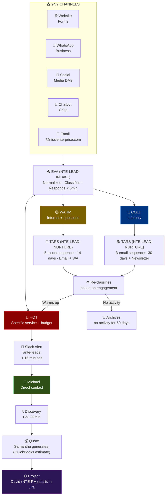

# 🎯 Flow: Multichannel Lead Management
### From Stranger to Customer in Real Time

## Lead Lifecycle Diagram

## Pipeline Metrics

| Metric | Target |
|---|---|
| First response time | < 5 minutes |
| COLD → WARM conversion rate | > 20% in 30 days |
| WARM → HOT conversion rate | > 15% in 14 days |
| HOT leads closed | > 30% |
| Inquiries resolved without escalation | > 70% |

[← All flows](./README.md)
