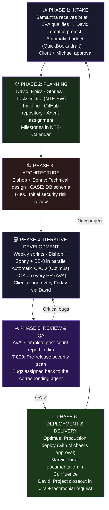

# ⚙️ Flow: Automated Software Development
### The 6 Phases — From Brief to Delivery

## Roles by Phase

| Phase | Active Agents | Output |
|---|---|---|
| 1. Intake | Samantha (NTE-CX) · EVA (NTE-LEAD-INTAKE) · David (NTE-PM) | Structured brief + approved QuickBooks estimate |
| 2. Planning | David (NTE-PM) | Jira board (NTE-SW) + GitHub repo + NTE-Calendar |
| 3. Architecture | David · Bishop · Sonny · T-800 | Technical architecture document |
| 4. Development | Bishop · Sonny · BB-8 · CASE · AVA · Optimus | Code + working CI/CD pipeline |
| 5. QA & Review | AVA (NTE-QA) · T-800 (NTE-SECURITY) | Bug report in Jira + security clearance |
| 6. Delivery | Optimus · Marvin · David | App in production + documentation in Confluence |

---

## SCRUM: Process Detail

Phase 4 (Iterative Development) operates under **weekly sprints** with Jira (project `NTE-SW`).

See the complete SCRUM process document:

**[→ Detailed SCRUM Workflow: Ceremonies · Jira · Branches · Definition of Done](./detailed-scrum-flow.md)**

Includes:
- Sprint Planning, Daily Standup, Sprint Review, Retrospective
- Jira board columns and ticket lifecycle
- Branch and commit conventions (Conventional Commits)
- Complete Definition of Done
- Production hotfix management
- Agile process KPIs

[← All flows](./README.md)
