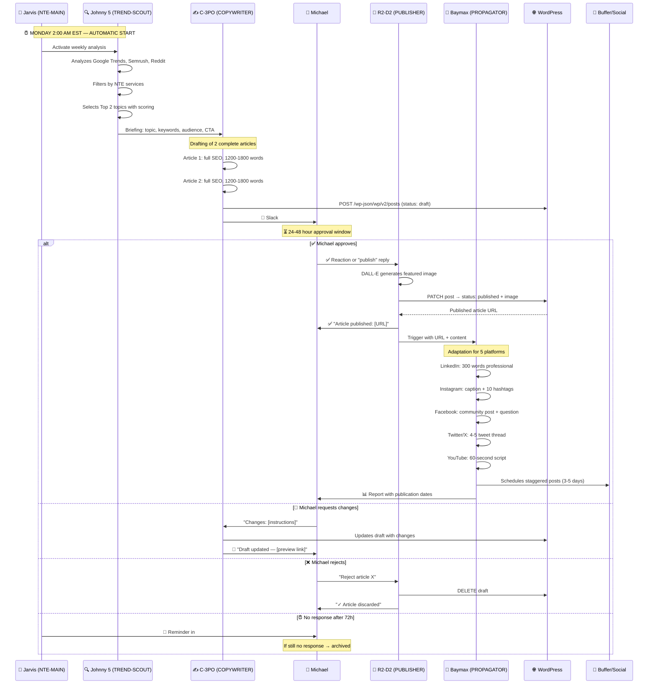

# 🔄 Flow: Automated Weekly Blog
### From Trend to Tweet in 48 hours

## Complete Sequence Diagram

## Typical Timeline

| Time | Event |
|---|---|
| Monday 2:00 AM | Johnny 5 (NTE-TREND-SCOUT) starts analysis |
| Monday 2:30 AM | Briefing sent to C-3PO (NTE-COPYWRITER) |
| Monday 5:00 AM | 2 articles drafted and uploaded as drafts |
| Monday 7:00 AM | Michael receives notification on Slack |
| Monday/Tuesday | Michael reviews and approves |
| +30 min | Article published + image generated |
| Week | Social media posts distributed on a staggered schedule |

[← All flows](./README.md)
